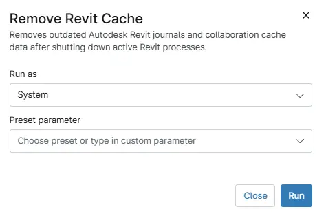

## Overview

Removes outdated Autodesk Revit journals and collaboration cache data after shutting down active Revit processes. This automated maintenance script identifies and safely terminates any running Revit-related processes (including Revit, Revit Accelerator, Revit Browser Subprocess, and Revit Worker) before performing cleanup, ensuring that no files are locked or in active use during the operation.

Once processes are stopped, the script scans all user profiles on the workstation and removes journal files older than 10 days, as well as collaboration cache directories older than 60 days. These files accumulate over time from normal Revit usage and cloud collaboration (BIM 360/ACC) sessions, often consuming significant disk space and, in some cases, contributing to performance degradation or troubleshooting complications.

The script includes built-in logging to record each step of the cleanup process, capture any errors encountered, and provide a verifiable audit trail of what was removed.

## Sample Run

`Play Button` > `Run Automation` > `Script`  

## Automation Setup/Import

[Automation Configuration](https://github.com/ProVal-Tech/ninjarmm/blob/main/scripts/remove-revit-cache.ps1)

## Output

- Activity Details  

## Changelog

### 2026-07-13

- Initial version of the document.