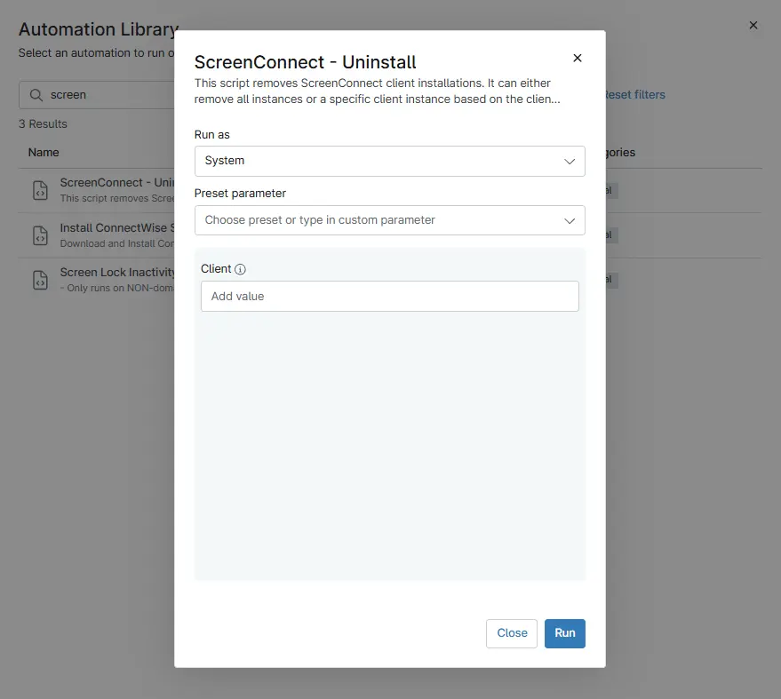

## Overview

This script identifies and removes ScreenConnect Client installations from a Windows machine using registry-based detection.

If a specific Client ID is provided (via parameter or environment variable),the script will uninstall only that matching ScreenConnect Client instance.

If no Client ID is provided, the script will uninstall all detected ScreenConnect Client installations.

In addition to uninstalling via MSI, the script also performs cleanup of remaining installer cache, registry entries, and installation directories to ensure complete removal.

## Sample Run

`Play Button` > `Run Automation` > `Script`  

## Parameters

| Name | Calculated Name | Example | Accepted Values | Required | Default | Type | Description |
| ---- | --------------- | ------- | --------------- | -------- | ------- | ---- | ----------- |
| Client | Client | -- | -- | NO | "" | `String/Text` | To uninstall a specific client/instance enter the value here. By default, all instances will be removed. |

## Automation Setup/Import

[Automation Configuration](https://github.com/ProVal-Tech/ninjarmm/blob/main/scripts/remove-screen-connect-client.ps1)

## Output

- Activity Details  

## Changelog

### 2026-03-26

- Initial version of the document
