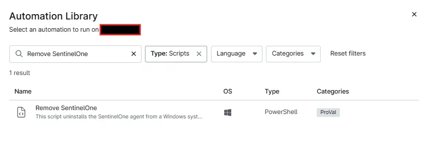
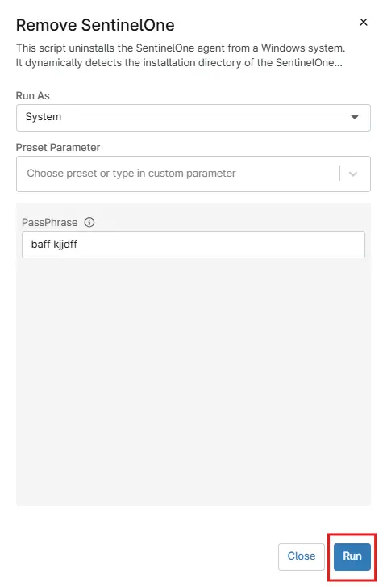

## Overview

This script uninstalls the SentinelOne agent from a Windows system. It dynamically detects the installation directory of the SentinelOne agent and executes the uninstallation process.

## Sample Run

`Play Button` > `Run Automation` > `Script`  

Search and select `Remove SentinelOne`

Set the required arguments and click the `Run` button to run the script.

- **Run As:** `System`  
- **Preset Parameter:** `<Leave it Blank>`  
- **PassPhrase:** `<Required PassPhrase>`  

**Run Automation:** `Yes`  

## Dependencies

- [Remove-SentinelOne](/docs/c64c47e7-8da3-46c6-9765-29da85addc2f)

## Parameters

| Name | Example | Accepted Values | Required | Default | Type | Description |
| ---- | ------- | --------------- | -------- | ------- | ---- | ----------- |
| PassPhrase | `ROAM GIN ELAN GWEN LOP FORK JUT REND PRY PUN KARL GULF` | | False |  | String/Text | Enter the PassPhrase to Uninstall the S1 Agent. This is required if Anti-Tamper protection is enabled. |

## Automation Setup/Import

[Automation Configuration](https://github.com/ProVal-Tech/ninjarmm/blob/main/scripts/remove-sentinelone.ps1)

## Output

- Activity Details  
