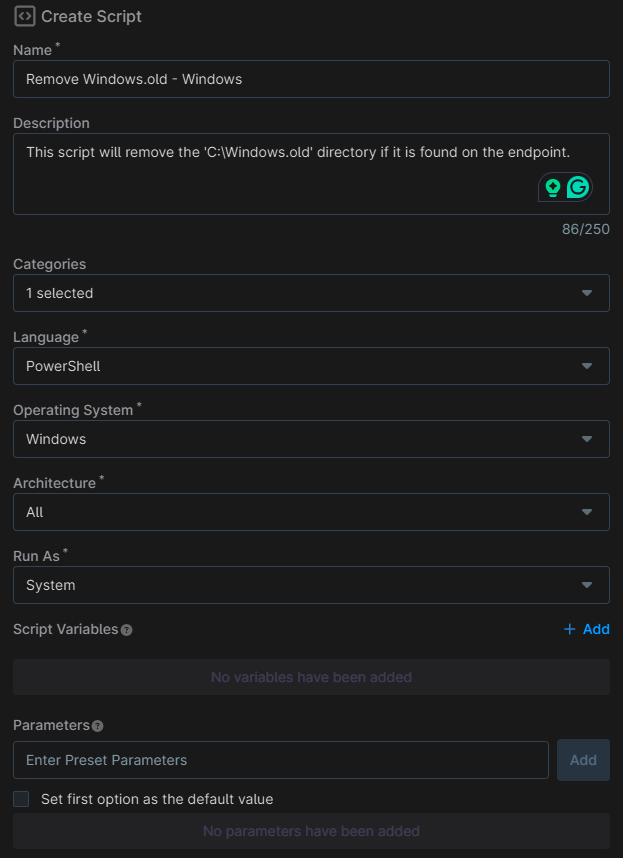
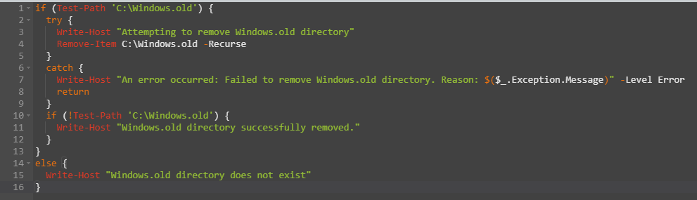
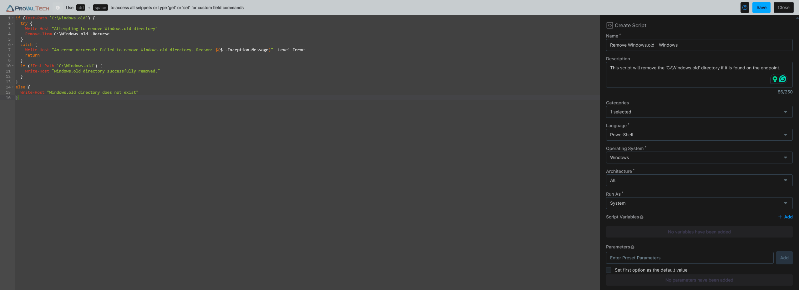

## Overview

This script will remove the C:\Windows.old directory if it is found on the endpoint.

## Sample Run

`Play Button` > `Run Automation` > `Script`  


Search and select `Remove Windows.old - Windows`


## Automation Setup/Import

### Step 1

Navigate to `Administration` > `Library` > `Automation`  


### Step 2

Locate the `Add` button on the right-hand side of the screen, click on it and click the `New Script` button.  


The scripting window will open.  


### Step 3

Configure the `Create Script` section as follows:

- **Name:** `Remove Windows.old - Windows`  
- **Description:**  `This script will remove the 'C:\Windows.old' directory if it is found on the endpoint.`  
- **Categories:** `ProVal`  
- **Language:**  `PowerShell`  
- **Operating System:** `Windows`  
- **Architecture:** `All`  
- **Run As:** `System`



## Step 4

Paste the following powershell script in the scripting section:  

```PowerShell
if (Test-Path 'C:\Windows.old') { 
  try {
    Write-Host "Attempting to remove Windows.old directory"
    Remove-Item C:\Windows.old -Recurse
  }
  catch {
    Write-Host "An error occurred: Failed to remove Windows.old directory. Reason: $($_.Exception.Message)" -Level Error
    return
  }
  if (!Test-Path 'C:\Windows.old') {
    Write-Host "Windows.old directory successfully removed."
  }
} 
else {
  Write-Host "Windows.old directory does not exist"
}
```



## Saving the Automation

Click the Save button in the top-right corner of the screen to save your automation.  


You will be prompted to enter your MFA code. Provide the code and press the Continue button to finalize the process.  


## Completed Automation



## Output

- Activity Details  
