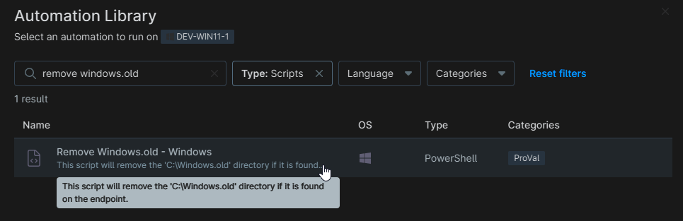

## Overview

This script will remove the C:\Windows.old directory if it is found on the endpoint.

## Sample Run

`Play Button` > `Run Automation` > `Script`  

Search and select `Remove Windows.old - Windows`

## Automation Setup/Import

[Automation Configuration](https://github.com/ProVal-Tech/ninjarmm/blob/main/scripts/remove-windows-old-windows.ps1)

## Output

- Activity Details  
