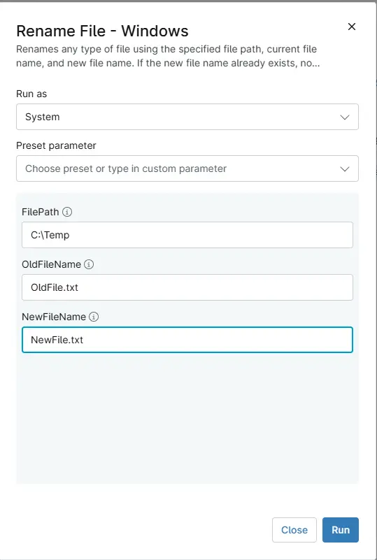

## Overview
Renames any type of file using the specified file path, current file name, and new file name. If the new file name already exists, no action is taken and the script exits successfully.

## Sample Run

## Parameters

| Name | Example | Accepted Values | Required | Default | Type | Description |
| ---- | ------- | --------------- | -------- | ------- | ---- | ----------- |
| FilePath | `C:\Temp` | String | True | - | String/Text | The directory containing the file. |
| OldFileName | `OldFile.txt` | String | True | - | String/Text | The current name of the file. |
| NewFileName | `NewFile.txt` | String | True | - | String/Text | The new name for the file. |

## Automation Setup/Import

[Automation Configuration](https://github.com/ProVal-Tech/ninjarmm/blob/main/scripts/rename-file-windows.ps1)

## Output

- Activity Details 

## Changelog

### 2026-08-17

- Initial version of the document
