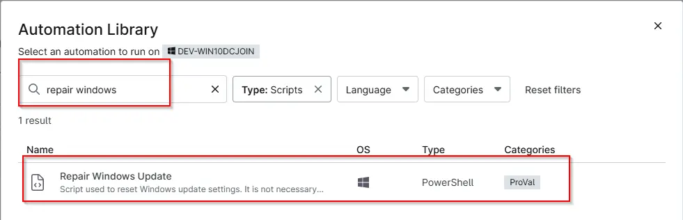
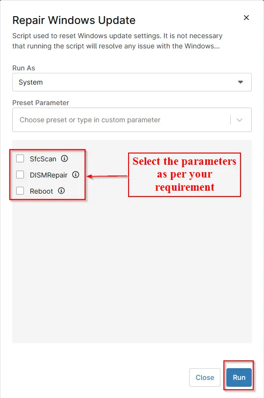

## Summary

This script attempts to repair and reset Windows update settings using the ProVal script: [Repair-WindowsUpdate](/docs/39345bfd-d9e2-4e68-9d7a-3e8b443140cc)  
The goal of this script is to fix potential patching issues for Windows devices.

:::warning
This script is provided without warranty and does not guarantee that all Windows Update issues will be resolved.
:::

## Sample Run

Select any computer where you want to run the script. Then go to `Play Button` > `Run Automation` > `Script`  
  

Search the script name and click on it:  
  

Select the parameters as per your requirement and then click on `Run`:  
  

Click on `Yes` to run the script

## Dependencies

[Repair-WindowsUpdate](/docs/39345bfd-d9e2-4e68-9d7a-3e8b443140cc)

## Parameters

| Name       | Example | Accepted Values | Required | Default | Type     | Description                                                   |
|------------|---------|-----------------|----------|---------|----------|---------------------------------------------------------------|
| SfcScan    | -       | -               | False    | False   | Checkbox | Select it to scan and repair corrupted Windows system files. |
| DISMRepair | -       | -               | False    | False   | Checkbox | Select it to repair the Windows image using DISM. It runs before SFC.  |
| Reboot     | -       | -               | False    | False   | Checkbox | If selected, the script will forcefully restart the computer after completing the repair operations.|

## Automation Setup/Import

[Automation Configuration](https://github.com/ProVal-Tech/ninjarmm/blob/main/scripts/repair-windows-update.ps1)

## Output

- Activity Details  
- Custom Field

## Changelog

### 2026-08-26

- Updated the script and document as per our new standards.

### 2025-04-22

- Initial version of the document
