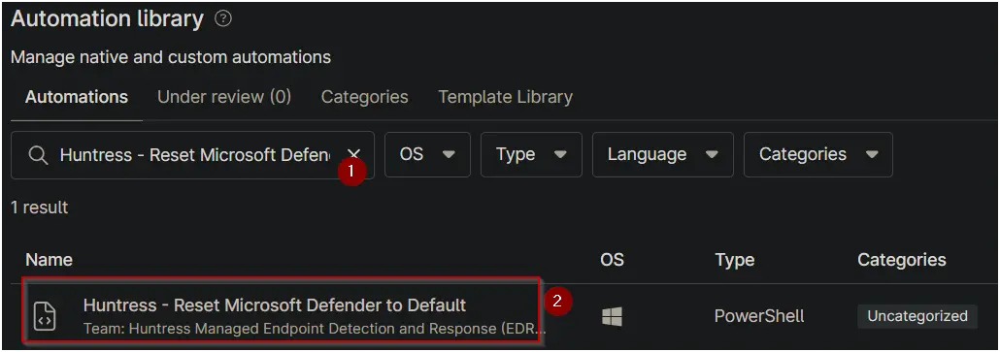
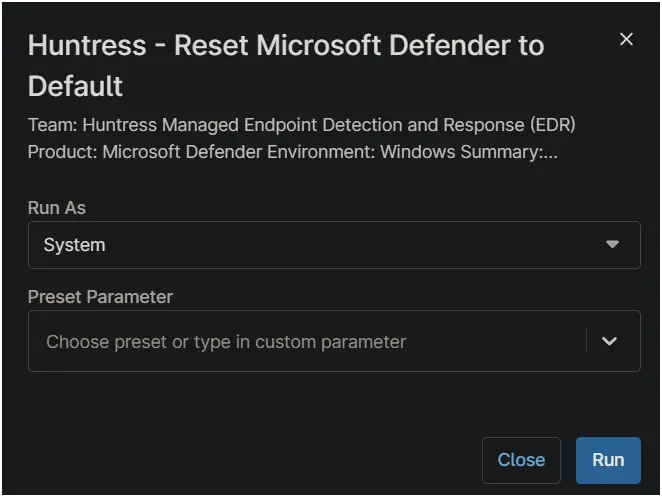

## Overview

Reset Huntress Managed Microsoft Defender and reset Microsoft Defender to it's defaults

**Reference:** [Huntress Support Article](https://support.huntress.io/hc/en-us/articles/4411542446611-Reset-Microsoft-Defender-to-Default)

## Sample Run

`Play Button` > `Run Automation` > `Script`  


Search and select `Huntress - Reset Microsoft Defender to Default`


Set the required arguments and click the `Run` button to run the script.  
**Run As:** `System`  
**Preset Parameter:** `<Leave it Blank>`   


**Run Automation:** `Yes`  


## Automation Setup/Import

### Step 1

Navigate to `Administration` > `Library` > `Automation`  


### Step 2

Locate the `Add` button on the right-hand side of the screen, click on it and click the `New Script` button.  


The scripting window will open.  


### Step 3

Configure the `Create Script` section as follows:

**Name:** `Huntress - Reset Microsoft Defender to Default`  
**Description:** `Reset Huntress Managed Microsoft Defender and reset Microsoft Defender to it's defaults`  
**Categories:** `<Leave it blank>`  
**Language:** `PowerShell`  
**Operating System:** `Windows`  
**Architecture:** `All`  
**Run As:** `System`  


## Step 4

Paste the following powershell script in the scripting section:  

```PowerShell

# Copyright (c) 2024 Huntress Labs, Inc.
# All rights reserved.
#
# Redistribution and use in source and binary forms, with or without modification, are permitted provided that the following conditions are met:
# * Redistributions of source code must retain the above copyright notice, this list of conditions and the following disclaimer.
# * Redistributions in binary form must reproduce the above copyright notice, this list of conditions and the following disclaimer in the
# documentation and/or other materials provided with the distribution.
# * Neither the name of the Huntress Labs nor the names of its contributors may be used to endorse or promote products derived from this software
# without specific prior written permission.
#
# THIS SOFTWARE IS PROVIDED BY THE COPYRIGHT HOLDERS AND CONTRIBUTORS "AS IS" AND ANY EXPRESS OR IMPLIED WARRANTIES, INCLUDING, BUT NOT LIMITED TO, THE
# IMPLIED WARRANTIES OF MERCHANTABILITY AND FITNESS FOR A PARTICULAR PURPOSE ARE DISCLAIMED. IN NO EVENT SHALL HUNTRESS LABS BE LIABLE FOR ANY DIRECT, INDIRECT,
# INCIDENTAL, SPECIAL, EXEMPLARY, OR CONSEQUENTIAL DAMAGES (INCLUDING, BUT NOT LIMITED TO, PROCUREMENT OF SUBSTITUTE GOODS OR SERVICES; LOSS OF USE, DATA,
# OR PROFITS; OR BUSINESS INTERRUPTION) HOWEVER CAUSED AND ON ANY THEORY OF LIABILITY, WHETHER IN CONTRACT, STRICT LIABILITY, OR TORT (INCLUDING
# NEGLIGENCE OR OTHERWISE) ARISING IN ANY WAY OUT OF THE USE OF THIS SOFTWARE, EVEN IF ADVISED OF THE POSSIBILITY OF SUCH DAMAGE.
#
# Written by Alan Bishop


# This script attempts to set a machine to all the current Huntress / Microsoft Defender defaults. It also logs several Defender related environmental variables
# and stores the log file within the Huntress working directory (program files\Huntress or program files (x86)\Huntress)
#
# * Must be run as admin
# * This will wipe out any existing Defender exclusions, use with caution!
$pathExclusions = Get-MpPreference | select ExclusionPath 
foreach ($exclusion in $pathExclusions) {
if ($exclusion.ExclusionPath -ne $null) {
Remove-MpPreference -ExclusionPath $exclusion.ExclusionPath
}
}
$extensionExclusion = Get-MpPreference | select ExclusionExtension 
foreach ($exclusion in $extensionExclusion) {
if ($exclusion.ExclusionExtension -ne $null) {
Remove-MpPreference -ExclusionExtension $exclusion.ExclusionExtension
}
}
$processExclusions = Get-MpPreference | select ExclusionProcess
foreach ($exclusion in $processExclusions) {
if ($exclusion.ExclusionProcess -ne $null) {
Remove-MpPreference -ExclusionProcess $exclusion.ExclusionProcess
}
}


# adds time stamp to a message and then writes that to the log file
function LogMessage ($msg) {
$timeStamp = "[{0:yyyy/MM/dd} {0:HH:mm:ss}]" -f (Get-Date)
Add-Content $DebugLog "$($timeStamp) $msg"
Write-Host "$($timeStamp) $msg"
}

# Find poorly written code faster with the most stringent setting.
Set-StrictMode -Version Latest

# determine where Huntress is installed and place the log files inside the same directory
if (Test-Path 'C:\Program Files\Huntress\') {
$DebugLog = 'C:\Program Files\Huntress\HuntressMAV.log'
$PolicyLog = 'C:\Program Files\Huntress\PolicyResult.html'
} elseif (Test-Path 'C:\Program Files (x86)\Huntress\') {
$DebugLog = 'C:\Program Files (x86)\Huntress\HuntressMAV.log' 
$PolicyLog = 'C:\Program Files (x86)\Huntress\PolicyResult.html'
} else {
Write-Host "Huntress install path not found! Attempting to use log file c:\Windows\temp\ for HuntressMAV.log and PolicyResult.html"
$DebugLog = 'C:\Windows\temp\HuntressMAV.log'
$PolicyLog = 'C:\Windows\temp\PolicyResult.html'
}

# Used by the Huntress support team when troubleshooting.
LogMessage "MAV repair script: 2022 Oct 6"
LogMessage "Beginning status and preferences:"
$MPCS = Out-String -inputobject $(Get-MPComputerStatus)
$MPP = Out-String -inputobject $(Get-MPPreference)
LogMessage $MPCS
LogMessage $MPP
cls


# Check for Tamper Protection, if it's on then this script may have difficulty reseting MAV to defaults. Tamper Protection can ONLY be changed in the GUI!
# TP only exists with Windows Security Center, which is only on workstations. i.e. servers don't have TP. 1 = workstation, 2 = DC, 3 = server
if ((Get-CimInstance -ClassName win32_operatingsystem).producttype -eq 1)
{
if ((Get-ItemPropertyValue -Path "HKLM:\Software\Microsoft\Windows Defender\Features" -Name "TamperProtection") -eq 5) {
LogMessage "Tamper Protection is ON, you'll need to turn it off within the GUI for this script to work correctly! TP can be turned back on after running this script successfully." 
LogMessage "Last change to Tamper Protection was done by:"
switch (Get-ItemPropertyValue -Path "HKLM:\Software\Microsoft\Windows Defender\Features" -Name "TamperProtectionSource")
{
1 {LogMessage "Init (default, unchanged)"}
2 {LogMessage "User Interface (GUI)"}
3 {LogMessage "E3"}
4 {LogMessage "E5"}
5 {LogMessage "Signatures"}
6 {LogMessage "MpCmdRun (Powershell)"}
40 {LogMessage "Intune or ConfigMgr"}
41 {LogMessage "ATP (aka Defender for Business aka Microsoft Defender for Endpoints)"}
}
pause
}
}

# Check for AD joined machines that cannot currently talk to any DC
if ($env:UserDNSDomain -ne $null) {
if (!(Test-ComputerSecureChannel)) {
LogMessage "WARNING: End point is AD joined but unable to contact a DC. This script will only work on end points that can currently talk to a DC or for end points not joined to a domain." 
pause
} else { LogMessage "Domain joined, DC connectivity is working - no problems"}
}

# Check system uptime. 95% of the time Defender appears broken, Windows is silently waiting on a reboot in order to fix or update something
$uptime = (New-TimeSpan -start $((Get-CimInstance -ClassName win32_operatingsystem ).lastbootuptime) -end $(Get-Date)).Days
if ($uptime -gt 6) {
LogMessage "High uptime detected, $($uptime) days, STRONGLY suggest a reboot before proceeding!" 
pause
}
cls

# make sure the 8 base engines are on - best effort
# Antimalware / Antispyware / Antivirus -> cannot be manually turned on or off, instead just make sure the service is running
Start-Service windefend
# Network Inspection -> same as above, cannot be turned on/off
Start-Service wdnissvc 
# Real-time Protection
Set-MpPreference -DisableRealtimeMonitoring $false
# on access protection - for Win10/11 only, command to turn on/off was deprecated
# IE/Outlook antivirus
Set-MpPreference -DisableIOAVProtection $false
# Behavior monitoring
Set-MpPreference -DisableBehaviorMonitoring $false


# set exclusions to default
$pathExclusions = Get-MpPreference | select ExclusionPath 
foreach ($exclusion in $pathExclusions) {
if ($exclusion.ExclusionPath -ne $null) {
Remove-MpPreference -ExclusionPath $exclusion.ExclusionPath
}
}
$extensionExclusion = Get-MpPreference | select ExclusionExtension 
foreach ($exclusion in $extensionExclusion) {
if ($exclusion.ExclusionExtension -ne $null) {
Remove-MpPreference -ExclusionExtension $exclusion.ExclusionExtension
}
}
$processExclusions = Get-MpPreference | select ExclusionProcess
foreach ($exclusion in $processExclusions) {
if ($exclusion.ExclusionProcess -ne $null) {
Remove-MpPreference -ExclusionProcess $exclusion.ExclusionProcess
}
}


# set scans to default times and cadence
Set-MpPreference -ScanScheduleTime "02:00:00"
Set-MpPreference -ScanScheduleQuickScanTime "02:00:00"
Set-MpPreference -DisableCatchupFullScan $true
Set-MpPreference -DisableCatchupQuickScan $false

# scan removable drives, archives / packed executables, but not network files
Set-MpPreference -DisableArchiveScanning $false
Set-MpPreference -DisableRemovableDriveScanning $false
Set-MpPreference -DisableScanningNetworkFiles $true

# set signatures updates to default times and cadence
Set-MpPreference -SignatureUpdateInterval 6
Set-MpPreference -SignatureUpdateCatchupInterval 1
Set-MpPreference -SignatureDisableUpdateOnStartupWithoutEngine $false
Set-MpPreference -SignatureFallbackOrder "MicrosoftUpdateServer|MMPC"

# set advanced options to default, no purge
Set-MpPreference -QuarantinePurgeItemsAfterDelay 0
Set-MpPreference -UILockdown $false

# Log the final state of the machine - Defender status, Defender services, and gpresult
LogMessage "Script successfully finished running, results:"
$MPCStatus = Out-String -inputobject (Get-MPComputerStatus)
$MPPreference = Out-String -inputobject (Get-MPPreference)
$Services = Out-String -inputobject (Get-Service | Where{$_.displayname -like "*defender*"} | Select Name, Status, StartType)
LogMessage $MPCS
LogMessage $MPP
LogMessage $Services
LogMessage " "
gpresult /h $PolicyLog
cls

Write-Host "Log saved to $($DebugLog)"
Write-Host "RSoP - results of current policy set saved to $($PolicyLog)"
```


## Saving the Automation

Click the `Save` button in the top-right corner of the screen to save your automation.  


You will be prompted to enter your MFA code. Provide the code and press the Continue button to finalize the process.  


## Completed Automation


## Output

- Activity Details