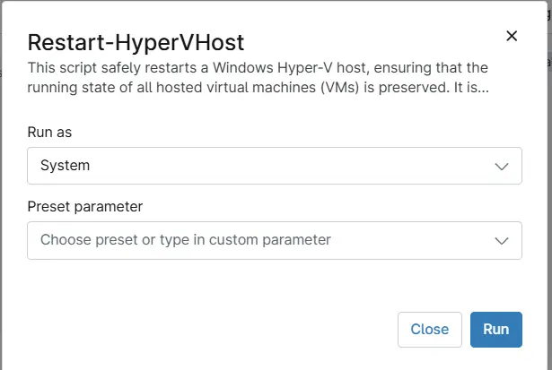

## Overview

This script uses the Agnostic script [Restart-HyperVHost](/docs/6da0235c-ed6e-4a81-b085-411337706b36) to restarts a **Windows Hyper-V host**, ensuring that the running state of all hosted virtual machines (VMs) is preserved. It is designed for environments where VM state preservation is critical during maintenance, patching, or updates, and where live migration to another host is not available or desired.

## Sample Run

`Play Button` > `Run Automation` > `Script`  

## Dependencies

- [Agnostic: Restart-HyperVHost](/docs/6da0235c-ed6e-4a81-b085-411337706b36)

## Automation Setup/Import

[Automation Configuration](https://github.com/ProVal-Tech/ninjarmm/blob/main/scripts/restart-hypervhost.ps1)

## Output

- Activity Details

## Changelog

### 2026-08-06

- Initial version of the document