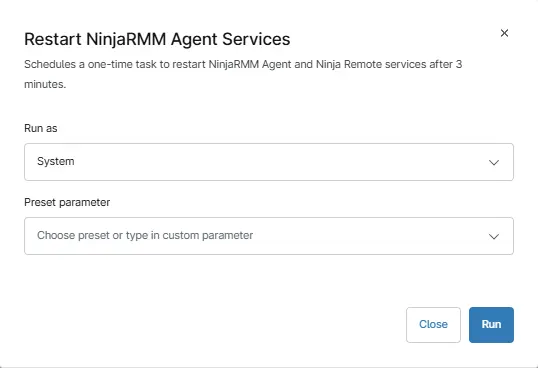

## Overview

This script performs the following actions:

- Verifies the NinjaRMMAgent service exists on the system.
- Sets the service startup type to Automatic.
- Configures Windows Service Recovery settings to restart on failure.
- Creates a monitoring script that checks service status and restarts if stopped.
- Registers a scheduled task to run the monitoring script at regular intervals `(15 minutes for servers, 60 minutes for workstations)`.
- Attempts to start the service if it's not currently running.
- Logs events to the Application event log for monitoring purposes
The script is designed to ensure the NinjaRMM Agent remains operational and automatically recovers from service failures.

## Sample Run

`Play Button` > `Run Automation` > `Script`  

## Automation Setup/Import

[Automation Configuration](https://github.com/ProVal-Tech/ninjarmm/blob/main/scripts/restart-ninjarmm-agent-service.ps1)

## Output

- Activity Details

## Changelog

2026-03-10

- Initial version of the document
