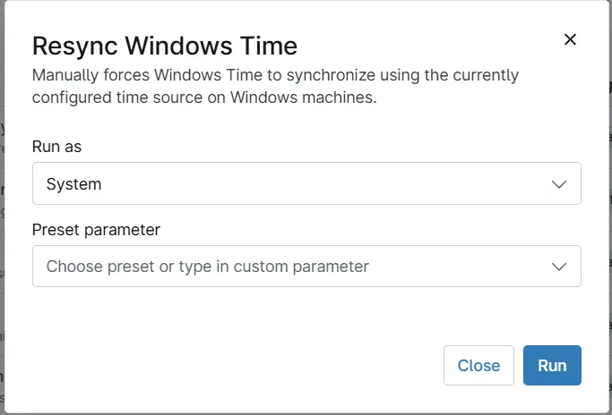

## Overview
Manually forces Windows Time to synchronize using the currently configured time source on Windows workstations.

## Sample Run

## Dependencies

- [Solution - Time Sync Compliance](/docs/49acbca5-5fa4-4f75-bbbc-595cec9a7e29)

## Automation Setup/Import

[Automation Configuration](https://github.com/ProVal-Tech/ninjarmm/blob/main/scripts/resync-windows-time.ps1)

## Output

- Activity Details  

## Changelog

### 2026-09-30

- Initial version of the document
