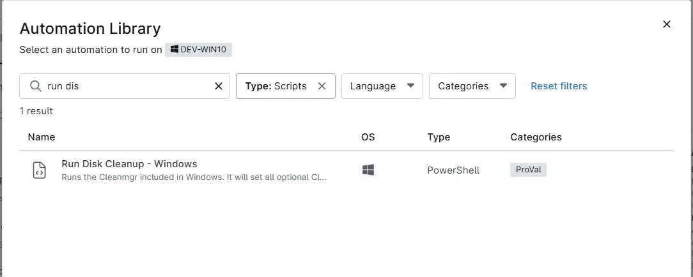

## Overview
This script runs the Cleanmgr included in Windows. It will set all optional Cleanmgr targets to enabled except for the Downloads folder.

## Sample Run

`Play Button` > `Run Automation` > `Script`  

Search and select `Run Disk Cleanup - Windows`

## Automation Setup/Import

[Automation Configuration](https://github.com/ProVal-Tech/ninjarmm/blob/main/scripts/run-disk-cleanup-windows.ps1)

## Output

- Activity Details  
