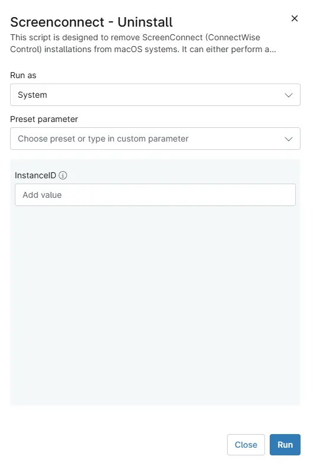

## Overview
This script is designed to remove ScreenConnect (ConnectWise Control) installations from **macOS** systems. It can either perform a full cleanup by removing all installed ScreenConnect client instances, or it can target and uninstall a specific client instance when provided with its unique client ID.

## Sample Run

`Play Button` > `Run Automation` > `Script`  

Search and select `Screenconnect - Uninstall [macOS]`

## Parameters

| Name | Example | Required | Default | Type | Description |
| ---- | ------- | -------- | ------- | ---- | ----------- |
| InstanceID| 7df67d57637499t6 | False | - | String | To uninstall a specific client/instance enter the InstanceID here. By default, all instances will be removed. |

## Automation Setup/Import

[Automation Configuration](https://github.com/ProVal-Tech/ninjarmm/blob/main/scripts/screenconnect-uninstall-macos.sh)

## Output

- Activity Details  

## Changelog

### 2026-03-17

- Initial version of the document
