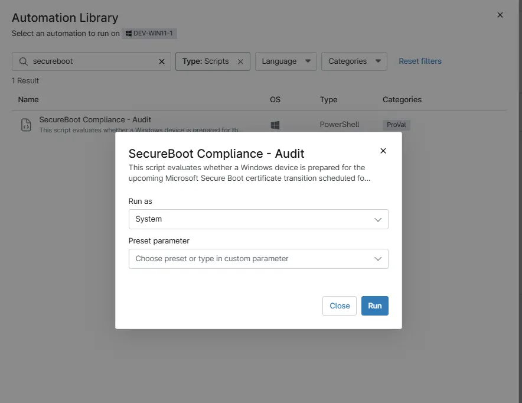

## Overview

This script evaluates whether a Windows device is prepared for the upcoming Microsoft Secure Boot certificate transition scheduled for 2026.

Microsoft is replacing legacy Secure Boot certificates with updated 2023-era certificates (KEK and DB). Devices that do not contain these updated certificates may be considered "at risk" once older certificates expire.

The script performs the following checks and stores the status in the custom fields:

  1. `Secure Boot`
    - Verifies whether Secure Boot is enabled or disabled on the device.

  2. `Windows Telemetry`
    - Determines CA2023 compliance based on Secure Boot state and certificate presence.

  3. `Windows DB Certificate`
    - Checks for presence of the 'Windows UEFI CA 2023' certificate in the DB store.

  4. `Windows KEK Certificate`
    - Checks for presence of the 'Microsoft Corporation KEK 2K CA 2023' certificate.

## Sample Run

`Play Button` > `Run Automation` > `Script`  

## Dependencies

- [Solution - Secure Boot Compliance Audit](/docs/b037020a-1af5-4ecb-bb6b-62d59c123937)

## Automation Setup/Import

[Automation Configuration](https://github.com/ProVal-Tech/ninjarmm/blob/main/scripts/secureboot-compliance-audit.ps1)

## Output

- Activity Details  
- Custom Field

## Changelog

### 2026-03-12

- Initial version of the document
