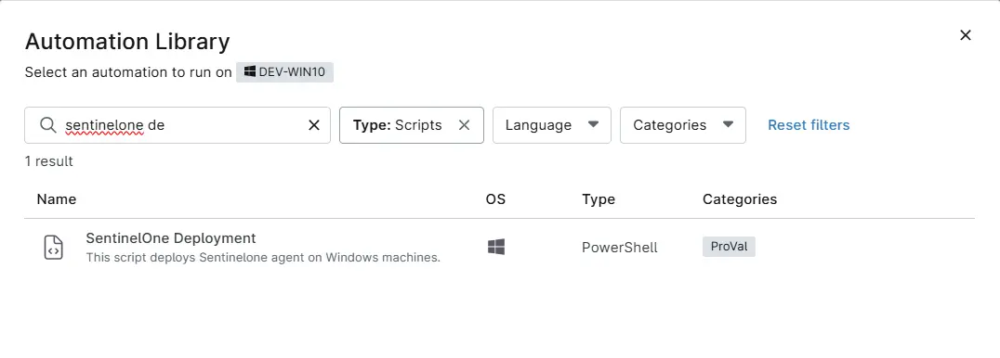

## Overview
This script deploys Sentinelone agent on Windows machines.

## Sample Run

`Play Button` > `Run Automation` > `Script`  

Search and select `SetinelOne Deployment`

## Dependencies
[cPVAL SentinelOne Key](/docs/44561301-d22b-4013-86af-d1842773d2ca)

## Automation Setup/Import

[Automation Configuration]((https://github.com/ProVal-Tech/ninjarmm/blob/main/scripts/sentinelone-deployment.ps1))

## Output

- Activity Details
