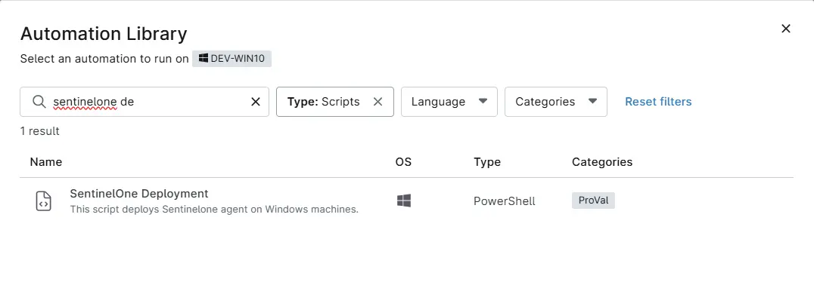

## Overview
This script handles both the deployment and update of the SentinelOne agent on Windows machines.

## Sample Run

`Play Button` > `Run Automation` > `Script`  

Search and select `SetinelOne Deployment`

## Dependencies
[cPVAL SentinelOne Key](/docs/44561301-d22b-4013-86af-d1842773d2ca)

## Automation Setup/Import

[Automation Configuration](https://github.com/ProVal-Tech/ninjarmm/blob/main/scripts/sentinelone-deployment.ps1)

## Output

- Activity Details

## Changelog

### 2026-05-26

- Written up the better PS1 to validate the S1 key, to make sure the custom field has it, and also signed the PS1.

### 2025-08-18

- Initial version of the document
