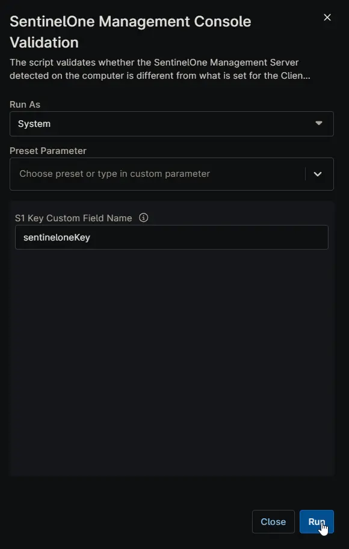

## Overview

The script validates whether the SentinelOne Management Server detected on the computer is different from what is set for the Client in NinjaRMM.

## Sample Run

- **Run As:** `System`  
- **Preset Parameter:** `<Leave it blank>`  
- **S1 Key Custom Field Name:** `<If you're using the 'cPVAL SentinelOne Key' custom field to store the SentinelOne installer key or token, leave this field blank. Otherwise, enter the name of the client-level custom field where the SentinelOne installation key is stored.>`  

## Dependencies

- [cPVAL SentinelOne Key](/docs/44561301-d22b-4013-86af-d1842773d2ca)
- [cPVAL SentinelOne Mgmt Server Discrepancy](/docs/1de41dd5-c222-45cb-9b74-5ae45bb86dd8)
- [cPVAL SentinelOne Mgmt Server Url](/docs/0691fe63-dd6b-4f15-8b39-dce377d9064a)
- [Solution - SentinelOne Management Server Url Validation](/docs/5c97a683-f12f-4fb0-bc18-1720a561da93)

## Parameters

| Name | Example | Accepted Values | Required | Default | Type | Description |
| ---- | ------- | --------------- | -------- | ------- | ---- | ----------- |
| S1 Key Custom Field Name | sentineloneKey | | false | | String/Text | If you're using the 'cPVAL SentinelOne Key' custom field to store the SentinelOne installer key or token, leave this field blank. Otherwise, enter the name of the client-level custom field where the SentinelOne installation key is stored. |

## Custom Fields

| Name | Example | Required | Description |
| ---- | ------- | -------- | ----------- |
| [cPVAL SentinelOne Key](/docs/44561301-d22b-4013-86af-d1842773d2ca) | eyJ1cmwiOiAidXJsdXJsdXJsdXJsdXJsdXJsdXJsdXJsdXJsdXJsdXJsdXJsdXJsIiwgInNpdGVfa2V5IjogIjExMTExMTExMTExMTExMTEifQ== | true | If you're already using a custom field to store the SentinelOne installation token or key, there's no need to create a new one. Instead, simply reference the existing custom field by specifying its name in the runtime variable `S1 Key Custom Field Name`. |
| [cPVAL SentinelOne Mgmt Server Discrepancy](/docs/1de41dd5-c222-45cb-9b74-5ae45bb86dd8) | Yes | false |  If the S1 Management URL on the endpoint matches the value stored in the NinjaOne custom field, or if there is any discrepancy between the two. Updated by the script. |
| [cPVAL SentinelOne Mgmt Server Url](/docs/0691fe63-dd6b-4f15-8b39-dce377d9064a) | `https://usea1.sentinelone.net` | false | SentinelOne Management Server Url fetched from the Endpoint. Updated by the script. |

## Automation Setup/Import

[Automation Configuration](https://github.com/ProVal-Tech/ninjarmm/blob/main/scripts/sentinelone-management-console-validation.ps1)

## Output

- Activity Details  
- Custom Field
