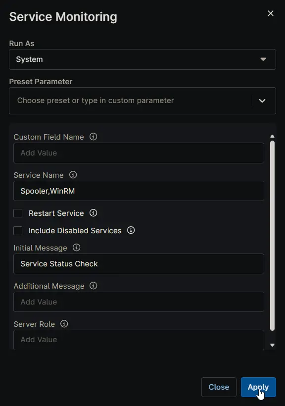
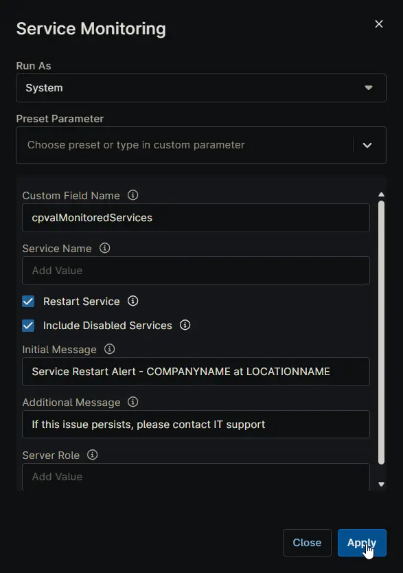
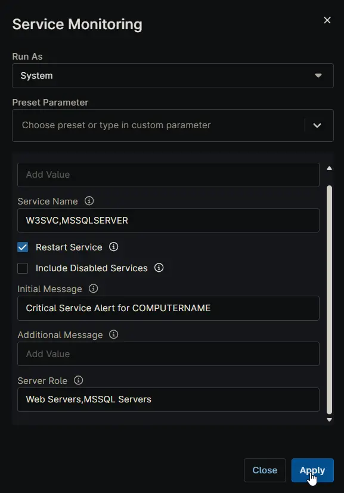
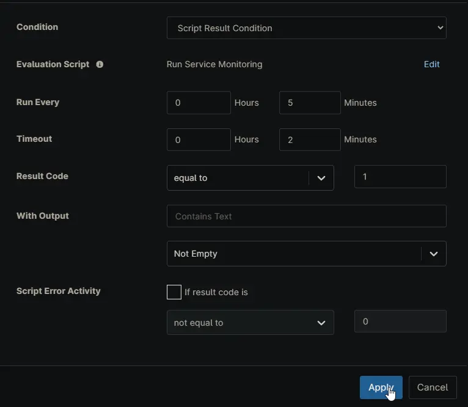
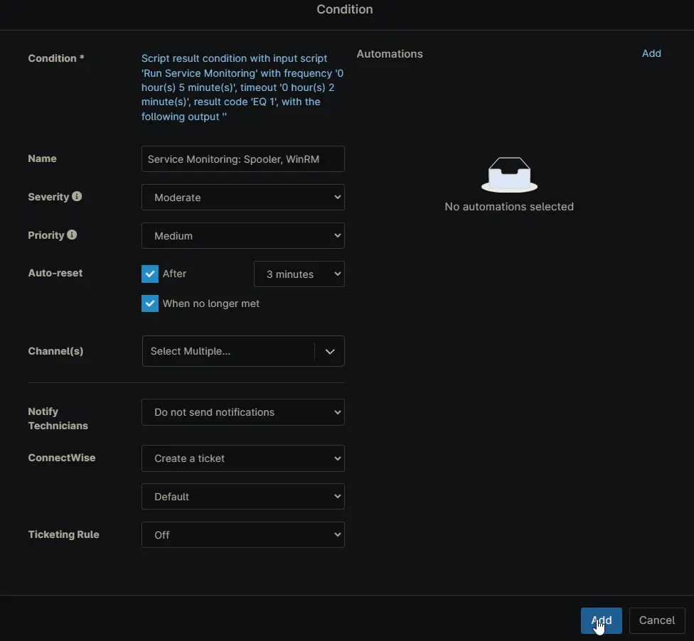

## Overview

The **Service Monitoring** automation is a comprehensive service health management workflow within NinjaRMM. It monitors specified Windows services and automatically restarts non-running services when configured to do so. The automation handles server role validation, disabled service management, and generates detailed ticket comments with full diagnostic context (*when executed from a condition or compound condition and ticketing is enabled*).

## Recommended Configuration in NinjaRMM

### Trigger: `Compound Condition` or `Condition` (Preferred)

Configure this automation to execute from within a **Compound Condition** or **Condition** from **Script Result Condition** rather than triggering directly as an Automation that's associated with a **Windows Service** condition. This approach:

- Prevents immediate ticket creation on service detection
- Allows the solution to attempt remediation first
- Only generates tickets when the automation completes with failures
- Enables layering of additional environmental checks before remedy attempts

### Schedule: Minimum Interval

- Set the automation to run at your system's **minimum supported interval** (typically **5–10 minutes**)
- Ensures rapid response to service failures without alert fatigue
- Adjust frequency based on service criticality and recovery tolerance

### Action Sequencing: Script Result Condition

Within NinjaRMM, structure the automation response as:

```PlainText
Trigger: Compound Condition or Condition (Script Result Condition)
  ↓
Execute: Service Monitoring Automation
  ├─ RestartService: Enabled
  ├─ IncludeDisabledServices: Enabled (optional)
  └─ ServiceName: [monitored services]
  ↓
Condition: Exit Code Analysis
  ├─ Exit Code 0 (Success) → Suppress Ticket or Log Event
  └─ Exit Code 1 (Failure) → Create Ticket with Full Output
```

### ⚠️ Critical: No Additional Restart Actions Needed

**DO NOT** add a separate action or sub-automation to restart services. This automation performs all restart operations internally when the `RestartService` parameter is enabled.

**What Happens Inside This Automation:**

1. Detects non-running services
2. Downloads and executes service restart logic
3. Verifies restart success
4. Returns atomic exit code reflecting final state

**Configuration to Avoid:**

```PlainText
❌ Do NOT create:
  - Separate "Restart Service" automation triggered by this automation
  - Additional script execution steps
  - Parallel restart workflows
  - Fallback restart actions
```

This ensures clean execution flow, prevents conflicting restart attempts, and maintains clear exit codes for intelligent ticket routing.

### Exit Code Behavior in NinjaRMM

| Exit Code | Interpretation | Recommended Action |
|-----------|-----------------|-------------------|
| **0** | All services running or successfully restarted | Suppress ticket or log event only |
| **1** | Services failed to restart OR role validation failed OR disabled services detected | Create ticket with full automation output |

## Sample Run

### Example 1: Basic Service Monitoring

```PlainText
Service Name: Spooler,WinRM
Restart Service: ○ (Unchecked)
Include Disabled Services: ○ (Unchecked)
Initial Message: Service Status Check
```



### Example 2: Automatic Restart with Custom Messaging

```PlainText
Custom Field Name: cpvalMonitoredServices
Restart Service: ✓ (Checked)
Include Disabled Services: ✓ (Checked)
Initial Message: Service Restart Alert - COMPANYNAME at LOCATIONNAME
Additional Message: If this issue persists, please contact IT support.
```



### Example 3: Role-Based Service Monitoring

```PlainText
Service Name: W3SVC,MSSQLSERVER
Server Role: Web Servers,MSSQL Servers
Restart Service: ✓ (Checked)
Initial Message: Critical Service Alert for COMPUTERNAME
```



## Sample Script Result Condition Configuration



## Sample Condition Configuration



## Dependencies

- [Invoke-RestartService](/docs/df5d8267-5836-48d8-8971-a5cc8b33722d)

## Parameters

| Parameter | Type | Required | Default | Description | Example |
|-----------|------|----------|---------|-------------|---------|
| **Service Name** | String/Text | No | (empty) | Specifies the name(s) of the service(s) to monitor. Either this or Custom Field Name must be configured. Use comma-separated values for multiple services. | `Spooler,WinRM,W3SVC` |
| **Custom Field Name** | String/Text | No | (empty) | Custom field name to retrieve service name(s) from NinjaRMM. When set, this overrides the Service Name parameter. Multiple services should be comma-separated in the custom field. | `cpvalMonitoredServices` |
| **Restart Service** | CheckBox | No | (unchecked) | Enable automatic restart of non-running services. When disabled, the automation only identifies and reports failed services without attempting restart. | Checked ✓ |
| **Include Disabled Services** | CheckBox | No | (unchecked) | Enable monitoring of disabled services. When enabled, disabled services are automatically set to Automatic startup and started. | Checked ✓ |
| **Server Role** | String/Text | No | (empty) | Restrict automation execution to specific server roles. Use exact role names from the [cPVAL Roles Detected](/docs/e9ec73dd-98b1-4436-a027-4ee8906f7cba) custom field. Use comma-separated values for multiple roles. | `Web Servers,File Servers` |
| **Initial Message** | String/Text | No | (empty) | Custom message displayed at the top of ticket comments and subject line. Supports replacement variables for dynamic content. | `Service Alert - COMPANYNAME at LOCATIONNAME` |
| **Additional Message** | String/Text | No | (empty) | Additional context message appended to the end of ticket comments. | `Please investigate if issues persist.` |

## Initial Message Replacement Variables

The **Initial Message** parameter supports dynamic token replacement:

| Token | Replacement | Example Output |
|-------|------------|-----------------|
| `ORGANIZATIONNAME` | Organization name from NinjaRMM | `Acme Corporation` |
| `COMPANYNAME` | Company/client name from NinjaRMM | `TechCorp Solutions` |
| `LOCATIONNAME` | Location name from NinjaRMM | `New York Office` |
| `COMPUTERNAME` | Computer/server name | `WEB-SERVER-01` |

### Example Initial Message Usage

```PlainText
Service Alert for COMPUTERNAME at LOCATIONNAME
```

**Resolves to:**

```PlainText
Service Alert for WEB-SERVER-01 at New York Office
```

---

```PlainText
ORGANIZATIONNAME - COMPANYNAME Service Health Check
```

**Resolves to:**

```PlainText
Acme Corporation - TechCorp Solutions Service Health Check
```

## Ticket Comment Content

When exit code is 1 and a ticket is created, the comment includes:

- Initial message (if configured)
- Services detected as not running
- Status of restart attempts
- Individual service verification results
- Server role validation details
- Log file excerpts from failed restarts (if available)
- Additional message (if configured)

## Setup Checklist for NinjaRMM

✓ Create **Compound Condition** or **Condition** trigger (if needed)  
✓ Create **Script Result Condition**  
✓ Add **Service Monitoring** Automation to the condition  
✓ Enable **RestartService** parameter  
✓ Configure **ServiceName** or **Custom Field Name** mapping  
✓ Set automation **schedule** to minimum interval (5–15 min)  
✓ Add **Script Result Condition**: Exit Code = 1 → Create Ticket  
✓ Populate **Initial Message** and **Additional Message** for context  
✓ **Verify**: No separate restart actions exist in this workflow  
✓ Test on non-critical servers first before production deployment  

## Key Advantages of This Configuration

- **Single Atomic Operation**: Service detection and restart occur in one execution with one exit code
- **Reduced Noise**: No tickets generated for already-running services
- **Full Context**: Failures include comprehensive diagnostic data collected during the attempt
- **Role-Based Targeting**: Prevents running on incompatible server types
- **Self-Contained**: No dependency on additional automations or manual steps

## Automation Setup/Import

[Automation Configuration](https://github.com/ProVal-Tech/ninjarmm/blob/main/scripts/service-monitoring.ps1)

## Output

- Activity Details

## FAQs

### Should I run this as a direct automation or from a Condition/Compound Condition?

> Use it from a **Condition** or **Compound Condition** with a **Script Result Condition**. This gives the automation a chance to fix the issue first and only create a ticket when the final result is a failure.

### What is the minimum setup required?

> At minimum, set one of these:
>>
> - **Service Name** (manual list like `Spooler,WinRM`)
> - **Custom Field Name** (dynamic list stored in a Ninja custom field)
>
> If both are empty, the automation cannot monitor services.

### Which value is used if I set both Service Name and Custom Field Name?

> **Custom Field Name** takes priority. If a custom field name is provided and returns values, those services are used for monitoring.

### What does Restart Service actually change?

> When **Restart Service** is unchecked, the automation only reports stopped services. When checked, it attempts remediation by restarting non-running services and then verifies their final status.

### What happens with disabled services?

> By default, disabled services are treated as a failure condition. If **Include Disabled Services** is enabled, the automation attempts to set those services to **Automatic** and include them in monitoring/restart logic.

### How should I use Server Role?

> Use **Server Role** to limit where this runs (for example: `Web Servers`, `MSSQL Servers`). Role names must match the values in the [cPVAL Roles Detected](/docs/e9ec73dd-98b1-4436-a027-4ee8906f7cba) custom field. If no valid role match exists, the automation exits as a failure.

### What do Initial Message and Additional Message do?

>> - **Initial Message** appears at the top of output and is useful for ticket subject/context.
>> - **Additional Message** appears at the end of output for next-step guidance.
>
> The Initial Message also supports replacement tokens like `COMPANYNAME`, `LOCATIONNAME`, and `COMPUTERNAME`.

### How will the created ticket look?

> The final ticket format depends on the **Manage Ticket Template** configured in your Condition or Compound Condition. This automation provides output details (service status, restart attempts, validation results), and your selected template controls how that information is presented in the ticket.

### When is a ticket typically created?

> Common pattern:
>
>> - Exit code `0`: no ticket (or log-only action)
>> - Exit code `1`: create/update ticket
>
> This is usually handled in the **Script Result Condition** step.

### Can I monitor multiple services with one automation?

> Yes. Use a comma-separated list (for example: `Spooler,WinRM,W3SVC`) either directly in **Service Name** or through the custom field referenced by **Custom Field Name**.

## Changelog

### 2026-03-18

- Initial version of the document
