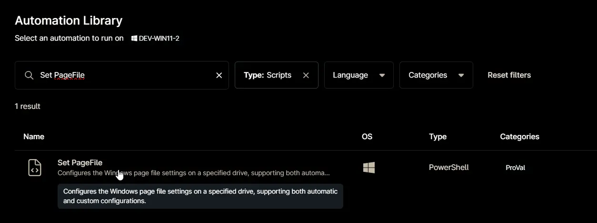
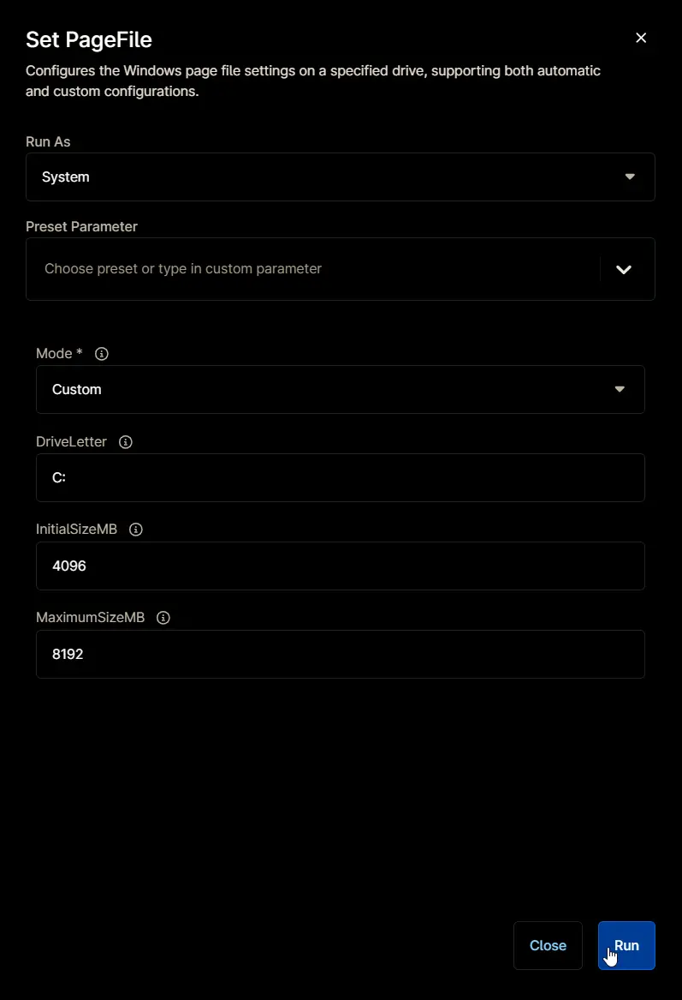

## Overview

Configures the Windows page file settings on a specified drive, supporting both automatic and custom configurations. It supports two modes of operation:

1. **AutomaticManagedPagefile:** Enables Windows-managed page file settings, allowing the operating system to automatically determine the size and location of the page file.
2. **Custom:** Disables automatic management and applies user-defined initial and maximum page file sizes on a specified drive.

**NOTE:** This script requires administrative privileges and PowerShell 5 or higher.

## Sample Run

`Play Button` > `Run Automation` > `Script`  

Search and select `Set PageFile`

Set the required arguments and click the `Run` button to run the script.

- **Run As:** `System`  
- **Preset Parameter:** `<Leave it Blank>`  
- **Mode:** `Custom` or `AutomaticManagedPagefile`  
- **DriveLetter:** `<Drive Letter to Set PageFile for, default value is C:>`  
- **InitialSizeMB:** `<Initial size of the page file in megabytes (MB). Used only in 'Custom' mode.>`  
- **MaximumSizeMB:**  `<Maximum size of the page file in megabytes (MB). Used only in 'Custom' mode.>`  

**Run Automation:** `Yes`  

## Parameters

| Name | Example | Accepted Values | Required | Default | Type | Description |
| ---- | ------- | --------------- | -------- | ------- | ---- | ----------- |
| Mode | `Custom` | `Custom`, `AutomaticManagedPagefile` | True | `Custom` | Drop-Down | Specifies whether to use automatic or custom page file settings. Use 'AutomaticManagedPagefile' to let Windows manage the page file, or 'Custom' to specify your own size and location. |
| DriveLetter | `D:` | | False | `C:` | String/Text | Drive letter where the page file will be created (e.g., C:, D:). Defaults to the system drive if not specified. |
| InitialSizeMB | `8192` | | False | `4096` | Integer | Initial size of the page file in megabytes (MB). Used only in 'Custom' mode. Defaults to 4096 MB. |
| MaximumSizeMB | `16384` | | False | `16384` | Integer | Maximum size of the page file in megabytes (MB). Used only in 'Custom' mode. Defaults to 8192 MB. |

## Automation Setup/Import

[Automation Configuration](https://github.com/ProVal-Tech/ninjarmm/blob/main/scripts/set-pagefile.ps1)

## Output

- Activity Details
