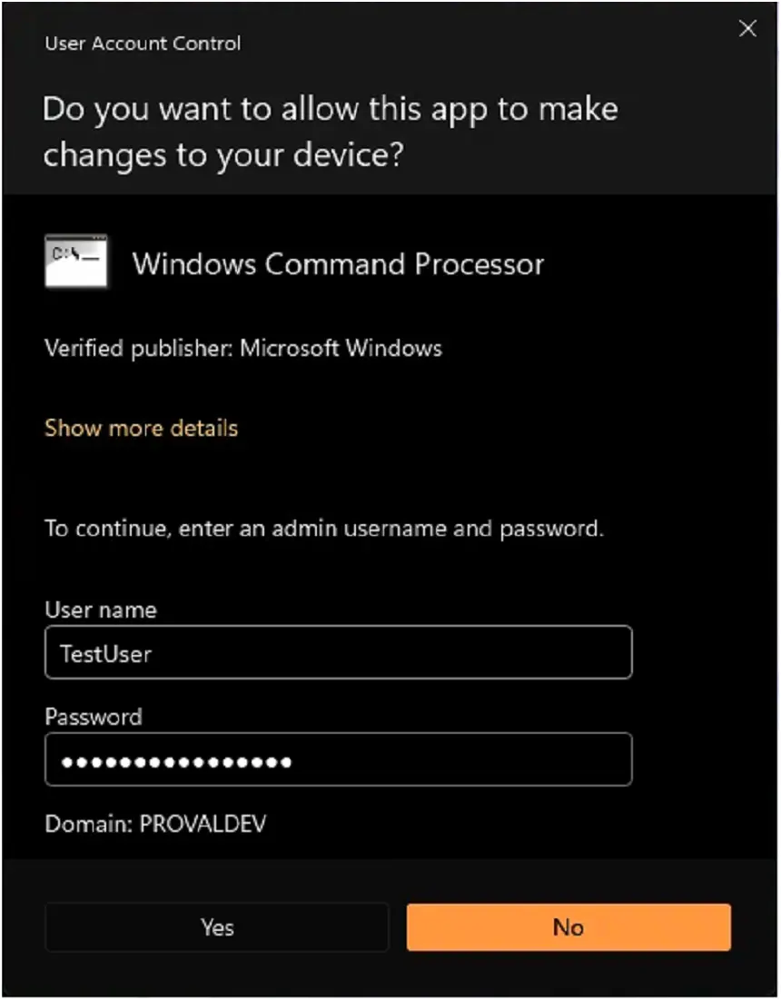
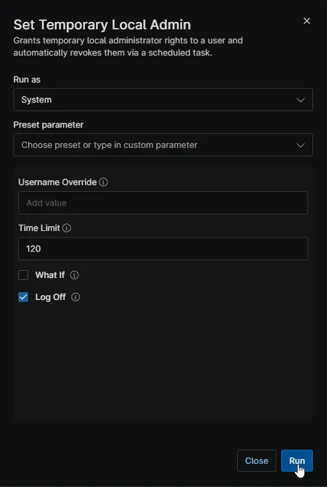
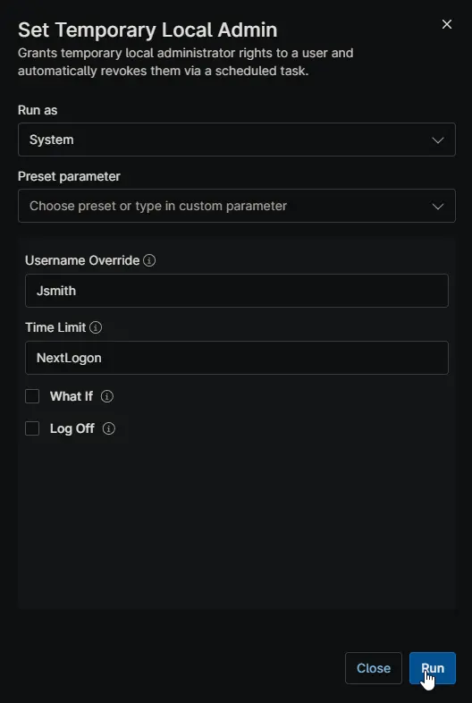
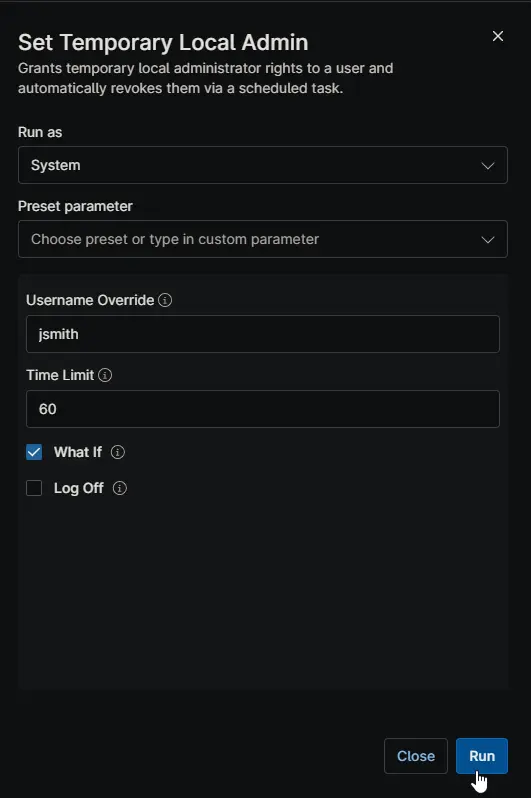
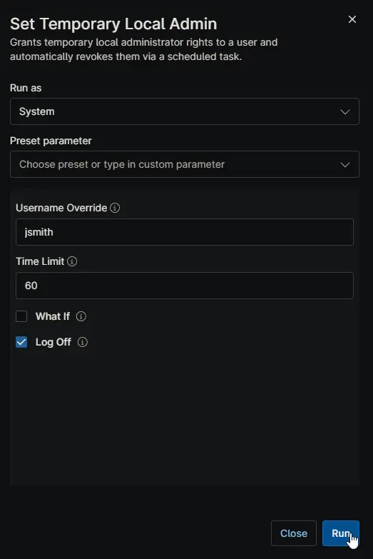

## Overview

Use this automation to give a user temporary local administrator access on a Windows device. The access is removed automatically either after a set number of minutes or at the user's next sign-in.

Leave **Username Override** blank to target the user who is currently signed in. If no user is signed in and the field is left blank, the automation stops without making changes. If the selected user is already a local administrator, the automation also stops without changing anything.

Choose **Time Limit** carefully:

- Use a number such as `60` or `120` when the user needs admin access for a planned work window.
- Use `NextLogon` only when you want access removed at the next sign-in.
- If the device is off when a timed removal is due, the removal runs when the device is back online.

Keep these points in mind before you run it:

- If the user is already signed in when access is granted, they may still see User Account Control prompts until they sign out and sign back in. In that session, they can approve those prompts with their own credentials if they are the user who was granted access.
- If you leave **Username Override** blank, the automation targets the currently signed-in user. Any User Account Control prompts that appear in that session are tied to that signed-in user's account.
    
- A sign-out and sign-in refreshes the user's session so Windows fully recognizes the new local administrator membership.
- If **Log Off** is enabled, the user is signed out when admin access is removed.
- If **Time Limit** is `NextLogon` and **Log Off** is enabled, the user may be signed out immediately after their next sign-in.
- If **Time Limit** is `NextLogon`, the access window ends at the next sign-in, so it is best used only when that timing is intentional.
- If the device is restarted or turned off before a timed removal runs, the scheduled removal still runs later when the device is available again.
- Running the automation again for a user who is already a local administrator does not extend the existing access window.
- Use **What If** first when you want to confirm which user will be targeted and when access will be removed.

## Tips

- Use **What If** before a live run when you want to confirm the target user and the removal timing.
- Use a minute value such as `30`, `60`, or `120` for most support sessions. This gives the user a clear access window.
- Use `NextLogon` only when you specifically want access removed at the next sign-in.
- Do not use `NextLogon` if the user is currently signed out and still needs admin access after they sign in. Their next sign-in will trigger the removal.
- If the user is already signed in, ask them to sign out and sign back in if you want Windows to fully apply the new admin access to that session.
- Turn on **Log Off** when you want admin access fully cleared at the end of the temporary access window.
- Leave **Username Override** blank only when you are sure the correct user is currently signed in.
- If the user is already a local administrator, this automation does not refresh or extend their access.

## Sample Run

### Example 1: Grant logged-in user admin for 120 minutes and log the user off when access is revoked

- **Username Override:** `<blank>`  
- **Time Limit:** `120`  
- **What If:** `false`  
- **Log Off:** `true`  

### Example 2: Grant a specific user admin until next logon

- **Username Override:** `jsmith`  
- **Time Limit:** `NextLogon`  
- **What If:** `false`  
- **Log Off:** `false`  

### Example 3: Preview what would happen for user jsmith for 60 minutes

- **Username Override:** `jsmith`  
- **Time Limit:** `60`  
- **What If:** `true`  
- **Log Off:** `false`  

### Example 4: Grant admin for 60 minutes and log the user off when access is revoked

- **Username Override:** `jsmith`  
- **Time Limit:** `60`  
- **What If:** `false`  
- **Log Off:** `true`  

## Parameters

| Name | Example | Accepted Values | Required | Default | Type | Description |
| ---- | ------- | --------------- | -------- | ------- | ---- | ----------- |
| Username Override | jsmith | Blank, local username, or domain-prefixed username | No | Blank | String/Text | Selects the user to receive temporary admin rights. Leave blank to use the currently signed-in user. Domain prefixes are accepted, but only the username is used. |
| Time Limit | 60 | `NextLogon` or any whole number `1` or higher | No | `NextLogon` | String/Text | Controls when admin rights are removed. Use a number for a timed access window, or `NextLogon` to remove access at the next sign-in. |
| What If | true | `true` or `false` | No | `false` | Checkbox | Preview mode. Shows which user would be targeted and when access would be removed, without changing group membership or creating a scheduled task. |
| Log Off | true | `true` or `false` | No | `false` | Checkbox | Signs the user out when admin rights are removed. Use this when you want elevated access fully cleared at the end of the temporary access window. |

## Automation Setup/Import

[Automation Configuration](https://github.com/ProVal-Tech/ninjarmm/blob/main/scripts/set-temporary-local-admin.ps1)

## Output

- Activity Details

## FAQs

### What happens if I leave Username Override blank?

> The automation uses the user who is currently signed in. If no interactive user is signed in, the automation stops and makes no changes.

### Will the user become a full admin immediately?

> The user is added to the local Administrators group immediately. If they are already signed in, Windows may still show User Account Control prompts until they sign out and sign back in.

### Which credentials can be used at User Account Control prompts?

> If the signed-in user is the one who was granted temporary admin access, they can approve prompts with their own credentials. If the user signs out and signs back in, Windows applies the new group membership fully to that refreshed session.

### When should I use NextLogon instead of a number of minutes?

> Use `NextLogon` only when you want access removed at the next sign-in. For a predictable support window, use a minute value such as `30`, `60`, or `120`.

### What does What If do?

> It shows which user would be targeted and when access would be removed. It does not add the user to the Administrators group and does not create the removal task.

### What happens if the computer is off when the access window ends?

> The removal task runs when the device is available again. A user should not keep temporary admin access just because the device was turned off at the scheduled time.

### Does Log Off matter?

> Yes. Removing a user from the Administrators group does not end already-open elevated sessions by itself. **Log Off** forces the user to sign out so temporary elevated access is fully cleared.

## Changelog

### 2026-04-23

- Initial version of the document.
