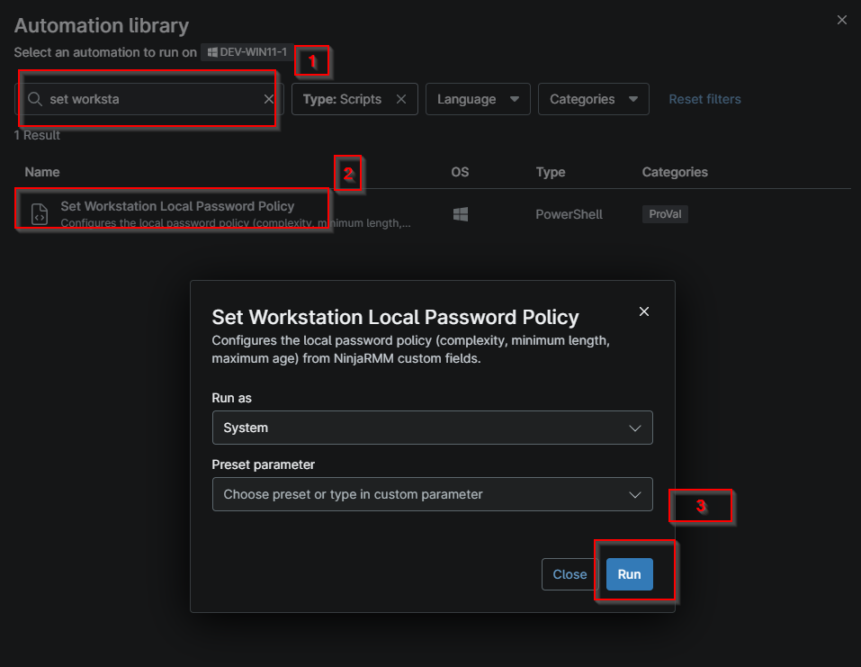
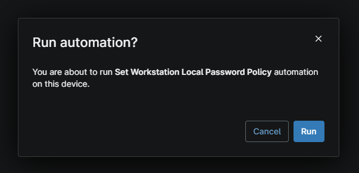

## Overview

Sets the local password policy for the workstation.

## Sample Run

- Search for the script `Set workstation local password policy`
  

- Click `Run` to execute  

## Dependencies

- [Solution: Set Workstation Local Password Policy](/docs/72e89e20-3771-450a-a89a-b6e27d9c46b5)

## Custom Fields

| Field Name | Type | Mandatory | Scope | Description |
| ---------- | ---- | --------- | ----- | ----------- |
| cpvalEnableMaximumLocalPasswordAge | Checkbox | true | `Organization` | Check this box to activate the maximum password age policy for local users |
| cpvalEnableMinimumLocalPasswordLength | Checkbox | true | `Organization` | Check this box to activate the minimum password length policy for local users. |
| cpvalEnforceLocalPasswordComplexity | Checkbox | true | `Organization` | Check this box to activate the password complexity policy for local users. |
| cpvalMinimumPasswordLength | Text | true | `Organization` | Provide the minimum length for the local password length policy. The valid range is between 8 and 14. |
| cpvalMaximumPasswordAge | Text | true | `Organization` | Provide the maximum age in days for the maximum local password age policy. The valid range is between 4 and 360. |

## Automation Setup/Import

[Automation Configuration](https://github.com/ProVal-Tech/ninjarmm/blob/main/scripts/set-workstation-local-password-policy.ps1)

## Output

- Activity Details  

## Changelog

### 2026-10-07

- Initial version of the document