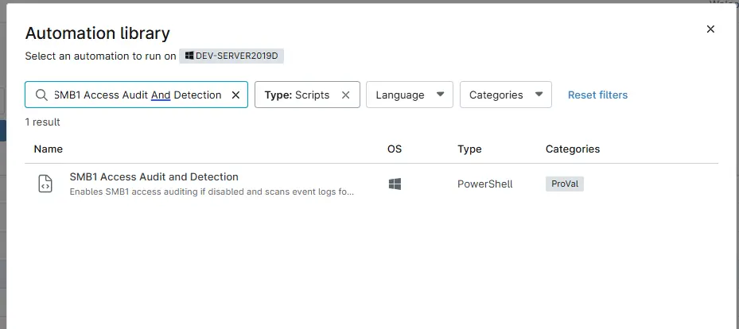
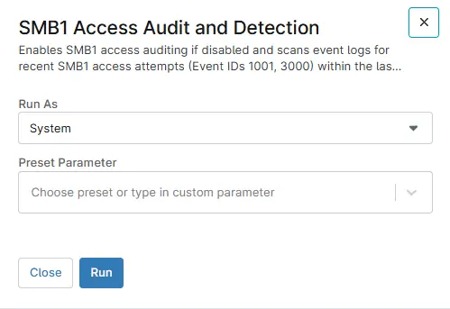

## Overview
Enables SMB1 access auditing if disabled and scans event logs for recent SMB1 access attempts (Event IDs 1001, 3000) within the last hour. Returns exit codes for detection or script failure.

## Sample Run

`Play Button` > `Run Automation` > `Script`  
  

## Dependencies

[Solution - SMB1 Access Audit](/docs/b9c24693-91db-4014-a5d9-7208d7fe492a)  
[Compound Condition - SMB1 Traffic Audit](/docs/f6b984a2-acbe-40fa-93e3-43682acde7ca)

## Automation Setup/Import

[Automation Configuration](https://github.com/ProVal-Tech/ninjarmm/blob/main/scripts/smb1-access-audit-and-detection.ps1)

## Output

- Activity Details  
