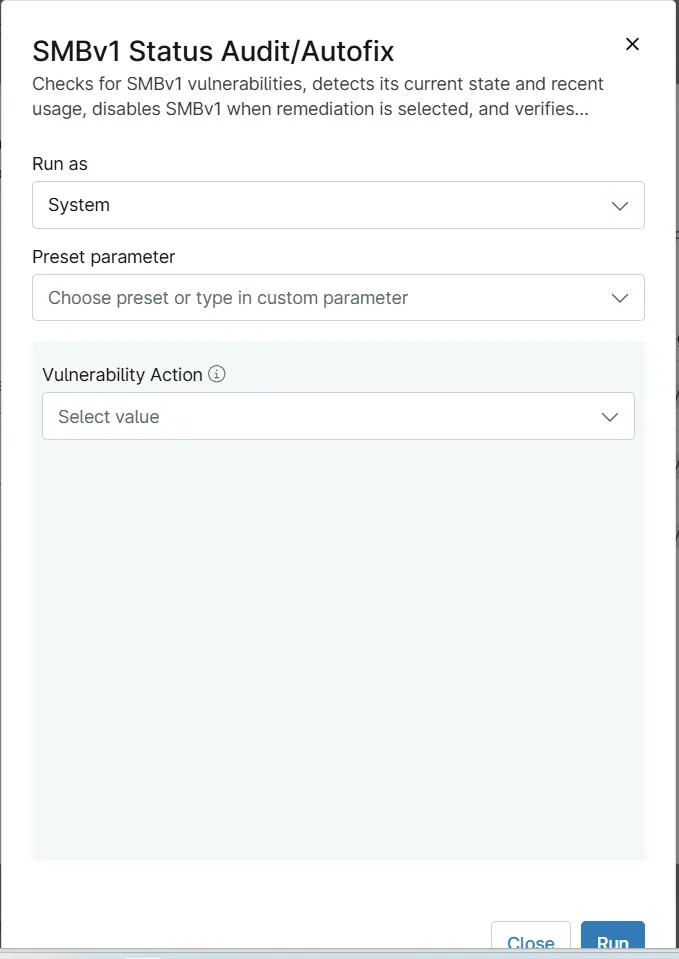

## Overview
Checks for SMBv1 vulnerabilities, detects its current state and recent usage, disables SMBv1 when remediation is selected, and verifies the resulting configuration.

## Sample Run

## Dependencies

- [Custom Field - cPVAL SMB1 Vulnerability Action](/docs/e2522a83-b703-4282-ae28-2a4643d6f1a1) 
- [Solution - SMBv1 Status Audit/Autofix](/docs/d4508b91-c43e-41ca-bc94-28a4a22508d8) 

## Parameters

| Name | Example | Accepted Values | Required | Default | Type | Description |
| ---- | ------- | --------------- | -------- | ------- | ---- | ----------- |
| Vulnerability Action | `Detection` | `Detection`, `Detection and Remediation` | `False` | - | Drop-Down| Choose the SMB1 Vulnerability action to perform on the machine. Detection reports the current SMBv1 state without making any changes. Detection and Remediation disables SMBv1 and then reports the resulting state.

## Automation Setup/Import

[Automation Configuration](https://github.com/ProVal-Tech/ninjarmm/blob/main/scripts/smbv1-status-audit-autofix.ps1)

## Output

- Activity Details  
- Custom Field

## Changelog

### 2026-10-07

- Initial version of the document