## Summary

Soji is a smart yet straightforward disk cleanup utility designed to enhance system cleanliness on Windows. It utilizes both native System.IO file and directory management along with COM references to the deprecated cleanmgr tool.

This document provides a guide on creating the Soji disk cleanup automation in Ninja One.

Please reference [Soji](/docs/c762e174-5262-44b9-a3e9-97ca9ff94afc) for argument usage.

## Sample Run

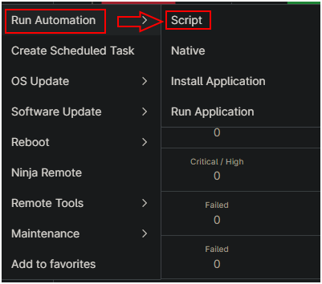

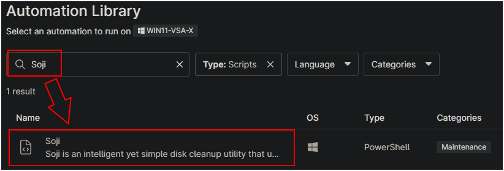

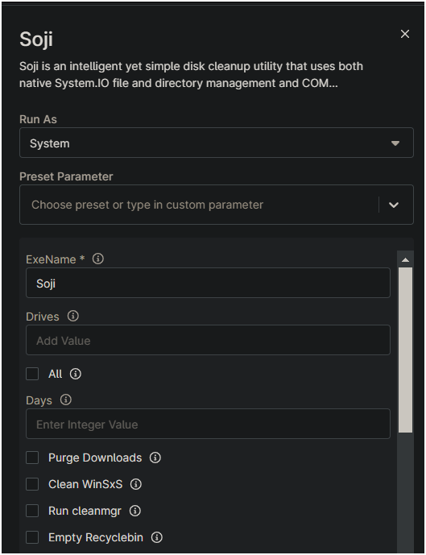  
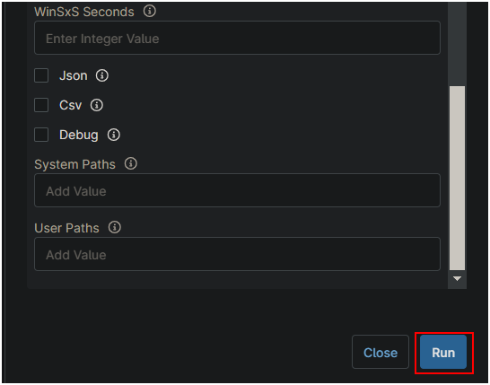

## Dependencies

- [Soji](/docs/c762e174-5262-44b9-a3e9-97ca9ff94afc)

## Automation Setup/Import

Add a "New Script" to the Automation library for this automation.  
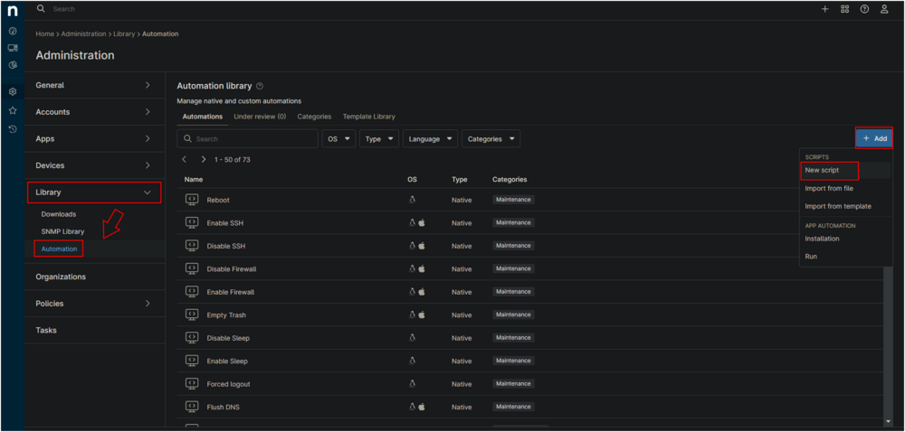

**Name:** `Soji (Disk Cleanup Utility)`  
**Description:** `Soji is an intelligent yet simple disk cleanup utility that uses both native System.IO file and directory management and COM references to the deprecated cleanmgr tool to tidy up one or more volumes on a Windows system.`  
**Category:** `Maintenance`  
**Language:** `PowerShell`  
**Operating System:** `Windows`  
**Architecture:** `All`  
**Run As:** `System`  

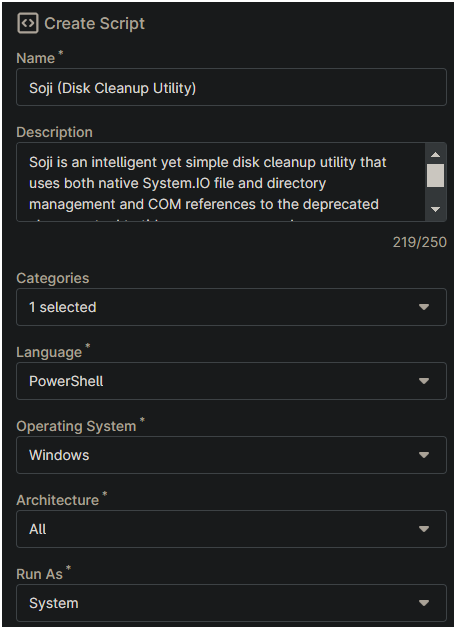

Paste in the following PowerShell script into the Ninja One editor

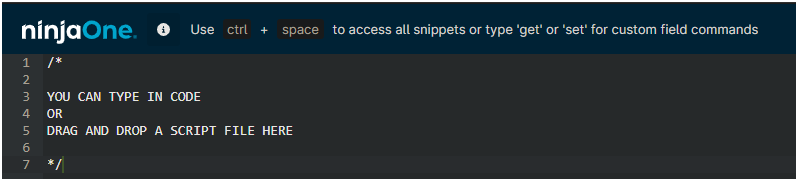

```PowerShell
# Set working directory and paths
$WorkingDirectory = "$Env:SystemDrive\ProgramData\_automation\script\$env:ExeName"
$EXEPath = "$WorkingDirectory\$env:ExeName.exe"

# Create working directory
New-Item -Type Directory -Path $WorkingDirectory -ErrorAction SilentlyContinue | Out-Null

# Check and install .NET 6 Runtime if needed
$dotnetRuntimes = (dotnet --list-runtimes 2>$null) -join " "
if($dotnetRuntimes -notmatch "WindowsDesktop\.App 6") {
    Write-Host "Installing .NET 6 Desktop Runtime..."
    [Net.ServicePointManager]::SecurityProtocol = [Net.SecurityProtocolType]::Tls12
    $dotnetInstallerPath = Join-Path $WorkingDirectory "windowsdesktop-runtime-6.0.6-win-x64.exe"
    try {
        (New-Object System.Net.WebClient).DownloadFile(
            "https://dotnetcli.azureedge.net/dotnet/WindowsDesktop/6.0.6/windowsdesktop-runtime-6.0.6-win-x64.exe",
            $dotnetInstallerPath
        )
        $process = Start-Process -FilePath $dotnetInstallerPath -ArgumentList "/quiet", "/norestart" -NoNewWindow -Wait -PassThru
        if ($process.ExitCode -ne 0) {
            Write-Error "Failed to install .NET 6 Runtime. Exit code: $($process.ExitCode)"
            exit 1
        }
        Remove-Item $dotnetInstallerPath -Force -ErrorAction SilentlyContinue
    }
    catch {
        Write-Error "Failed to download or install .NET 6 Runtime: $_"
        exit 1
    }
}

# Download the main executable
[Net.ServicePointManager]::SecurityProtocol = [Enum]::ToObject([Net.SecurityProtocolType], 3072)
try {
    (New-Object System.Net.Webclient).DownloadFile("https://file.provaltech.com/repo/app/$env:ExeName.exe", $EXEPath)
}
catch {
    Write-Error "Failed to download application: $_"
    exit 1
}

if (!(Test-Path -Path $EXEPath)) {
    Write-Error -Message 'An error occurred and the application was unable to be downloaded. Exiting.'
    exit 1
}

# List of potential parameters to check
$PossibleParameters = @(
    # Boolean/switch parameters
    'Json',
    'Csv',
    'All',
    'Debug',
    # String value parameters
    'Drives',
    'Days',
    'SystemPaths',
    'UserPaths',
    'WinsxsSeconds',
    # Hyphenated parameters (stored without hyphens in env vars)
    'PurgeDownloads',
    'CleanWinsxs',
    'RunCleanmgr',
    'EmptyRecyclebin'
)

# Create an array to store our parameters
$Parameters = @()

# Parameter mapping for hyphenated parameters
$HyphenMapping = @{
    'PurgeDownloads' = 'purge-downloads'
    'CleanWinsxs' = 'clean-winsxs'
    'RunCleanmgr' = 'run-cleanmgr'
    'EmptyRecyclebin' = 'empty-recyclebin'
}

# Check each possible parameter
foreach ($Param in $PossibleParameters) {
    $EnvVar = Get-Item "Env:$Param" -ErrorAction SilentlyContinue
    if ($EnvVar -and $EnvVar.Value -and $EnvVar.Value -notlike "null") {
        # Handle different parameter types
        switch ($Param) {
            # Boolean/switch parameters
            { $_ -in @('Json','Csv','All','Debug') } {
                if ($EnvVar.Value.ToLower() -eq 'true') {
                    $Parameters += "--$($Param.ToLower())"
                }
            }
            # String value parameters
            { $_ -in @('Drives','Days','SystemPaths','UserPaths','WinsxsSeconds') } {
                $paramName = $_.ToLower()
                if ($_ -eq 'WinsxsSeconds') { $paramName = 'winsxs-seconds' }
                $Parameters += "--$paramName"
                $Parameters += "`"$($EnvVar.Value)`""
            }
            # Hyphenated parameters
            { $HyphenMapping.ContainsKey($_) } {
                if ($EnvVar.Value.ToLower() -eq 'true') {
                    $Parameters += "--$($HyphenMapping[$_])"
                }
            }
        }
    }
}

# Execute the exe with all collected parameters
& $EXEPath @Parameters

# Check for and display log files
$logFilePath = "$WorkingDirectory\$env:ExeName-log.txt"
$errorFilePath = "$WorkingDirectory\$env:ExeName-Error.txt"

if (Test-Path -Path $logFilePath) {
    Write-Host "Log File Contents:"
    Get-Content -Path $logFilePath
}

if (Test-Path -Path $errorFilePath) {
    Write-Host "Error File Contents:"
    Get-Content -Path $errorFilePath
}
```

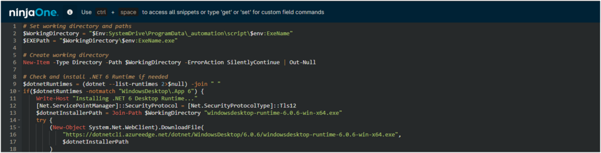

### Script Variables

Click the `Add` button next to Script Variables.  
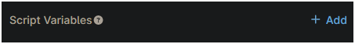

Select the appropriate variable type (referenced below)  
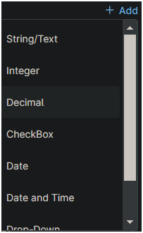

Fill in the values as required (referenced below)  
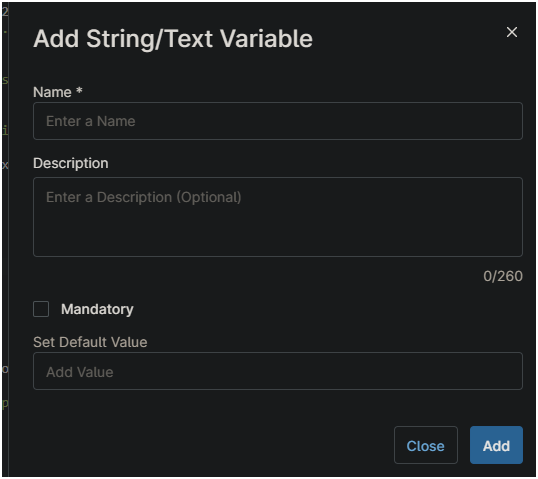

In the box fill in the following details and select `Add` to create the script variable.

**Variable Name:** `ExeName`  
**Variable Type:** `String`  
**Description:** `(Do Not Modify) Name of the executable from the ProVal file repository.`  
**Default Value:** `Soji`  
**Mandatory:** `true`  

**Variable Name:** `Drives`  
**Variable Type:** `String`  
**Description:** `(Default: All fixed drives) A comma-separated list of volume letters to process.`  
**Default Value:**  
**Mandatory:** `false`  

**Variable Name:** `All`  
**Variable Type:** `CheckBox`  
**Description:** `(Default: false) Enable all possible cleaning tools (--purge-downloads, --clean-winsxs, --run-cleanmgr, --empty-recyclebin)`  
**Default Value:** `Unchecked`  
**Mandatory:** `false`  

**Variable Name:** `Days`  
**Variable Type:** `Integer`  
**Description:** `(Default: 7.0) The maximum number of days between now and the last write time of files to keep.`  
**Default Value:**  
**Mandatory:** `false`  

**Variable Name:** `Purge Downloads`  
**Variable Type:** `CheckBox`  
**Description:** `(Default: false) Purge all user Downloads folders.`  
**Default Value:** `Unchecked`  
**Mandatory:** `false`  

**Variable Name:** `Clean WinSxS`  
**Variable Type:** `CheckBox`  
**Description:** `(Default: false) Enable WinSxS component cleanup.`  
**Default Value:** `Unchecked`  
**Mandatory:** `false`  

**Variable Name:** `Run cleanmgr`  
**Variable Type:** `CheckBox`  
**Description:** `(Default: false) Enable legacy cleanmgr execution.`  
**Default Value:** `Unchecked`  
**Mandatory:** `false`  

**Variable Name:** `Empty Recyclebin`  
**Variable Type:** `CheckBox`  
**Description:** `(Default: false) Empty the recycle bin. May still occur when running the legacy cleanmgr.`  
**Default Value:** `Unchecked`  
**Mandatory:** `false`  

**Variable Name:** `WinSxS Seconds`  
**Variable Type:** `Integer`  
**Description:** `(Default: 300) The number of seconds to wait for WinSxS processing when --clean-winsxs or --all is passed.`  
**Default Value:**  
**Mandatory:** `false`  

**Variable Name:** `Json`  
**Variable Type:** `CheckBox`  
**Description:** `(Default: false) Include JSON file output.`  
**Default Value:** `Unchecked`  
**Mandatory:** `false`  

**Variable Name:** `Csv`  
**Variable Type:** `CheckBox`  
**Description:** `(Default: false) Include CSV file output.`  
**Default Value:** `Unchecked`  
**Mandatory:** `false`  

**Variable Name:** `Debug`  
**Variable Type:** `CheckBox`  
**Description:** `(Default: false) Set this flag to enable debug output in the console.`  
**Default Value:** `Unchecked`  
**Mandatory:** `false`  

**Variable Name:** `System Paths`  
**Variable Type:** `String`  
**Description:** `(Default: null) An optional comma separated list of additional paths to scan for files to clean with regex file filtering.`  
**Default Value:**  
**Mandatory:** `false`  

**Variable Name:** `User Paths`  
**Variable Type:** `String`  
**Description:** `(Default: null) An optional comma separated list of additional user paths to scan with regex file filtering.`  
**Default Value:**  
**Mandatory:** `false`

Click the Save button to save the Automation.  


## Completed Automation

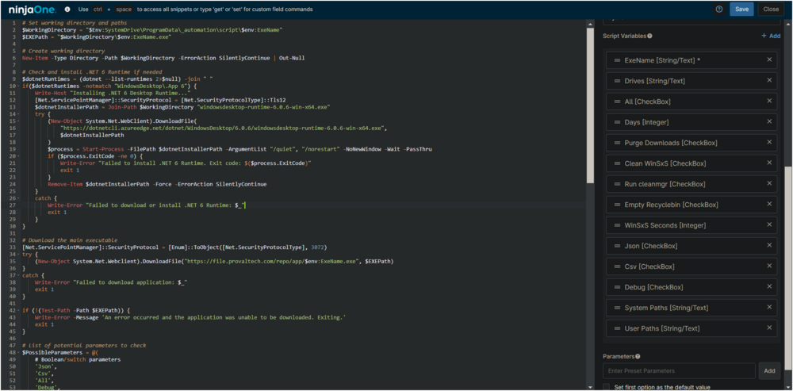

## Output

- Activity Details
    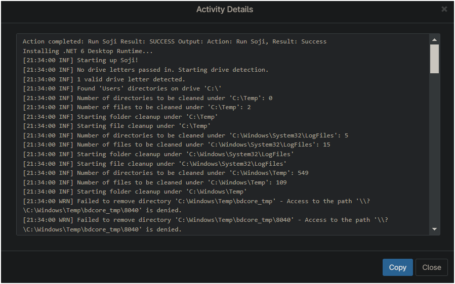
