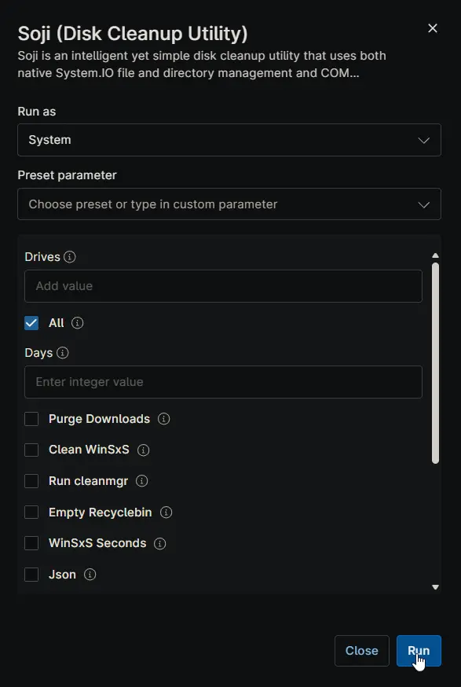
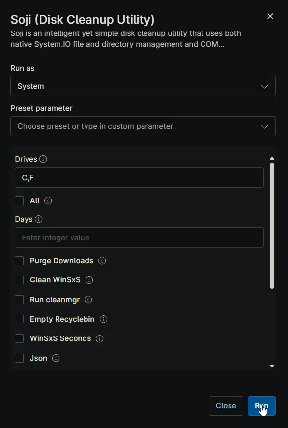
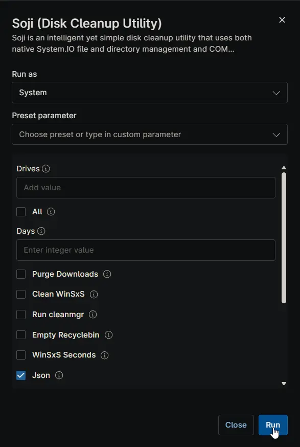

## Summary

Soji is a smart yet straightforward disk cleanup utility designed to enhance system cleanliness on Windows. It utilizes both native System.IO file and directory management along with COM references to the deprecated cleanmgr tool.

This document provides a guide on creating the Soji disk cleanup automation in Ninja One.

Please reference [Soji](/docs/c762e174-5262-44b9-a3e9-97ca9ff94afc) for argument usage.

## Sample Run

*Clean all fixed drives with all available cleaners:*

*Clean the C and F drives:*

*Clean all fixed drives and read back the file JSON report in PowerShell:*

## Dependencies

- [Soji](/docs/c762e174-5262-44b9-a3e9-97ca9ff94afc)
- [cPVAL Soji Result](/docs/0d8c8069-8883-4135-b322-da61e1a932e0)

## Parameters

| Name | Example | Accepted Values | Required | Default | Type | Description |
| :--- | :--- | :--- | :--- | :--- | :--- | :--- |
| **Drives** | `C,D` | String | false | All fixed drives | String/Text | A comma-separated list of volume letters to process. |
| **All** | `Checked` | Checkbox | false | Unchecked | CheckBox | Enable all cleaning tools: purge downloads, clean WinSxS, run cleanmgr, and empty recycle bin. |
| **Days** | `14` | Integer | false | 7.0 | Integer | The maximum number of days between now and the last write time of files to keep. |
| **Purge Downloads** | `Checked` | Checkbox | false | Unchecked | CheckBox | Purge all user Downloads folders. |
| **Clean WinSxS** | `Checked` | Checkbox | false | Unchecked | CheckBox | Enable WinSxS component cleanup. |
| **Run cleanmgr** | `Checked` | Checkbox | false | Unchecked | CheckBox | Enable legacy cleanmgr execution. |
| **Empty Recyclebin** | `Checked` | Checkbox | false | Unchecked | CheckBox | Empty the recycle bin. |
| **WinSxS Seconds** | `600` | Integer | false | 300 | Integer | Seconds to wait for WinSxS processing when Clean WinSxS or All is enabled. |
| **Json** | `Checked` | Checkbox | false | Unchecked | CheckBox | Include JSON file output. |
| **Csv** | `Checked` | Checkbox | false | Checked | CheckBox | Include CSV file output. **Required** for custom field output. |
| **Debug** | `Checked` | Checkbox | false | Unchecked | CheckBox | Set this flag to enable debug output in the console. |
| **System Paths** | `C:\Temp\Logs` | String | false | null | String/Text | Optional comma-separated list of additional system paths to scan with regex filtering. |
| **User Paths** | `AppData\Local\Temp` | String | false | null | String/Text | Optional comma-separated list of additional user paths to scan with regex filtering. |

## Custom Fields

| Name | Example | Required | Description |
| :--- | :--- | :--- | :--- |
| **[cPVAL Soji Result](/docs/0d8c8069-8883-4135-b322-da61e1a932e0)** | `Soji last run (03/23/2026 16:10) - Results: Removed 1242 files, returned 4.2 GB to the device.` | true | Stores the most recent results of the Soji automation, including a timestamp, file count, and total space recovered. |

## Automation Setup/Import

[Automation Configuration](https://github.com/ProVal-Tech/ninjarmm/blob/main/scripts/soji-disk-cleanup-utility.ps1)

## Output

- Activity Details
- Custom Field

## Changelog

### 2026-03-23

- Updated .Net8 Desktop Runtime installation logic to install the latest available version.
- Code Signed the PowerShell script.
- Document modifications.

### 2025-06-25

- Updated the script to save the result of Soji cleanup inn the Custom Field "cPVAL Soji Result".

### 2025-05-06

- Initial version of the document
