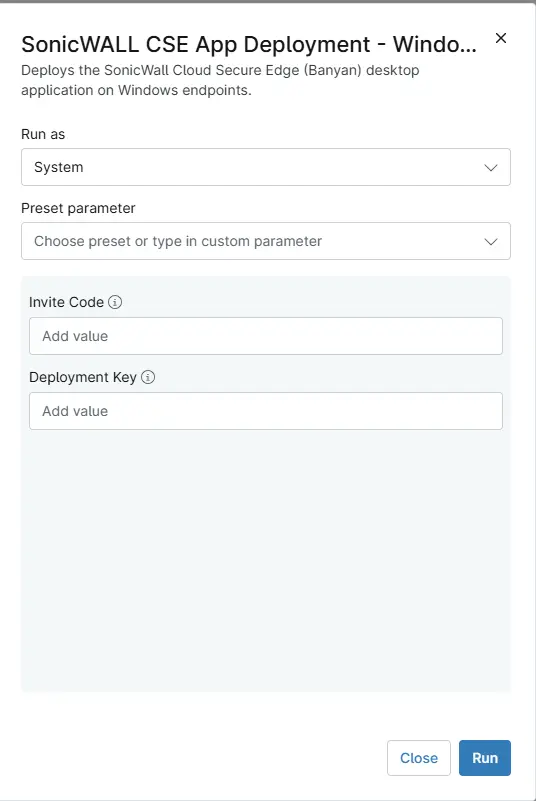

## Overview

Deploys the SonicWall Cloud Secure Edge (Banyan) desktop application on Windows endpoints. The user needs to be logged in.

## Sample Run

`Play Button` > `Run Automation` > `Script`  

## Dependencies

- [Solution - CSE SonicWall Deployment - NinjaOne](/docs/ac43f3f2-821f-4103-91c7-783e33f4aa0f)
- [Custom Field - cPVAL CSE Deployment](/docs/acd50145-b46f-4168-af13-b4512061d240)
- [Custom Field - cPVAL CSE Deployment Key](/docs/96e9cd4c-975b-44eb-85d1-b138e0de1d48)
- [Custom Field - cPVAL CSE InviteCode](/docs/f596a2b4-a5c3-439b-a1b4-57d2c5ffd998)

## Parameters

| Name | Required | Default | Type | Description |
| ---- | -------- | ------- | ---- | ----------- |
| Invite Code | NO | --- | `string/text` | Set this variable to override the value stored in the organization-level custom field cPVAL CSE Invite code. |
| Deployment Key | NO | --- | `string/text` | Set this variable to override the value stored in the organization-level custom field cPVAL CSE Deployment Key. |

## Automation Setup/Import

[Automation Configuration](https://github.com/ProVal-Tech/ninjarmm/blob/main/scripts/sonicwall-cse-app-deployment-windows.ps1)

## Output

- Activity Details  

## Changelog

### 2026-06-08

- Initial version of the document
