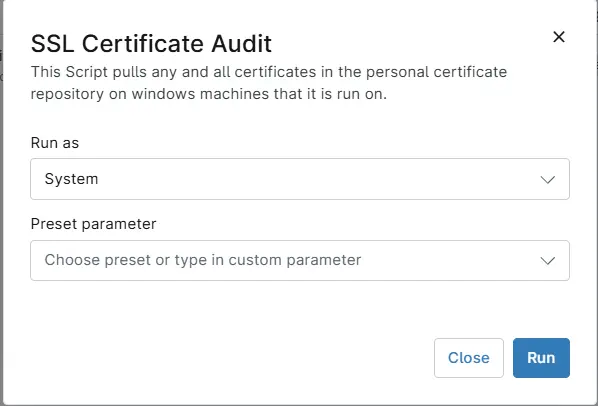

## Overview
This Script pulls any and all certificates in the personal certificate repository on windows machines that it is run on. It then updates the custom field [cPVAL SSL certificate Audit](/docs/350874e6-7bef-4bff-8fce-f2772acab495) with the SSL details.

## Sample Run

`Play Button` > `Run Automation` > `Script`  

## Dependencies
- [Solution - SSL Certificate Audit](/docs/cf5acc69-183c-4838-9484-2f3d9a247877)
- [Custom field - cPVAL SSL certificate Audit](/docs/350874e6-7bef-4bff-8fce-f2772acab495) 

## Automation Setup/Import

[Automation Configuration](https://github.com/ProVal-Tech/ninjarmm/blob/main/scripts/ssl-certificate-audit.ps1)

## Output

- Activity Details  
- Custom Field

## Changelog

### 2026-02-13

- Initial version of the document
