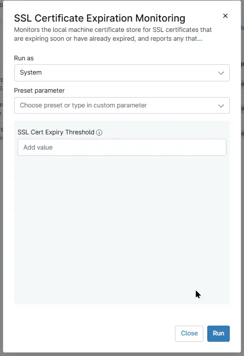

## Overview

Monitors the local machine certificate store for SSL certificates that are expiring soon or have already expired, and reports any that haven't already been alerted on.

## Sample Run

`Play Button` > `Run Automation` > `Script`  

## Dependencies

- [Solution - SSL Certificate Audit](/docs/cf5acc69-183c-4838-9484-2f3d9a247877)

## Parameters

| Name | Example | Accepted Values | Required | Default | Type | Description |
| ---- | ------- | --------------- | -------- | ------- | ---- | ----------- |
| SSL Cert Expiry Threshold | 15 | Numeric Values | False | - | Text | Set the number of days before SSL certificate expiration to detect and report certificates requiring attention. | 

## Automation Setup/Import

[Automation Configuration](https://github.com/ProVal-Tech/ninjarmm/blob/main/scripts/ssl-certificate-expiration-monitoring.ps1)

## Output

- Activity Details 

## Changelog

### 2026-07-22

- Initial version of the document