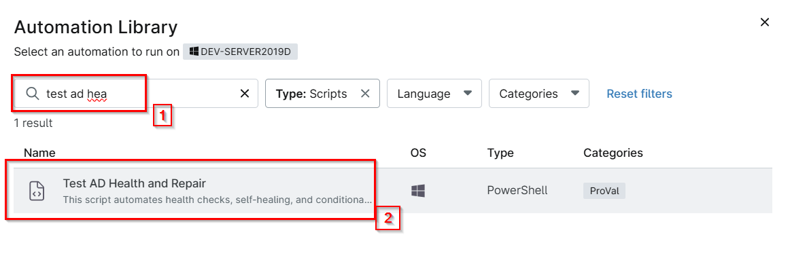
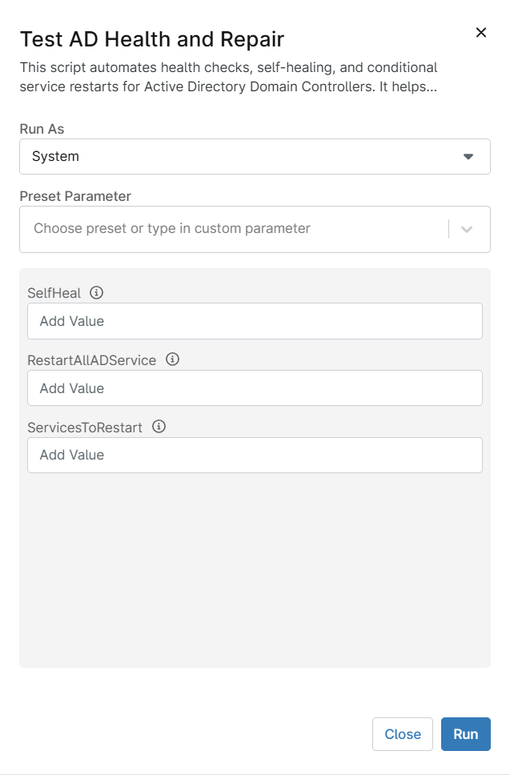
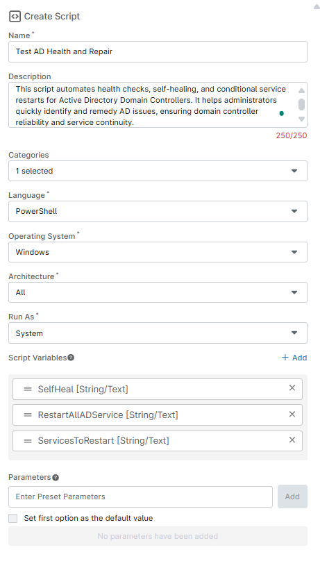
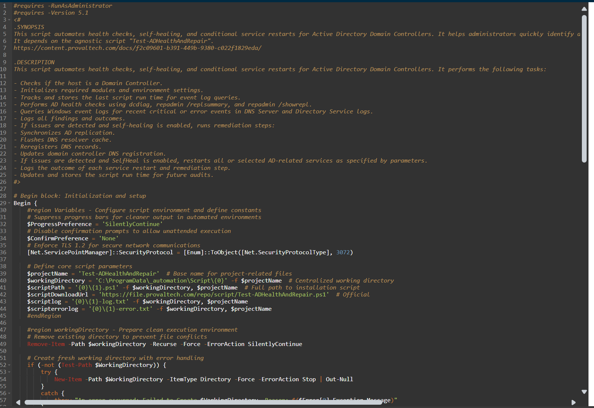
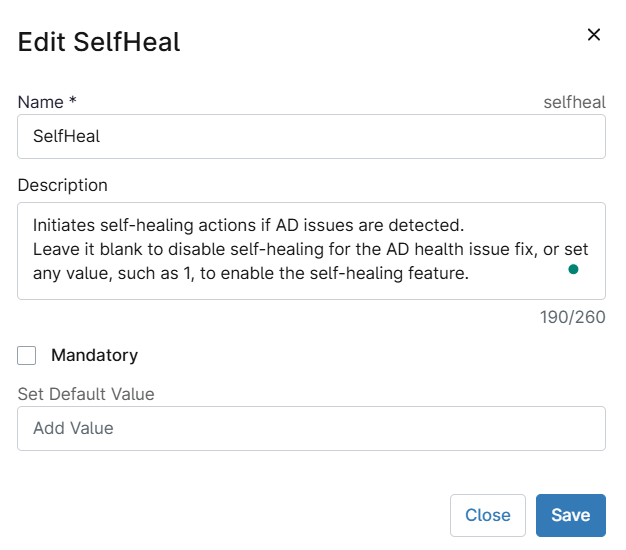
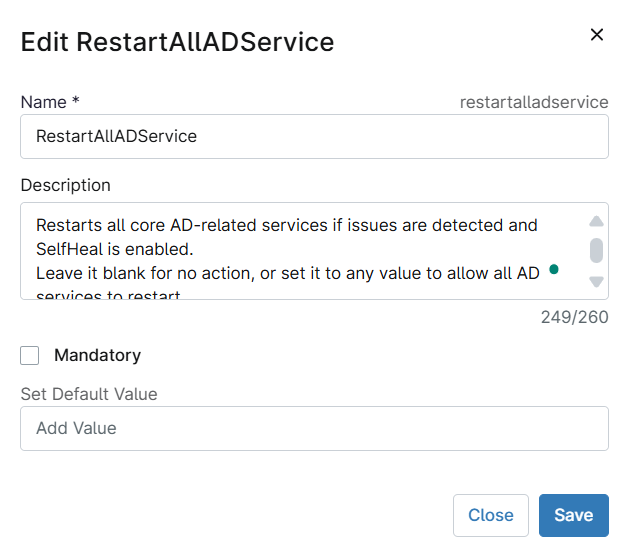
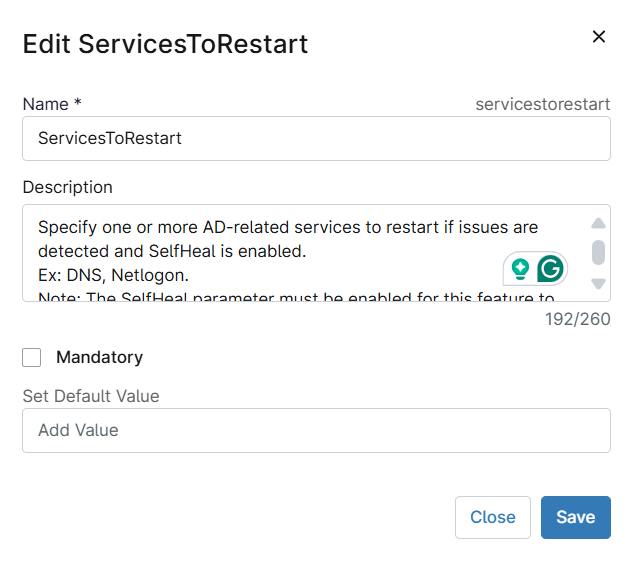
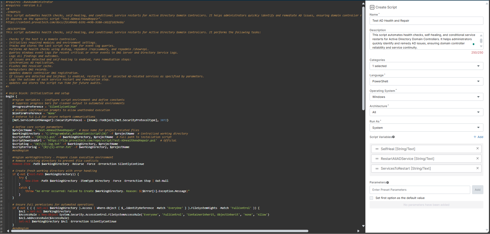

## Overview
This script automates health checks, self-healing, and conditional service restarts for Active Directory Domain Controllers. It helps administrators quickly identify and remediate AD issues, ensuring domain controller reliability and service continuity.

## Sample Run

`Play Button` > `Run Automation` > `Script`  


Search and select `Test Ad Health and Repair`


Set the required arguments and click the `Run` button to run the script.  
**Run As:** `System`  
**Preset Parameter:** `<Leave it Blank>`  
**SelfHeal:** `Initiates self-healing actions if AD issues are detected.Leave it blank to disable self-healing for the AD health issue fix, or set any value, such as 1, to enable the self-healing feature.`  
**RestartAllADService:** `Restarts all core AD-related services if issues are detected and SelfHeal is enabled.Leave it blank for no action, or set it to any value to allow all AD services to restart. Note: The SelfHeal parameter must be enabled for this feature to operate.`  
**ServicesToRestart:**  `Specify one or more AD-related services to restart if issues are detected and SelfHeal is enabled. Ex: DNS, Netlogon. Note: The SelfHeal parameter must be enabled for this feature to operate.`  



**Run Automation:** `Yes`  


## Dependencies

[Agnostic - Test-ADHealthAndRepair](/docs/f2c09601-b391-449b-9380-c022f1829eda)

## Parameters

| Name | Required | Accepted Values | Default | Type | Description |
| ---- | -------- | --------------- | ------- | ---- | ----------- |
| SelfHeal | False | | | String/Text | Initiates self-healing actions if AD issues are detected.Leave it blank to disable self-healing for the AD health issue fix, or set any value, such as 1, to enable the self-healing feature. |
| RestartAllADService | False | | | String/Text | Restarts all core AD-related services if issues are detected and SelfHeal is enabled.Leave it blank for no action, or set it to any value to allow all AD services to restart. Note: The SelfHeal parameter must be enabled for this feature to operate. |
| ServicesToRestart | False | | | String/Text | Specify one or more AD-related services to restart if issues are detected and SelfHeal is enabled. Ex: DNS, Netlogon. Note: The SelfHeal parameter must be enabled for this feature to operate. |


## Automation Setup/Import

### Step 1

Navigate to `Administration` > `Library` > `Automation`  


### Step 2

Locate the `Add` button on the right-hand side of the screen, click on it and click the `New Script` button.  


The scripting window will open.  


### Step 3

Configure the `Create Script` section as follows:

**Name:** `Test AD Health and Repair`  
**Description:** `This script automates health checks, self-healing, and conditional service restarts for Active Directory Domain Controllers. It helps administrators quickly identify and remedy AD issues, ensuring domain controller reliability and service continuity.`  
**Categories:** `ProVal`  
**Language:** `PowerShell`  
**Operating System:** `Windows`  
**Architecture:** `All`  
**Run As:** `System`  

## Step 4

Paste the following powershell script in the scripting section:  

```PowerShell
#requires -RunAsAdministrator
#requires -Version 5.1
<#
.SYNOPSIS
This script automates health checks, self-healing, and conditional service restarts for Active Directory Domain Controllers. It helps administrators quickly identify and remediate AD issues, ensuring domain controller reliability and service continuity.
It depends on the agnostic script "Test-ADHealthAndRepair".
https://content.provaltech.com/docs/f2c09601-b391-449b-9380-c022f1829eda/

.DESCRIPTION
This script automates health checks, self-healing, and conditional service restarts for Active Directory Domain Controllers. It performs the following tasks:

- Checks if the host is a Domain Controller.
- Initializes required modules and environment settings.
- Tracks and stores the last script run time for event log queries.
- Performs AD health checks using dcdiag, repadmin /replsummary, and repadmin /showrepl.
- Queries Windows event logs for recent critical or error events in DNS Server and Directory Service logs.
- Logs all findings and outcomes.
- If issues are detected and self-healing is enabled, runs remediation steps:
- Synchronizes AD replication.
- Flushes DNS resolver cache.
- Reregisters DNS records.
- Updates domain controller DNS registration.
- If issues are detected and SelfHeal is enabled, restarts all or selected AD-related services as specified by parameters.
- Logs the outcome of each service restart and remediation step.
- Updates and stores the script run time for future audits.
#>

# Begin block: Initialization and setup
Begin {
    #region Variables - Configure script environment and define constants
    # Suppress progress bars for cleaner output in automated environments
    $ProgressPreference = 'SilentlyContinue'
    # Disable confirmation prompts to allow unattended execution
    $ConfirmPreference = 'None'
    # Enforce TLS 1.2 for secure network communications
    [Net.ServicePointManager]::SecurityProtocol = [Enum]::ToObject([Net.SecurityProtocolType], 3072)

    # Define core script parameters
    $projectName = 'Test-ADHealthAndRepair'  # Base name for project-related files
    $workingDirectory = 'C:\ProgramData\_automation\Script\{0}' -f $projectName  # Centralized working directory
    $scriptPath = '{0}\{1}.ps1' -f $workingDirectory, $projectName  # Full path to installation script
    $scriptDownloadUrl = 'https://file.provaltech.com/repo/script/Test-ADHealthAndRepair.ps1'  # Official 
    $scriptlog = '{0}\{1}-log.txt' -f $workingDirectory, $projectName
    $scripterrorlog = '{0}\{1}-error.txt' -f $workingDirectory, $projectName
    #endRegion

    #region workingDirectory - Prepare clean execution environment
    # Remove existing directory to prevent file conflicts
    Remove-Item -Path $workingDirectory -Recurse -Force -ErrorAction SilentlyContinue

    # Create fresh working directory with error handling
    if (-not (Test-Path $WorkingDirectory)) {
        try {
            New-Item -Path $WorkingDirectory -ItemType Directory -Force -ErrorAction Stop | Out-Null
        }
        catch {
            throw "An error occurred: Failed to Create $WorkingDirectory. Reason: $($Error[0].Exception.Message)"
        }
    }

    # Ensure full permissions for automated operations
    if (-not ( ( ( Get-Acl $WorkingDirectory ).Access | Where-Object { $_.IdentityReference -Match 'EveryOne' } ).FileSystemRights -Match 'FullControl' )) {
        $Acl = Get-Acl $WorkingDirectory
        $AccessRule = New-Object System.Security.AccessControl.FileSystemAccessRule('Everyone', 'FullControl', 'ContainerInherit, ObjectInherit', 'none', 'Allow')
        $Acl.AddAccessRule($AccessRule)
        Set-Acl $WorkingDirectory $Acl -ErrorAction SilentlyContinue
    }
    #endRegion

    if (-not [string]::IsNullOrEmpty($env:selfheal)) {
        $selfhealcheck = $env:selfheal  # Prefer runtime environment variable
    } 
    if (-not [string]::IsNullOrEmpty($env:servicestorestart)) {
        $ServicesToRestartCheck = $env:servicestorestart
    }
    if (-not [string]::IsNullOrEmpty($env:restartalladservice)) {
        $RestartAllADServiceCheck = $env:restartalladservice
    }
    #endRegion
}

# Process block: Execute the downloaded script with the specified parameters

Process {
    $role = (Get-CimInstance Win32_ComputerSystem).DomainRole

    if ($role -ne 4 -and $role -ne 5) {
        return "This machine is NOT a Domain Controller. Exiting script."
    }
    else {
        Write-Output "This machine IS a Domain Controller. Continuing..."
        
        #Download Script
        $response = Invoke-WebRequest -Uri $scriptDownloadUrl -UseBasicParsing
        if (($response.StatusCode -ne 200) -and (!(Test-Path -Path $scriptPath))) {
            return "An error occurred: No pre-downloaded script exists and the script '$PS1URL' failed to download. Exiting."
        }
        elseif ($response.StatusCode -eq 200) {
            Remove-Item -Path $scriptPath -ErrorAction SilentlyContinue
			Remove-Item -Path $scriptlog -ErrorAction SilentlyContinue
			Remove-Item -Path $scripterrorlog -ErrorAction SilentlyContinue
            [System.IO.File]::WriteAllLines($scriptPath, $response.Content)
        }
        if (!(Test-Path -Path $scriptPath)) {
            return 'An error occurred: The script could not be downloaded. Exiting.'
        }
        #EndRegion
        #region Execution Logic
        if ([string]::IsNullOrEmpty($SelfhealCheck) -and [string]::IsNullOrEmpty($RestartAllADServiceCheck) -and [string]::IsNullOrEmpty($ServicesToRestartCheck)) {
            # No parameters set
            & $scriptPath *> $null
            Write-Output "To see full details, check the log file at: $scriptlog"
            Get-Content -Path $scriptlog | Select-Object -Last 50
        }
        elseif (-not [string]::IsNullOrEmpty($SelfhealCheck) -and [string]::IsNullOrEmpty($RestartAllADServiceCheck) -and [string]::IsNullOrEmpty($ServicesToRestartCheck)) {
            # Only SelfHealCheck
            & $scriptPath -SelfHeal *> $null
            Write-Output "To see full details, check the log file at: $scriptlog"
            Get-Content -Path $scriptlog | Select-Object -Last 50
        }
        elseif (-not [string]::IsNullOrEmpty($SelfhealCheck) -and -not [string]::IsNullOrEmpty($RestartAllADServiceCheck)) {
            # SelfHealCheck and RestartAllADServiceCheck
            & $scriptPath -SelfHeal -RestartAllADService *> $null
            Write-Output "To see full details, check the log file at: $scriptlog"
            Get-Content -Path $scriptlog | Select-Object -Last 50
        }
        elseif (-not [string]::IsNullOrEmpty($SelfhealCheck) -and -not [string]::IsNullOrEmpty($ServicesToRestartCheck)) {
            # SelfHealCheck and specific services
            $services = $ServicesToRestartCheck -split ',' | ForEach-Object { $_.Trim() }
            & $scriptPath -SelfHeal -ServicesToRestart $services *> $null
            Write-Output "To see full details, check the log file at: $scriptlog"
            Get-Content -Path $scriptlog | Select-Object -Last 50
        }
        else {
            return 'An error occurred: Invalid combination of parameters provided.'
        }
        #endregion
    }
}
# End block: Final cleanup or additional actions (if needed)
End {}
```



## Script Variables

### SelfHeal

Click the `Add` button next to `Script Variables`.  


Select the `String/Text` option.  


The `Add String/Text Variable` window will open.  


In the box, fill in the following details and select `Add` to create the script variable.  

**Name:** `SelfHeal`  
**Description:** `Initiates self-healing actions if AD issues are detected. Leave it blank to disable self-healing for the AD health issue fix, or set any value, such as 1, to enable the self-healing feature.`  
**Mandatory:** `<Leave it Unchecked>`  
**Set Default Value:** `<Leave it blank>`



### RestartAllADService

Click the `Add` button next to `Script Variables`.  


Select the `String/Text` option.  


The `Add String/Text Variable` window will open.  


In the box, fill in the following details and select `Add` to create the script variable.  

**Name:** `RestartAllADService`  
**Description:** `Restarts all core AD-related services if issues are detected and SelfHeal is enabled. Leave it blank for no action, or set it to any value to allow all AD services to restart. Note: The SelfHeal parameter must be enabled for this feature to operate.`  
**Mandatory:** `<Leave it Unchecked>`  
**Set Default Value:** `<Leave it blank>`



### Huntress Tags

Click the `Add` button next to `Script Variables`.  


Select the `String/Text` option.  


The `Add String/Text Variable` window will open.  


In the box, fill in the following details and select `Add` to create the script variable.  

**Name:** `ServicesToRestart`  
**Description:** `Specify one or more AD-related services to restart if issues are detected and SelfHeal is enabled. Ex: DNS, Netlogon. Note: The SelfHeal parameter must be enabled for this feature to operate.`  
**Mandatory:** `<Leave it Unchecked>`  
**Set Default Value:** `<Leave it blank>`




## Saving the Automation

Click the `Save` button in the top-right corner of the screen to save your automation.  


You will be prompted to enter your MFA code. Provide the code and press the Continue button to finalize the process.  


## Completed Automation




## Output

- Activity Details
- Refer to the logs: "C:\ProgramData\_automation\Script\Test-ADHealthAndRepair\Test-ADHealthAndRepair-log.txt"
- Refer to the error logs:
"C:\ProgramData\_automation\Script\Test-ADHealthAndRepair\Test-ADHealthAndRepair-error.txt"