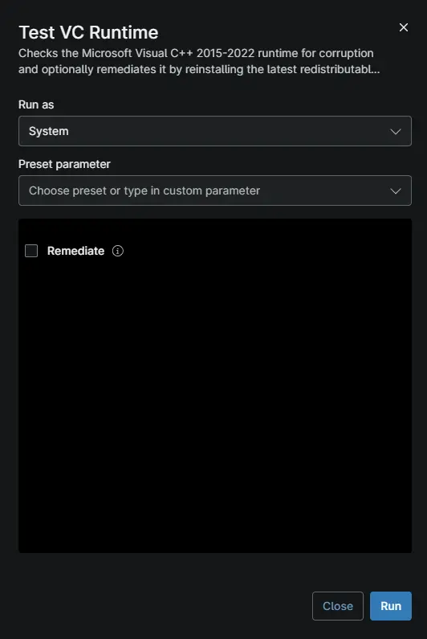

## Overview

This script checks whether the Microsoft Visual C++ 2015-2022 runtime is healthy and can repair it if it is corrupted. Many Windows applications need this runtime to start. The script is part of the [Visual C++ Health Remediation](/docs/6646d475-e16b-4fa0-b758-fede6155ed96) solution.

## Choose a Mode

The `Remediate` checkbox decides whether the script only checks the runtime or also repairs it.

| Remediate | What Happens | Use It When |
| :--- | :--- | :--- |
| Unchecked | Checks the runtime and reports the result. Nothing on the device changes. | You want to find affected devices without making changes. |
| Checked | Checks the runtime and repairs it if it is corrupted. Healthy devices are left unchanged. | You want to fix affected devices. |

## What the Repair Does

When the runtime is corrupted and `Remediate` is checked, the script:

1. Downloads and installs the latest Visual C++ runtime from Microsoft.
2. Repairs Windows system files with DISM and System File Checker (SFC), the built-in Windows repair tools.
3. Checks the runtime again to confirm the repair worked.
4. Deletes the files it downloaded.

The script never restarts the device. If a restart is needed to finish the repair, the activity output says so.

## Understand the Results

After each run, the result is saved to the [cPVAL VC Runtime Health Status](/docs/81660c29-6528-4cb0-9dbe-964ba1b4588e) custom field.

| Result | Exit Code | What It Means |
| :--- | :--- | :--- |
| `Healthy` | `0` | The runtime is working. No action is needed. |
| `Corrupted` | `1` | The runtime is damaged or missing files. Run the script with `Remediate` checked to repair it. |

## Before You Run the Script

- The device needs internet access. Repair runs also download installers from Microsoft.
- Repair runs can take 30 minutes or more. Set the automation timeout to allow for this.
- Keep the automation's architecture set to 64-bit. The script stops if it runs as 32-bit.

## Troubleshooting

| Problem | Cause | Solution |
| :--- | :--- | :--- |
| The activity shows as failed after a repair run. | The script records the original corruption as an error, even when the repair works. | Look for `Visual C++ runtime state: Healthy` in the activity output. This means the repair worked. |
| The result is still `Corrupted` after a repair run. | A repair step failed, or the device needs a restart to finish. | Check the activity output for the failed step. Restart the device if the output asks for it, then run the script again. |
| Repairs fail on devices that get updates from WSUS (Windows Server Update Services). | DISM cannot download repair files through WSUS. | In Group Policy, enable **Specify settings for optional component installation and component repair**. Select the option to download repair content directly from Windows Update. |
| The script ends with an error before showing a result. | The device could not download the script, or security software blocked it. | Check the device's internet access and security software, then run the script again. |

## Sample Run

> **Note:** The [Windows Workstations](/docs/0f9b6490-325a-4863-8d1a-e4e38f21f0e6) and [Windows Servers](/docs/8be26d10-ce6c-49b1-99ac-bd5b3bdafc2d) compound conditions run this script automatically on devices in scope. Run it manually to check or repair a single device.

## Dependencies

- [Test-VcRuntime](/docs/bb5b1652-515d-4981-95ca-a983d1e04b84)
- [Custom Field: cPVAL VC Runtime Health Status](/docs/81660c29-6528-4cb0-9dbe-964ba1b4588e)
- [Custom Field: cPVAL VC Runtime Remediation](/docs/c6895ff6-39ae-403c-9436-4830e1a84d4c)
- [Solution: Visual C++ Health Remediation](/docs/6646d475-e16b-4fa0-b758-fede6155ed96)

## Custom Fields

| Custom Field | Type | Example | Scope | Available Options | Editable | Description |
| :--- | :--- | :--- | :--- | :--- | :--- | :--- |
| [cPVAL VC Runtime Health Status](/docs/81660c29-6528-4cb0-9dbe-964ba1b4588e) | Text | `Healthy` | Device | N/A | No | Shows the result of the latest run: `Healthy` or `Corrupted`. |
| [cPVAL VC Runtime Remediation](/docs/c6895ff6-39ae-403c-9436-4830e1a84d4c) | Dropdown | `Windows` | System, Organization, Location, Device | `Windows`, `Windows Servers`, `Windows Workstations`, `Disable` | Yes | Selects which devices the solution runs on. Set to `Disable` to exclude a device or location. |

## Script Variables

| Name | Type | Example | Default | Available Options | Description |
| :--- | :--- | :--- | :--- | :--- | :--- |
| `Remediate` | Checkbox | `True` | `False` | `True`, `False` | Check to repair a corrupted runtime. Leave unchecked to only check it. |

> **💡 Note:** Do not edit the script file. It is digitally signed, and any change stops it from running.

## Automation Setup/Import

[Automation Configuration](https://github.com/ProVal-Tech/ninjarmm/blob/main/scripts/test-vc-runtime.ps1)

## Output

- **Activity Details:** The result and a log of each step.
- **Custom Field:** `cPVAL VC Runtime Health Status` shows `Healthy` or `Corrupted`.

## Changelog

### 2026-09-24

- Initial version of the document
