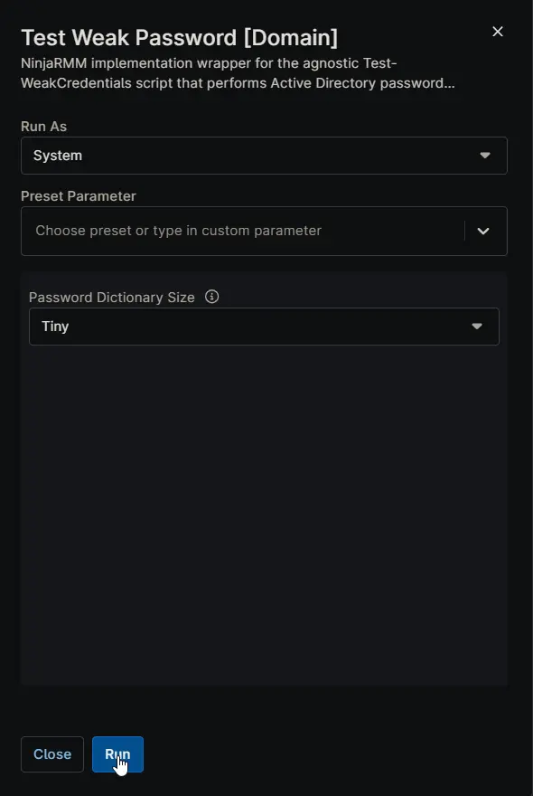

## Overview

NinjaRMM implementation wrapper for the agnostic [Test-WeakCredentials](/docs/9188a8e9-ba15-45aa-9391-d412866b1ebc) script that performs Active Directory password auditing with intelligent alerting and platform-specific data formatting.

The audit output includes:

- Current security configuration state (e.g., reversible encryption, interactive logon messages)
- All detected duplicate passwords
- All detected weak passwords
- Collection timestamp

The custom field is updated on every run so administrators always see the latest audit snapshot.

## Requirements

- Script must run on a Primary Domain Controller (DomainRole = 5)
- Internet access required for initial script download (optional afterwards)
- Minimum 20 GB free disk space if using the "Large" dictionary
- TLS 1.2 or TLS 1.3 support for downloads

## Sample Run

## Dependencies

- [PowerShell Script: Test-WeakCredentials](/docs/9188a8e9-ba15-45aa-9391-d412866b1ebc)
- [Custom Field: cPVAL Weak Credentials Audit](/docs/35c7cb4a-f876-4186-8336-c95878622a04)
- [Solution: Weak Credentials Monitoring](/docs/7d087aad-e93d-45d6-bc30-b31f8e78d6e6)

## Parameters

| Name | Example | Accepted Values | Required | Default | Type | Description |
| ---- | ------- | --------------- | -------- | ------- | ---- | ----------- |
| Password Dictionary Size | Tiny | Tiny, Small, Medium, Large | No | Tiny | Drop-down | Dictionary size used for password checks. Download sizes: Tiny = 3 MB; Small = 58 MB; Medium = 253 MB; Large = 2.9 GB. Top option (Tiny) is the default. |

## Automation Setup/Import

[Automation Configuration](https://github.com/ProVal-Tech/ninjarmm/blob/main/scripts/test-weak-password-domain.ps1)

## Output

- Activity Details  
- Custom Field
