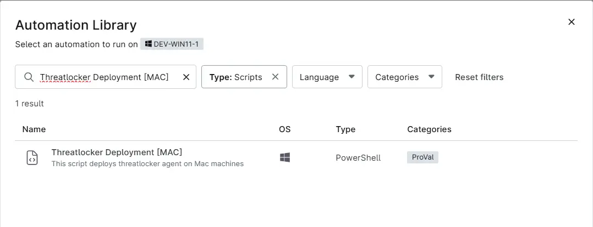
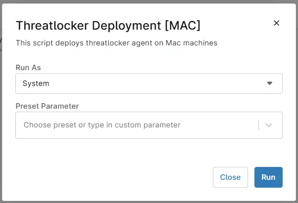
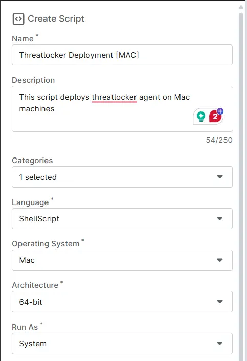
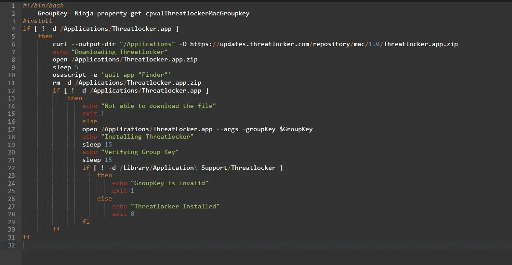
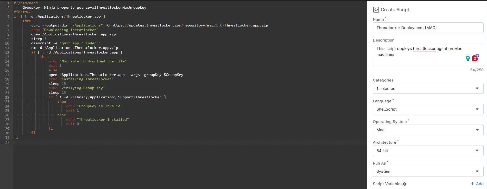

## Overview
This script deploys threatlocker agent on Mac machines.

## Sample Run

`Play Button` > `Run Automation` > `Script`  


Search and select `Threatlocker Deployment [MAC]`


Set the required arguments and click the Run button to run the script.  
`Run As`: System  
`Preset Parameter`: `<Leave it Blank>`    


`Run Automation`: Yes


## Dependencies
- [cPVAL ThreatLocker Mac GroupKey](/docs/8305e5b2-41ee-44bb-848e-758ac72b185f)  
- [cPVAL Threatlocker Deployment](/docs/c7aa0c9d-9b6b-4a78-bbf4-01a626acd6c2)
- [cPVAL Threatlocker Deployment - Exclude](/docs/c3329dd9-bdf8-42f6-aacc-bcfde0fa94da)
- [Threatlocker Deployment [NinjaOne]](/docs/a1efd808-41ad-4dee-9ea1-ff0c2a36e019)

## Automation Setup/Import

### Step 1

Navigate to `Administration` > `Library` > `Automation`  


### Step 2

Locate the `Add` button on the right-hand side of the screen, click on it and click the `New Script` button.  


The scripting window will open.  


### Step 3

Configure the `Create Script` section as follows:

`Name`: Threatlocker Deployment [MAC]  
`Description`: This script deploys threatlocker agent on Mac machine  
`Categories`: ProVal  
`Language`: ShellScript  
`Operating System`: Mac  
`Architecture`: 64-bit  
`Run As`: System  



### Step 4

Paste the following Shell script in the scripting section:

```
#!/bin/bash
    GroupKey= Ninja-property-get cpvalThreatlockerMacGroupkey
#install
if [ ! -d /Applications/Threatlocker.app ]
    then
        curl --output-dir "/Applications" -O https://updates.threatlocker.com/repository/mac/1.0/Threatlocker.app.zip
        echo "Downloading Threatlocker"
        open /Applications/Threatlocker.app.zip
        sleep 5
        osascript -e 'quit app "Finder"'
        rm -d /Applications/Threatlocker.app.zip
        if [ ! -d /Applications/Threatlocker.app ]
            then
                echo "Not able to download the file"
                exit 1
                else
                open /Applications/ThreatLocker.app --args -groupKey $GroupKey
                echo "Installing Threatlocker"
                sleep 15
                echo "Verifying Group Key"
                sleep 15
                if [ ! -d /Library/Application\ Support/Threatlocker ]
                    then
                        echo "GroupKey is Invalid"
                        exit 1
                    else
                        echo "Threatlocker Installed"
                        exit 0
                fi
        fi
fi
```


## Script Variables

Click the `Add` button next to `Script Variables`.  


## Saving the Automation

Click the Save button in the top-right corner of the screen to save your automation.  


You will be prompted to enter your MFA code. Provide the code and press the Continue button to finalize the process.  


## Completed Automation


## Output
- Activity Details  
