## Overview
This script will check for ThreatLocker and attempt to install if not present on Windows Machines. It matches the organization to the client name. If no match is found, it will create the company in the Threatlocker Portal. By default, servers will be installed into the Servers group, and workstations will be installed into the Workstations group.

## Sample Run

`Play Button` > `Run Automation` > `Script`  
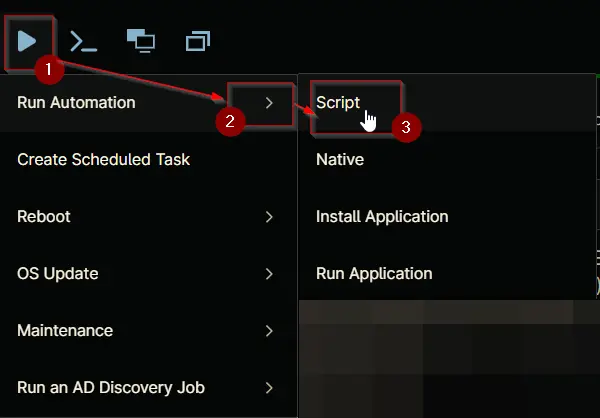

Search and select `Threatlocker Deployment`
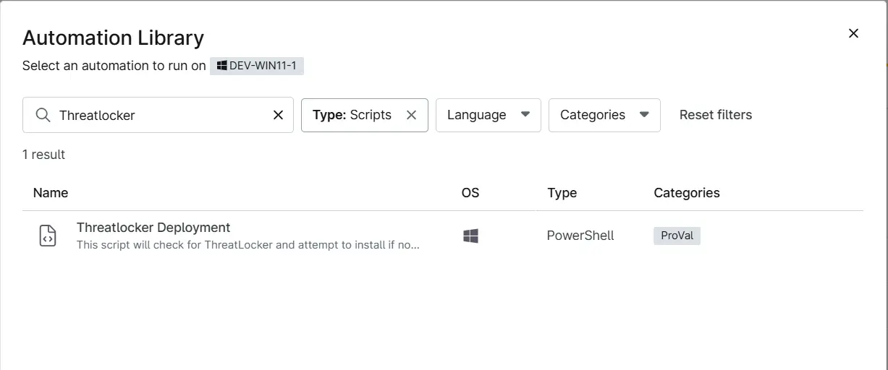

Set the required arguments and click the Run button to run the script.  
`Run As`: System  
`Preset Parameter`: `<Leave it Blank>`    
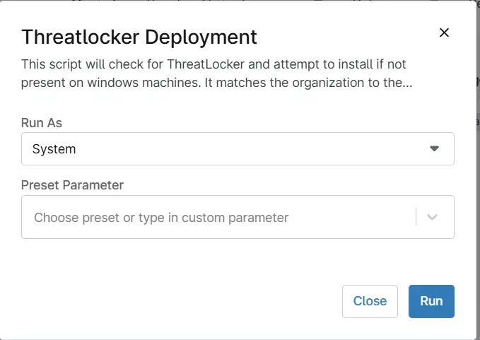

`Run Automation`: Yes
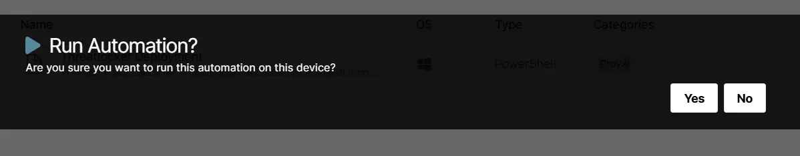


## Dependencies
- [cPVAL Threatlocker Auth Key](/docs/0ff9eab8-6df8-4154-9ecc-4f5bdedd648a) 
- [cPVAL Threatlocker Organization Name](/docs/573751d4-0648-4da9-8ec3-0ab96d4730de) 
- [cPVAL Threatlocker Deployment](/docs/c7aa0c9d-9b6b-4a78-bbf4-01a626acd6c2)
- [cPVAL Threatlocker Deployment - Exclude](/docs/c3329dd9-bdf8-42f6-aacc-bcfde0fa94da)
- [Threatlocker Deployment [NinjaOne]](/docs/a1efd808-41ad-4dee-9ea1-ff0c2a36e019)

## Automation Setup/Import

### Step 1

Navigate to `Administration` > `Library` > `Automation`  
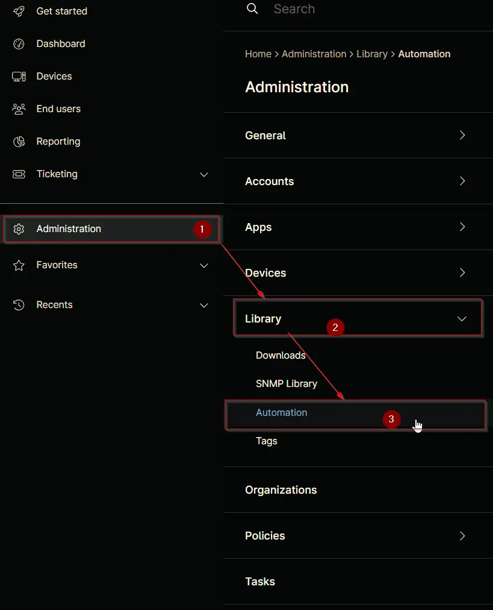

### Step 2

Locate the `Add` button on the right-hand side of the screen, click on it and click the `New Script` button.  
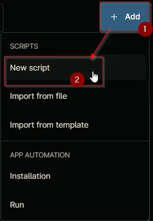

The scripting window will open.  
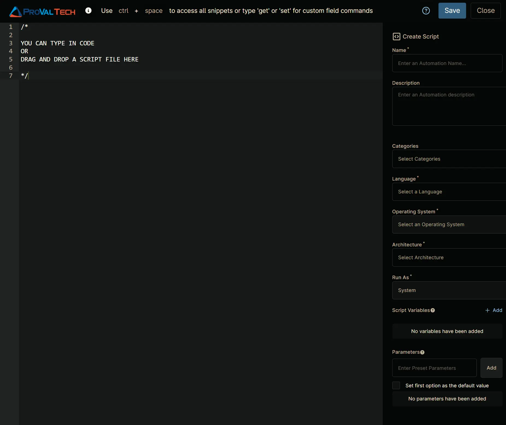

### Step 3

Configure the `Create Script` section as follows:

`Name`: Threatlocker Deployment  
`Description`: This script will check for ThreatLocker and attempt to install if not present on windows machines.
It matches the organization to the client name, if no match is found, it will create the organtization in Threatlcoker.  
`Categories`: ProVal   
`Language`: PowerShell  
`Operating System`: Windows  
`Architecture`: All  
`Run As`: System  
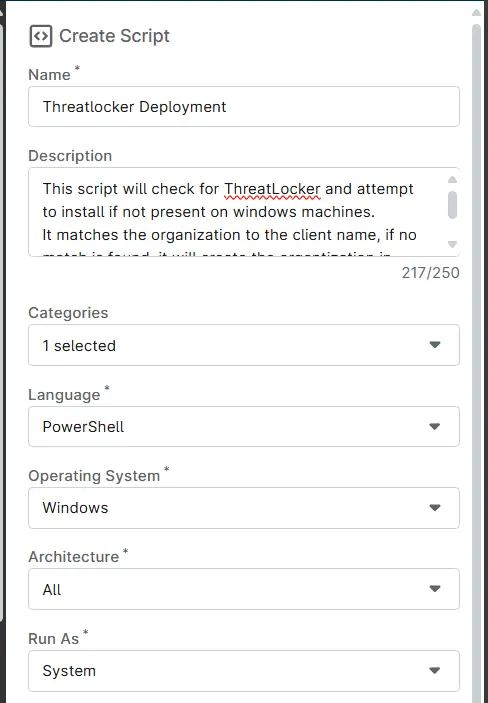


### Step 4

Paste the following Shell script in the scripting section:

```
[Net.ServicePointManager]::SecurityProtocol = "Tls12"

## Variables
[String]$organizationName = Ninja-property-get cpvalThreatlockerOrganizationName
[String]$UniqueIdentifier = Ninja-property-get cpvalThreatlockerAuthKey


if(!($organizationName ))
{
  Throw 'Error: Missing Organization Name. Configure it in NinjaOne field ''cpvalThreatlcokerOrganizationName'''
}

if(!($UniqueIdentifier))
{
  Throw 'Error: Missing Threatlocker Authenticatio Key. Configure it in NinjaOne field ''cpvalThreatlockerAuthKey'''
}

$service = Get-Service -Name ThreatLockerService -ErrorAction SilentlyContinue;

if ($service.Name -eq "ThreatLockerService" -and $service.Status -eq "Running") {
    return "Already Installed"
}


## Check if directory exists and create if not
if (!(Test-Path "C:\ProgramData\_automation\script\Threatlocker")) {
    mkdir "C:\ProgramData\_automation\script\Threatlocker";
}

## Check the OS architecture and download the correct installer
try {
    if ([Environment]::Is64BitOperatingSystem) {
        $downloadURL = "https://api.threatlocker.com/updates/installers/threatlockerstubx64.exe";
    }
    else {
        $downloadURL = "https://api.threatlocker.com/updates/installers/threatlockerstubx86.exe";
    }

    $localInstaller = "C:\ProgramData\_automation\script\Threatlocker\ThreatLockerStub.exe";

    Invoke-WebRequest -Uri $downloadURL -OutFile $localInstaller -Usebasicparsing;
    
}
catch {
    Write-Output "Failed to get download the installer";
    return;
}

## Attempt install
try {
    & "C:\ProgramData\_automation\script\Threatlocker\ThreatLockerStub.exe" key=$UniqueIdentifier Company=$organizationName
}
catch {
    Write-Output "Installation Failed";
    return
}

## Verify install
$service = Get-Service -Name ThreatLockerService -ErrorAction SilentlyContinue;

if ($service.Name -eq "ThreatLockerService" -and $service.Status -eq "Running") {
    Write-Output "Installation successful";
    return;
}
else {
    ## Check the OS type
    $osInfo = Get-CimInstance -ClassName Win32_OperatingSystem
    
    if ($osInfo.ProductType -ne 1) {
        Write-Output "Installation Failed";
        return
    }
}
```
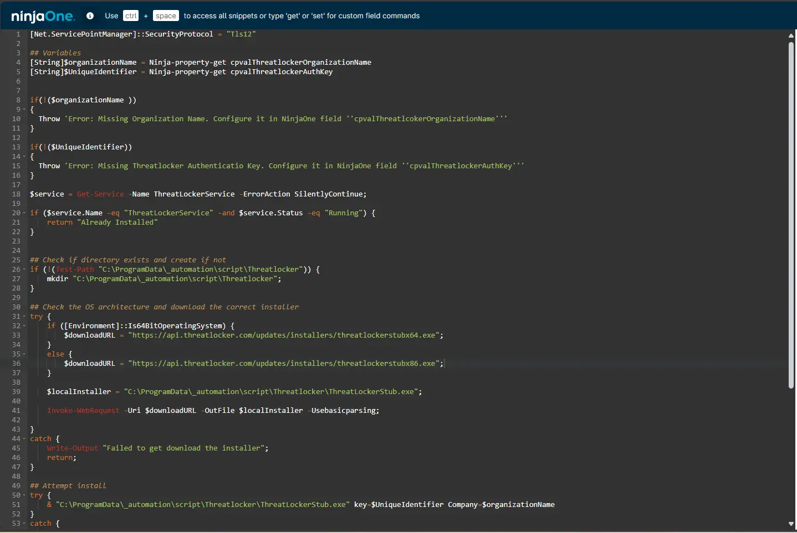

## Saving the Automation

Click the Save button in the top-right corner of the screen to save your automation.  


You will be prompted to enter your MFA code. Provide the code and press the Continue button to finalize the process.  
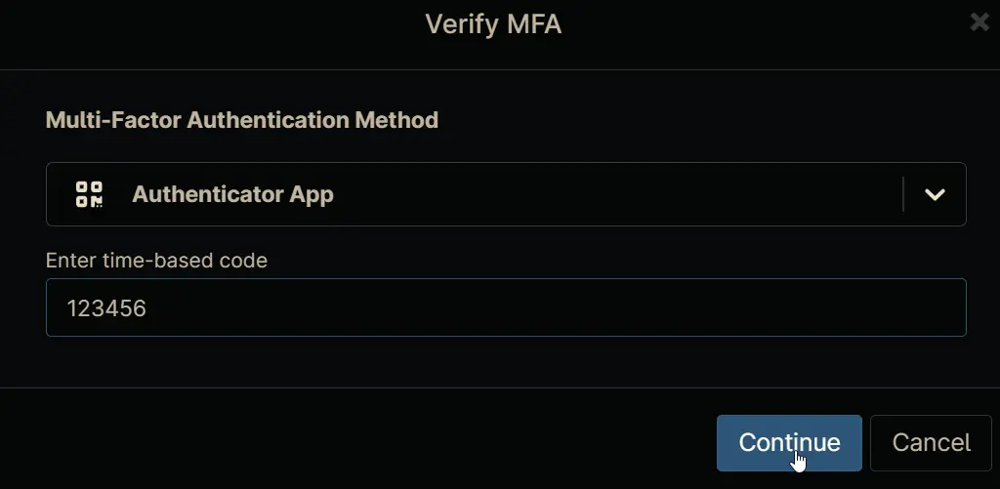

## Completed Automation
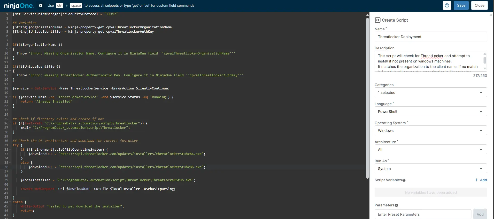

## Output

- Activity Details  
