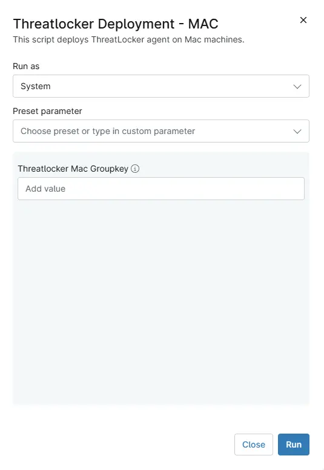

## Overview

This script will check for ThreatLocker and attempt to install if not present on Windows Machines. It matches the organization to the client name. If no match is found, it will create the company in the ThreatLocker Portal. By default, servers will be installed into the Servers group, and workstations will be installed into the Workstations group.

## Sample Run

`Play Button` > `Run Automation` > `Script`  

## Dependencies

- [cPVAL ThreatLocker Auth Key](/docs/0ff9eab8-6df8-4154-9ecc-4f5bdedd648a)
- [cPVAL ThreatLocker Organization Name](/docs/573751d4-0648-4da9-8ec3-0ab96d4730de)
- [cPVAL ThreatLocker Deployment](/docs/c7aa0c9d-9b6b-4a78-bbf4-01a626acd6c2)
- [Solution - ThreatLocker Deployment [NinjaOne]](/docs/a1efd808-41ad-4dee-9ea1-ff0c2a36e019)

## Parameters

| Name |  Required | Default | Type | Description |
| ---- | -------- | ------- | ---- | ----------- |
| ThreatLocker AuthKey | False  | -- | `String/Text` | Set this variable to override the value stored in the organization-level custom field cPVAL ThreatLocker AuthKey |
| ThreatLocker Org Key | False  | -- | `String/Text` | Set this variable to override the value stored in the organization-level custom field cPVAL ThreatLocker OrganizationName |

## Automation Setup/Import

[Automation Configuration](https://github.com/ProVal-Tech/ninjarmm/blob/main/scripts/threatlocker-deployment-windows.ps1)

## Output

- Activity Details
