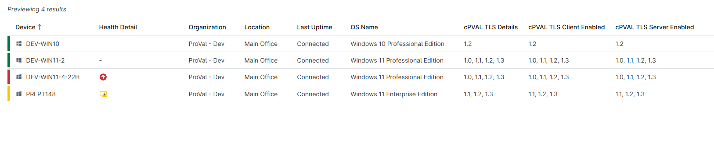
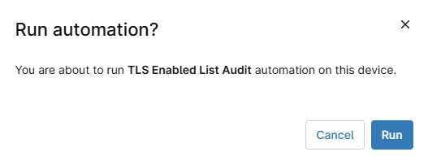

## Overview

This PowerShell script shows the list of TLS servers, and client are enabled.

## Sample Run

`Play Button` > `Run Automation` > `Script`  

Search for the `TLS Enable List Audit` and click `Run`

Click `Run`

## Dependencies

[Solution - TLS Version Audit](/docs/9882903a-a467-4136-bb9e-7e2c8f25ae01)

## Automation Setup/Import

[Automation Configuration](https://github.com/ProVal-Tech/ninjarmm/blob/main/scripts/tls-enabled-list-audit.ps1)

## Output

- Activity Details  
- Custom Field

## Changelog

### 2026-04-15

- Initial version of the document