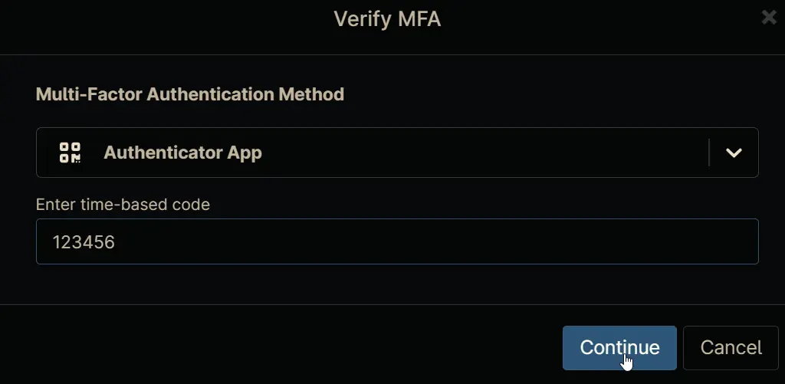

## Overview

Sends a toast message/notification to the currently signed in user and display a message saved in the custom field. This needs to be run as the Current Logged-on User. The script defaults to using NinjaOne's logo if none is provided.

## Sample Run

`Play Button` > `Run Automation` > `Script`  


Search and select `Display Toast Message - Standard Notification (Custom Field)`


Set the required arguments and click the `Run` button to run the script.

- **Run As:**: `Current Logged on User`
- **Preset Parameter:**: `<Leave it Blank>`  

Fill the Script variables as per requirement. For more information on these script variables, Go To **Parameters** Section.


**Run Automation:** `Yes` 


## Parameters

| Name | Example | Accepted Values | Required | Default | Type | Description |
| ---- | ------- | --------------- | -------- | ------- | ---- | ----------- |
| Title | Soji Results |  | True |  | Text | The Title used in the Toast notification. Maximum length displayed is 64 characters. Any thing beyond the 64 characters will be truncated and not displayed. |
| Message | cpvalsojiresult | Any valid cutom field label  | True |  | Text | Name of the custom field to display. Maximum length displayed is 200 characters, but the toast can be expanded to show more of the message, but will not show the full message if it is too long. |
| Application Id | ProVal Tech |  | False |  | Text | The Application Id that this script will use, defaults to your company name. This is not visible to the user. |
| Make Image a Circle | Unmarked |  | False | False | Flag | If checked, the image will be made a circle. |
| Path To Image File | https://labtech.provaltech.com/labtech/transfer/images/alogo.jpg |  | False | Ninja Logo | Text | The path to where an existing image is located and will be used in the toast message. Alternatively, a URL can be used in the toast message. The image should be square, e.g., 128x128. The Ninja Logo will be used if none is provided. |

## Automation Setup/Import

### Step 1

Navigate to `Administration` > `Library` > `Automation`  


### Step 2

Locate the `Add` button on the right-hand side of the screen, click on it and click the `New Script` button.  


The scripting window will open.  


### Step 3

Configure the `Create Script` section as follows:

- **Name:** `Display Toast Message - Standard Notification (Custom Field)`
- **Description:** `Sends a toast message/notification to the currently signed in user. Please run as the Current Logged-on User. The script defaults to using NinjaOnes logo if none is provided.`
- **Categories:** `ProVal`  
- **Language:**  `PowerShell`
- **Operating System:**  `Windows`
- **Architecture:** `All`
- **Run As:** `Current Logged on User`


## Step 4

Paste the following powershell script in the scripting section:  
```PowerShell
#Requires -Version 5.1

<#
.SYNOPSIS
    Sends a toast message/notification to the currently signed in user. Please run as the Current Logged-on User. The script defaults to using NinjaOne's logo if none is provided.
.DESCRIPTION
    Sends a toast message/notification to the currently signed in user. Please run as 'Current Logged on User'.
    This defaults to using NinjaOne's logo in the Toast Message, but you can specify any png formatted image from a url.
    You can also specify the "ApplicationId" to any string. The default is "NinjaOne RMM".

.EXAMPLE
    -Title "My Title Here" -Message "My Message Here"
    Sends the title "My Title Here" and message "My Message Here" as a Toast message/notification to the currently signed in user.
.EXAMPLE
    -Title "My Title Here" -Message "My Message Here" -ApplicationId "MyCompany"
    Sends the title "My Title Here" and message "My Message Here" as a Toast message/notification to the currently signed in user.
        ApplicationId: Creates a registry entry for your toasts called "MyCompany".
        PathToImageFile: Downloads a png image for the icon in the toast message/notification.
        MakeImageaCircle: Makes the image a circle.
.OUTPUTS
    None
.NOTES
    If you want to change the defaults then with in the param block.
    ImagePath uses C:\Users\Public\ as that is accessible by all users.
    If you want to customize the application name to show your company name,
        then look for $ApplicationId and change the content between the double quotes.

    Minimum OS Architecture Supported: Windows 10 (IoT editions are not supported due to lack of shell)
    Release Notes: Updated Calculated Name
#>

[CmdletBinding()]
param
(
    [string]$Title,
    [string]$Message,
    [string]$ApplicationId,
    [switch]$MakeImageaCircle,
    [string]$PathToImageFile
)

begin {
    $Base64 = 'iVBORw0KGgoAAAANSUhEUgAAAIAAAACACAMAAAD04JH5AAAAJFBMVEUARF0Apc0AmL8ApM0Aos0Aps7///8Am8ia1ug9rtLd8/jw+/2tMDHwAAAABXRSTlMBrBTIcce4nvwAAAIeSURBVHic7dvrcoMgEAXgiOAivv/7Fm+JBpCLwk7bsz86rcNkPw+Y0Gl5vd4lGtbLKSG7vmF18mwQnWpe3YcghP2Z1svU8OtbIOihm8op25M2gWBov9UqYJj/vSRzAGsEkhMglxngWINbdbxLAAAAAAAAAAAAAKAI8Oz2KRtApPWThEyAbT8NZwDZGpeav6sLIKXNMBwAtuGotTGTvTpMRms9qkxEBsDe/dz+A7B3rufeS/utrCKPkAywzfYmK8BeOHY+lBkzBImALfwDgA4XnNLphCTA4e43AKmL9vNMJD8pCQAna20nP5D+SfkQgJyp1qS9PYsEKQDnpVP627WYJCgBmGj+GRmUAFIraSXWBAwDcwJJk1AXMIzcgHgElQHxCGoDohHcBsybgIvPpei70S2A0csuaNkTBRBTbA7uAOb271E0+gWxOSgHfG87yD+wGsCz7fGONNf9iwGTb89DnlkwkUVQCPD2t1sXz9A6gMDT5YsgsggKARljI/vTMkDo7cU3B1USCL+oOwdVAMGF5RlcAxB+tBoBwq/JDlDcAPYEAGgDuPiNBwkgASSABJAAEkACSAAJIAEkgASQABL4JwlcA9w/9N4GTOZcl1OQMTgRoEannhv9O/+PCAAAAAAAAAAAAACAPwhgP+7HeOCR1jOfjBHI9dBrz9W/34/d9jyHLvvPweP2GdCx/3zyvLlAfZ8+l13LktJzAJ+nfgAP50EVLvPsRgAAAABJRU5ErkJggg=='
    [string]$ImagePath = "C:\Users\Public\PowerShellToastImage.png"

    # Set the default ApplicationId if it's not provided. Use the Company Name if available, otherwise use the default.
    $ApplicationId = if ($env:NINJA_COMPANY_NAME) { $env:NINJA_COMPANY_NAME } else { "NinjaOne RMM" }

    Write-Host "[Info] Using ApplicationId: $($ApplicationId -replace '\s+','.')"

    if ($env:title -and $env:title -notlike "null") { $Title = $env:title }
    if ($env:message -and $env:message -notlike "null") { $Message = Ninja-Property-Get $env:message }
    if ($env:applicationId -and $env:applicationId -notlike "null") { $ApplicationId = $env:applicationId }
    if ($env:pathToImageFile -and $env:pathToImageFile -notlike "null") { $PathToImageFile = $env:pathToImageFile }
    if ($env:makeImageACircle -and $env:makeImageACircle -like "true") { $MakeImageaCircle = $true }

    if ([String]::IsNullOrWhiteSpace($Title)) {
        Write-Host "[Error] A Title is required."
        exit 1
    }
    if ([String]::IsNullOrWhiteSpace($Message)) {
        Write-Host "[Error] A Message is required."
        exit 1
    }

    if ($Title.Length -gt 64) {
        Write-Host "[Warn] The Title is longer than 64 characters. The title will be truncated by the Windows API to 64 characters."
    }
    if ($Message.Length -gt 200) {
        Write-Host "[Warn] The Message is longer than 200 characters. The message might get truncated by the Windows API."
    }

    function Test-IsSystem {
        $id = [System.Security.Principal.WindowsIdentity]::GetCurrent()
        return $id.Name -like "NT AUTHORITY*" -or $id.IsSystem
    }

    if (Test-IsSystem) {
        Write-Host "[Error] Please run this script as 'Current Logged on User'."
        Exit 1
    }

    function Set-RegKey {
        param (
            $Path,
            $Name,
            $Value,
            [ValidateSet("DWord", "QWord", "String", "ExpandedString", "Binary", "MultiString", "Unknown")]
            $PropertyType = "DWord"
        )
        if (-not $(Test-Path -Path $Path)) {
            # Check if path does not exist and create the path
            New-Item -Path $Path -Force | Out-Null
        }
        if ((Get-ItemProperty -Path $Path -Name $Name -ErrorAction Ignore)) {
            # Update property and print out what it was changed from and changed to
            $CurrentValue = (Get-ItemProperty -Path $Path -Name $Name -ErrorAction Ignore).$Name
            try {
                Set-ItemProperty -Path $Path -Name $Name -Value $Value -Force -Confirm:$false -ErrorAction Stop | Out-Null
            }
            catch {
                Write-Error "[Error] Unable to Set registry key for $Name please see below error!"
                Write-Error $_
                exit 1
            }
            Write-Host "[Info] $Path\$Name changed from:"
            Write-Host " $CurrentValue to:"
            Write-Host " $($(Get-ItemProperty -Path $Path -Name $Name -ErrorAction Ignore).$Name)"
        }
        else {
            # Create property with value
            try {
                New-ItemProperty -Path $Path -Name $Name -Value $Value -PropertyType $PropertyType -Force -Confirm:$false -ErrorAction Stop | Out-Null
            }
            catch {
                Write-Error "[Error] Unable to Set registry key for $Name please see below error!"
                Write-Error $_
                exit 1
            }
            Write-Host "[Info] Set $Path\$Name to:"
            Write-Host " $($(Get-ItemProperty -Path $Path -Name $Name -ErrorAction Ignore).$Name)"
        }
    }

    function ConvertFrom-Base64 {
        param(
            $Base64,
            $Path
        )
        $bytes = [Convert]::FromBase64String($Base64)

        $ErrorActionPreference = [System.Management.Automation.ActionPreference]::SilentlyContinue
        [IO.File]::WriteAllBytes($Path, $bytes)
        $ErrorActionPreference = [System.Management.Automation.ActionPreference]::Continue
    }

    # Utility function for downloading files.
    function Invoke-Download {
        param(
            [Parameter()]
            [String]$URL,
            [Parameter()]
            [String]$Path,
            [Parameter()]
            [int]$Attempts = 3,
            [Parameter()]
            [Switch]$SkipSleep
        )
        Write-Host "[Info] Used $PathToImageFile for the image and saving to $ImagePath"

        $SupportedTLSversions = [enum]::GetValues('Net.SecurityProtocolType')
        if ( ($SupportedTLSversions -contains 'Tls13') -and ($SupportedTLSversions -contains 'Tls12') ) {
            [System.Net.ServicePointManager]::SecurityProtocol = [System.Net.ServicePointManager]::SecurityProtocol::Tls13 -bor [System.Net.SecurityProtocolType]::Tls12
        }
        elseif ( $SupportedTLSversions -contains 'Tls12' ) {
            [System.Net.ServicePointManager]::SecurityProtocol = [System.Net.SecurityProtocolType]::Tls12
        }
        else {
            # Not everything requires TLS 1.2, but we'll try anyways.
            Write-Host "[Warn] TLS 1.2 and or TLS 1.3 isn't supported on this system. This download may fail!"
            if ($PSVersionTable.PSVersion.Major -lt 3) {
                Write-Host "[Warn] PowerShell 2 / .NET 2.0 doesn't support TLS 1.2."
            }
        }

        $i = 1
        While ($i -le $Attempts) {
            # Some cloud services have rate-limiting
            if (-not ($SkipSleep)) {
                $SleepTime = Get-Random -Minimum 1 -Maximum 7
                Write-Host "[Info] Waiting for $SleepTime seconds."
                Start-Sleep -Seconds $SleepTime
            }
            if ($i -ne 1) { Write-Host "" }
            Write-Host "[Info] Download Attempt $i"

            $PreviousProgressPreference = $ProgressPreference
            $ProgressPreference = 'SilentlyContinue'
            try {
                # Invoke-WebRequest is preferred because it supports links that redirect, e.g., https://t.ly
                # Standard options
                $WebRequestArgs = @{
                    Uri                = $URL
                    MaximumRedirection = 10
                    UseBasicParsing    = $true
                    OutFile            = $Path
                }

                # Download The File
                Invoke-WebRequest @WebRequestArgs

                $ProgressPreference = $PreviousProgressPreference
                $File = Test-Path -Path $Path -ErrorAction SilentlyContinue
            }
            catch {
                Write-Host "[Error] An error has occurred while downloading!"
                Write-Warning $_.Exception.Message

                if (Test-Path -Path $Path -ErrorAction SilentlyContinue) {
                    Remove-Item $Path -Force -Confirm:$false -ErrorAction SilentlyContinue
                }

                $File = $False
            }

            if ($File) {
                $i = $Attempts
            }
            else {
                Write-Host "[Error] File failed to download."
                Write-Host ""
            }

            $i++
        }

        if (-not (Test-Path $Path)) {
            Write-Host "[Error] Failed to download file!"
            exit 1
        }
        else {
            return $Path
        }
    }

    function Show-Notification {
        [CmdletBinding()]
        Param (
            [string]
            $ApplicationId,
            [string]
            $ToastTitle,
            [string]
            [Parameter(ValueFromPipeline)]
            $ToastText,
            [switch]
            $UseHintCrop
        )

        # Import all the needed libraries
        [Windows.UI.Notifications.ToastNotificationManager, Windows.UI.Notifications, ContentType = WindowsRuntime] > $null
        [Windows.UI.Notifications.ToastNotification, Windows.UI.Notifications, ContentType = WindowsRuntime] > $null
        [Windows.System.User, Windows.System, ContentType = WindowsRuntime] > $null
        [Windows.System.UserType, Windows.System, ContentType = WindowsRuntime] > $null
        [Windows.System.UserAuthenticationStatus, Windows.System, ContentType = WindowsRuntime] > $null
        [Windows.Storage.ApplicationData, Windows.Storage, ContentType = WindowsRuntime] > $null

        # Make sure that we can use the toast manager, also checks if the service is running and responding
        try {
            $ToastNotifier = [Windows.UI.Notifications.ToastNotificationManager]::CreateToastNotifier("$ApplicationId")
        }
        catch {
            Write-Error $_
            Write-Host "[Error] Failed to create notification."
        }

        # Create a new toast notification
        $RawXml = [xml] @"
<toast>
    <visual>
    <binding template='ToastGeneric'>
        <text id='1'>$ToastTitle</text>
        <text id='2'>$ToastText</text>
        <image placement='appLogoOverride' src='$ImagePath' $(if($UseHintCrop){ "hint-crop='circle'" })/>
    </binding>
    </visual>
</toast>
"@

        # Serialized Xml for later consumption
        $SerializedXml = New-Object Windows.Data.Xml.Dom.XmlDocument
        $SerializedXml.LoadXml($RawXml.OuterXml)

        # Setup how are toast will act, such as expiration time
        $Toast = $null
        $Toast = [Windows.UI.Notifications.ToastNotification]::new($SerializedXml)
        $Toast.Tag = "PowerShell"
        $Toast.Group = "PowerShell"
        $Toast.ExpirationTime = [DateTimeOffset]::Now.AddMinutes(1)

        # Show our message to the user
        $ToastNotifier.Show($Toast)
    }
}
process {
    Write-Host "ApplicationID: $ApplicationId"

    if (-not $(Split-Path -Path $ImagePath -Parent | Test-Path -ErrorAction SilentlyContinue)) {
        try {
            New-Item "$(Split-Path -Path $ImagePath -Parent)" -ItemType Directory -ErrorAction Stop
            Write-Host "[Info] Created folder: $(Split-Path -Path $ImagePath -Parent)"
        }
        catch {
            Write-Host "[Error] Failed to create folder: $(Split-Path -Path $ImagePath -Parent)"
            exit 1
        }
    }

    $DownloadArguments = @{
        URL  = $PathToImageFile
        Path = $ImagePath
    }

    Set-RegKey -Path "HKCU:\SOFTWARE\Classes\AppUserModelId\$($ApplicationId -replace '\s+','.')" -Name "DisplayName" -Value $ApplicationId -PropertyType String
    if ($PathToImageFile -like "http*") {
        Invoke-Download @DownloadArguments
    }
    elseif ($PathToImageFile -match "^[a-zA-Z]:\\" -and $(Test-Path -Path $PathToImageFile -ErrorAction SilentlyContinue)) {
        Write-Host "[Info] Image is a local file, copying to $ImagePath"
        Copy-Item -Path $PathToImageFile -Destination $ImagePath
    }
    elseif ($PathToImageFile -match "^[a-zA-Z]:\\" -and -not $(Test-Path -Path $PathToImageFile -ErrorAction SilentlyContinue)) {
        Write-Host "[Error] Image does not exist at $PathToImageFile"
        exit 1
    }
    else {
        Write-Host "[Info] No image given, converting base64 on line 48 and saving to $ImagePath."
        Write-Host "[Info] Image will be used for the toast message."
        ConvertFrom-Base64 -Base64 $Base64 -Path $ImagePath
    }

    Set-RegKey -Path "HKCU:\SOFTWARE\Classes\AppUserModelId\$($ApplicationId -replace '\s+','.')" -Name "IconUri" -Value "$ImagePath" -PropertyType String

    Write-Host "[Info] System is ready to send Toast Messages to the currently logged on user."

    try {
        Write-Host "[Info] Attempting to send message to user..."
        $NotificationParams = @{
            ToastTitle    = $Title
            ToastText     = $Message
            ApplicationId = "$($ApplicationId -replace '\s+','.')"
            UseHintCrop   = if ($MakeImageaCircle) { $true }else { $false }
        }
        Show-Notification @NotificationParams -ErrorAction Stop
        Write-Host "[Info] Message sent to user."
    }
    catch {
        Write-Host "[Error] Failed to send message to user."
        Write-Error $_
        exit 1
    }
    exit 0
}
end {
    
    
    
}
```

## Script Variables

### Title

- Click the `Add` button next to Script Variables.
- Select the `String/Text` option.
- The `Add String/Text Variable` window will open.
- In the box, fill in the following details and select `Add` to create the script variable.

   -  **Name**: `Title`  
   -  **Description**: `The Title used in the Toast notification. Maximum length displayed is 64 characters. Any thing beyond the 64 characters will be truncated and not displayed.` 
   -  **Mandatory**: `Check the box`  
   - **Set Defaut Value**: `Leave it blank`


### Message

- Click the `Add` button next to Script Variables.
- Select the `String/Text` option.
- The `Add String/Text Variable` window will open.
- In the box, fill in the following details and select `Add` to create the script variable.

   -  **Name**: `Message`  
   -  **Description**: `Name of the custom field to display. Maximum length displayed is 200 characters, but the toast can be expanded to show more of the message, but will not show the full message if it is too long.` 
   -  **Mandatory**: `Check the box`  
   - **Set Defaut Value**: `Leave it blank`


### Application Id

- Click the `Add` button next to Script Variables.
- Select the `String/Text` option.
- The `Add String/Text Variable` window will open.
- In the box, fill in the following details and select `Add` to create the script variable.

   -  **Name**: `Application Id`  
   -  **Description**: `The Application Id that this script will use, defaults to your company name. This is not visible to the user.` 
   -  **Mandatory**: `Leave it Unchecked`  
   - **Set Defaut Value**: `Leave it blank`


### Make Image a Circle

- Click the `Add` button next to Script Variables.
- Select the `Checkbox` option.
- The `Add Checkbox Variable` window will open.
- In the box, fill in the following details and select `Add` to create the script variable.

   -  **Name**: `Make Image a Circle`  
   -  **Description**: `If checked, the image will be made a circle.`  
   - **Set Defaut Value**: `Leave it blank`


### Path To Image File

- Click the `Add` button next to Script Variables.
- Select the `String/Text` option.
- The `Add String/Text Variable` window will open.
- In the box, fill in the following details and select `Add` to create the script variable.

   -  **Name**: `Path To Image File`  
   -  **Description**: `The path to where an existing image is located and will be used in the toast message. Alternatively, a URL can be used in the toast message. The image should be square, e.g., 128x128. The Ninja Logo will be used if none is provided.` 
   -  **Mandatory**: `Leave it Unchecked`  
   - **Set Defaut Value**: `Leave it blank`  


## Saving the Automation

Click the Save button in the top-right corner of the screen to save your automation.  


You will be prompted to enter your MFA code. Provide the code and press the Continue button to finalize the process.  


## Completed Automation


## Output

- Activity Details  