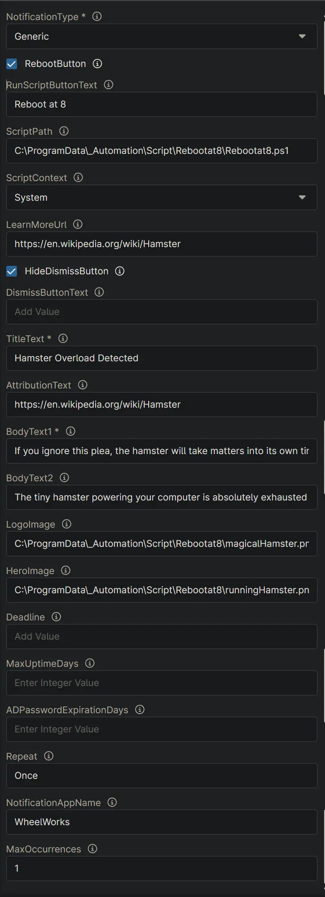
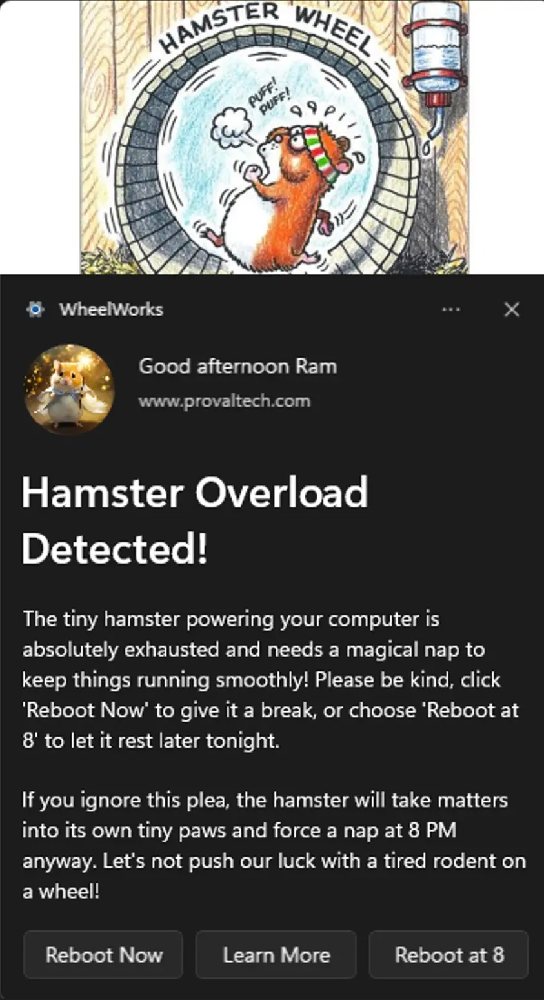
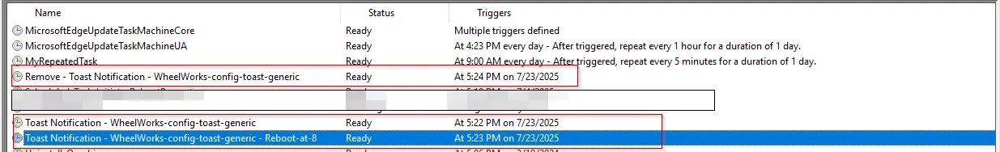
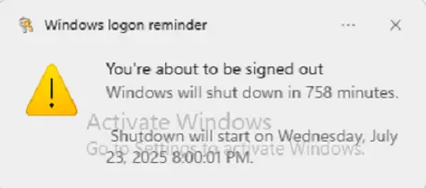
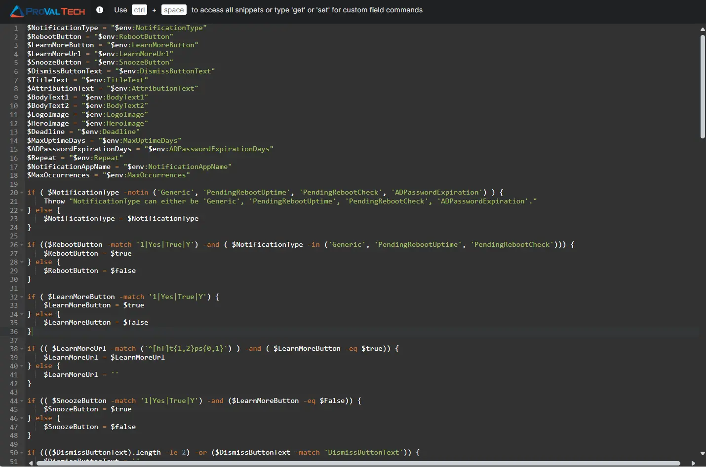

## Overview

This script is to create and manage toast notifications with customizable options, including images, buttons, and scenarios for different use cases. It is Ninja implementation of the agnostic script [Invoke-ToastNotification.ps1](/docs/426118d9-ff83-444e-9744-30a0e26cb490).

## Update Notice: 2025-07-22

- A script can be triggered via a button click within the notification.  
- The dismiss button is optional and can be excluded.  
- Notifications can be shown with or without buttons.
- New Parameters:  
  - RunScriptButtonText
  - ScriptPath
  - ScriptContext
  - HideDismissButton
- Parameters Removed:
  - SnoozeButton (Was unnecessary)
  - LearnMoreButton (Removed to adjust new parameters, setting the LearnMoreUrl will enable the button)

## Sample Run

### Variables

| ID  | Name                     | Value                                                                                                                                               |
|-----|--------------------------|-----------------------------------------------------------------------------------------------------------------------------------------------------|
| 1   | NotificationType         | Generic                                                                                                                                             |
| 2   | RebootButton             | 1                                                                                                                                                   |
| 3   | RunScriptButtonText      | Reboot at 8 |
| 4   | ScriptPath               | C:\ProgramData\_Automation\Script\Rebootat8\Rebootat8.ps1 |
| 5   | ScriptContext            | System |
| 6   | LearnMoreUrl             | https://en.wikipedia.org/wiki/Hamster                                                                                          |
| 7  | HideDismissButton        | 1                                                                                                                                             |
| 8   | TitleText                | Hamster Overload Detected!                                                                                                                          |
| 9  | AttributionText          | www.provaltech.com                                                                                                     |
| 10  | BodyText1                | The tiny hamster powering your computer is absolutely exhausted and needs a magical nap to keep things running smoothly! Please be kind, click 'Reboot Now' to give it a break, or choose 'Reboot at 8' to let it rest later tonight.   |
| 11  | BodyText2                | If you ignore this plea, the hamster will take matters into its own tiny paws and force a nap at 8 PM anyway. Let's not push our luck with a tired rodent on a wheel!. |
| 12  | LogoImage                | C:\ProgramData\_Automation\Script\Rebootat8\magicalHamster.png                                                                           |
| 13  | HeroImage                | C:\ProgramData\_Automation\Script\Rebootat8\runningHamster.png                                                                        |
| 14  | NotificationAppName      | WheelWorks                                                                                                                                                |
| 15  | Repeat                   | Once                                                                                                                                           |
| 16  | MaxOccurrences           | 1                                                                                                                  |

### Outcome

#### Notification

#### Scheduled Task

### Reboot at 8

### Affected Areas on Prompt Based on Example Variables

## Dependencies

- [Invoke-ToastNotification.ps1](/docs/426118d9-ff83-444e-9744-30a0e26cb490).

## Parameters

| Name | Example | Accepted Values | Required | Default | Type | Description |
| ---- | ------- | --------------- | -------- | ------- | ---- | ----------- |
| NotificationType | `Generic` | <ul><li>Generic</li><li>PendingRebootUptime</li><li>PendingRebootCheck</li><li>ADPasswordExpiration</li></ul> | Yes | - | Drop-Down | The type of notification to send. The accepted values for NotificationType are generic, PendingRebootUptime, PendingRebootCheck, and ADPasswordExpiration. It is a mandatory variable. <ul><li>**Generic:** Enables a static, generic toast notification.</li><li>**PendingRebootUptime:** Displays a toast notification reminding users to restart their system after exceeding the maximum uptime.</li><li>**PendingRebootCheck:** Displays a toast notification when a pending reboot is detected through the system registry or WMI.</li><li>**ADPasswordExpiration:** Sends a toast notification to users when their Active Directory password is nearing expiration.</li></ul> |
| RebootButton | - | true/false (checkbox) | No |  | CheckBox | Select RebootButton to enable the Reboot button in the notification. Unselecting the variable will disable it. RebootButton is available for Generic, PendingRebootUptime, and PendingRebootCheck notification types. |
| RunScriptButtonText | `Update Now` | Any string | No |  | String/Text | Set the string in this variable to add a custom button with the name set in this variable to run a specified PowerShell script when clicked. |
| ScriptPath | `C:\Scripts\update.ps1` | Valid .ps1 file path | No |  | String/Text | script (.ps1) to execute when the custom button is clicked. This must be a valid path ending in .ps1. Setting this variable is mandatory if RunScriptButtonText is set. |
| ScriptContext | `System` | <ul><li>User</li><li>System</li></ul> | No | - | Drop-Down | The context in which the script runs. This can be 'User' or 'System'. |
| LearnMoreUrl | `https://example.com/help` | Valid URL | No |  | String/Text | URL to learn more about the notification. If this variable is set, a 'Learn More' button will be added to the notification. |
| HideDismissButton | - | true/false (checkbox) | No |  | CheckBox | Select to remove the Dismiss button from the notification. Dismiss button is added to the notification by default. |
| DismissButtonText | `Close` | Any string | No |  | String/Text | Set the string in the DismissButtonText variable to customize the dismiss button's text. Leave it blank to return to the default value, Dismiss. |
| TitleText | `System Update Required` | Any string | Yes |  | String/Text | Sets the title of the notification in the TitleText variable. It is mandatory to set this variable. |
| AttributionText | `IT Department` | Any string | No | Organization name | String/Text | Sets the attribution text in the AttributionText variable. It can be a company name or website, for authenticity. If not set, it defaults to the organization name. |
| BodyText1 | `Your system requires an update` | Any string (avoid double quotes) | Yes |  | String/Text | BodyText1 stores the main text content of the notification body. It is a mandatory variable. Avoid using double quotes in the text. |
| BodyText2 | `Please save your work before continuing` | Any string (avoid double quotes) | No |  | String/Text | BodyText2 stores the secondary text content of the notification body. Avoid using double quotes in the text. |
| LogoImage | `C:\Images\logo.png` | URL or local path | No | Default logo | String/Text | LogoImage stores the URL or local path for the logo image in the notification. Leave it blank to generate the notification with the default logo. |
| HeroImage | `C:\Images\hero.jpg` | URL or local path | No | Default image | String/Text | HeroImage stores the URL or local path for the primary image in the notification. Leave it blank to generate the notification with the default image. |
| Deadline | `2025-12-31 23:59:59` | yyyy-MM-dd HH:mm:ss format | No |  | String/Text | Sets the deadline for the notification. Format: yyyy-MM-dd HH:mm:ss. |
| MaxUptimeDays | `30` | Positive integer | No | 30 | Integer | Defines the maximum uptime (in days) for the PendingRebootUptime NotificationType parameter. Default is 30 days. |
| ADPasswordExpirationDays | `7` | Positive integer | No | 7 | Integer | Number of days before password expiration when reminders should start. It is available for the ADPasswordExpiration NotificationType parameter. Default is 7 days. |
| Repeat | `Daily` | Once, Hourly, XXMinutes, XXHours, Daily, XXDays | No | Once | String/Text | Specifies how frequently the notification should repeat. Options: Once, Hourly, XXMinutes, XXHours, Daily, XXDays. Default is Once. |
| NotificationAppName | `Company IT Tool` | Any string | No | Windows PowerShell | String/Text | Specifies the name of the application that will display the notification. |
| MaxOccurrences | `5` | Positive integer | No |  | Integer | Specifies the maximum number of notifications to send before the scheduled task is automatically removed. This works in conjunction with the Repeat parameter, except when Repeat is set to Once. |

**Note**: Variables marked as "Required: Yes" are mandatory and must be configured. Variables with checkbox types accept boolean values (true/false). For drop-down types, only the specified accepted values are valid.

## Automation Setup/Import

[Automation Configuration](https://github.com/ProVal-Tech/ninjarmm/blob/main/scripts/toast-notification.ps1)

## Output

- Activity Details  
- Custom Field
