## Overview

This script is to create and manage toast notifications with customizable options, including images, buttons, and scenarios for different use cases. It is Ninja implementation of the agnostic script [Invoke-ToastNotification.ps1](/docs/426118d9-ff83-444e-9744-30a0e26cb490).

## Sample Run

`Play Button` > `Run Automation` > `Script`  


Search and select `Toast notification`
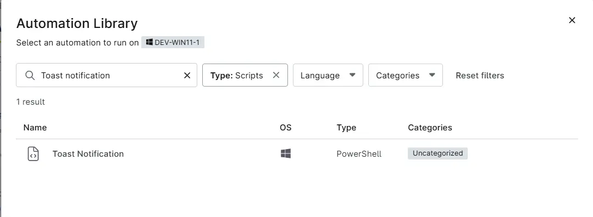

Set the required arguments and click the `Run` button to run the script.  
**Run As:** `System`  
**Preset Parameter:** `<Leave it Blank>`  
Fill the Script variables as per requirement. For more information on these script variables, Go To **Parameters** Section.

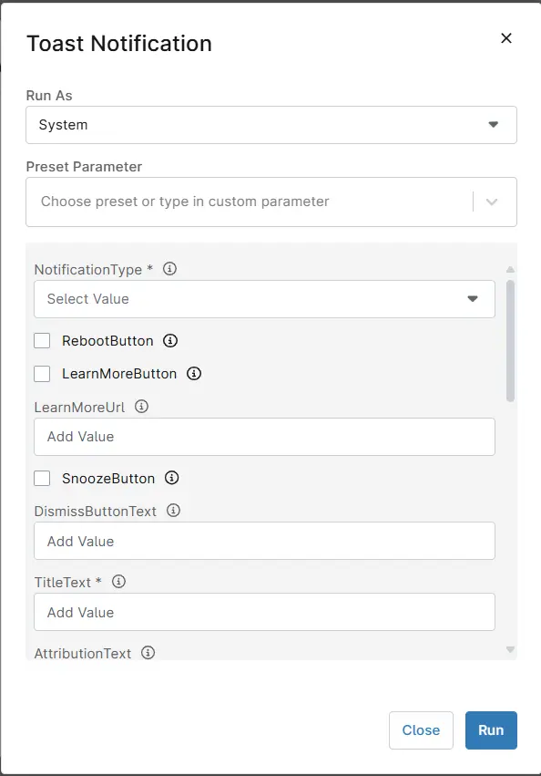

**Run Automation:** `Yes`  


## Dependencies
- [Invoke-ToastNotification.ps1](/docs/426118d9-ff83-444e-9744-30a0e26cb490).


## Parameters

| Name               | Example                         | Accepted Values             | Required | Default       | Type        | Description              |
|----------------------------|--------------------------------------------------------------------------------------------------------------|----------------------------------------------------------------------------------------------------------|----------|---------------|-------------|-----------------------------------------------------------------------------------------------------------------------------------------------------------------------------------------------------------------------------------|
| NotificationType           | Generic                         | Generic<br /> PendingRebootUptime<br /> PendingRebootCheck<br /> ADPasswordExpiration                      | True     |               | Text        | The type of notification to send. The accepted values for NotificationType are generic, PendingRebootUptime, PendingRebootCheck, and ADPasswordExpiration. It is a mandatory variable.<br /><br />**Generic**: Enables a static, generic toast notification.<br /><br />**PendingRebootUptime**: Displays a toast notification reminding users to restart their system after exceeding the maximum uptime.<br /><br />**PendingRebootCheck**: Displays a toast notification when a pending reboot is detected through the system registry or WMI.<br /><br />**ADPasswordExpiration**: Sends a toast notification to users when their Active Directory password is nearing expiration. |
| RebootButton               | Unmarked                        |                             | False    | False         | Flag        | Select it to enable the `Reboot` button in the notification. RebootButton is available for `Generic`, `PendingRebootUptime`, and `PendingRebootCheck` notification types.                    |
| LearnMoreButton            | Unmarked                        |                             | False    | False         | Flag        | Select it to enable the `Learn More` button in the notification.                       |
| LearnMoreUrl               | [https://www.provaltech.com](https://www.provaltech.com)                                                     |                             | False    |               | Text        | Set the URL to navigate by clicking the `Learn More` button in the notification. `LearnMoreButton` should be selected to allow the `LearnMoreUrl` parameter.                                |
| SnoozeButton               | Unmarked                        |                             | False    | False         | Flag        | Select it to enable the `Snooze` button in the notification.<br /><br />Note: The `LearnMoreButton` and the `SnoozeButton` cannot be enabled simultaneously.                                    |
| DismissButtonText          | Dismiss                         |                             | False    | Dismiss       | Text        | Customizes the text of the dismiss button. Default is "Dismiss."                       |
| TitleText                  | Reboot Required                 |                             | True     |               | Text        | Sets the title of the notification. It is mandatory to set this parameter.             |
| AttributionText            | [https://www.provaltech.com](https://www.provaltech.com)                                                     |                             | True     |               | Text        | Displays attribution text, such as a company name or website, for authenticity. If left blank, the task will use the client name of the agent in attribution text.                          |
| BodyText1                  | An application is installed on your computer and it is required to reboot the machine ASAP.                   |                             | True     |               | Text        | The main text content of the notification body. It is mandatory to set this parameter.  |
| BodyText2                  | Ignoring the notification is not suggested     |                             | False    |               | Text        | Secondary text content is displayed below BodyText1.                                   |
| LogoImage                  | [https://labtech.provaltech.com/labtech/transfer/images/alogo.jpg](https://labtech.provaltech.com/labtech/transfer/images/alogo.jpg) |                             | False    |               | Text        | Specify the URL or path for the logo image in the notification.                        |
| HeroImage                  | [https://labtech.provaltech.com/labtech/transfer/images/alogo.jpg](https://labtech.provaltech.com/labtech/transfer/images/alogo.jpg) |                             | False    |               | Text        | Specify the URL or path for the hero image displayed at the top of the notification.   |
| Deadline                   | 2025-02-05 08:00:00             | yyyy-MM-dd HH:mm:ss          | False    | Current +14days | Text        | Sets the deadline for the notification. Format: yyyy-MM-dd HH:mm:ss.                   |
| MaxUptimeDays              | 30                              |                             | False    | 30            | NumberValue | Defines the maximum uptime (in days) for the `PendingRebootUptime` NotificationType parameter. Default is 30 days.                                   |
| ADPasswordExpirationDays   | 7                               |                             | False    | 7             | NumberValue | Number of days before password expiration when reminders should start. It is available for the `ADPasswordExpiration` NotificationType parameter. Default is 7 days.   |
| Repeat                     | Once                            | Once, Hourly, XXMinutes, XXHours, Daily, XXDays.                  | False    | Once          | Text        | Specifies how frequently the notification should repeat. Options: Once, Hourly, XXMinutes, XXHours, Daily, XXDays. |
| NotificationAppName        | Connectwise RMM  |  | False    | Windows PowerShell          | Text        | Specifies the name of the application that will display the notification. |
| MaxOccurrences        | 5  |  | False    |  | Number Values   | Specifies the maximum number of notifications to send before the scheduled task is automatically removed. This works in conjunction with the `Repeat` parameter, except when `Repeat` is set to `Once`. |
## Automation Setup/Import

### Step 1

Navigate to `Administration` > `Library` > `Automation`  


### Step 2

Locate the `Add` button on the right-hand side of the screen, click on it and click the `New Script` button.  


The scripting window will open.  


### Step 3

Configure the `Create Script` section as follows:

**Name:** `Toast Notification`  
**Description:** `A script to create and manage toast notifications with customizable options, including images, buttons, and scenarios for different use cases.`  
**Categories:** `ProVal`  
**Language:** `PowerShell`  
**Operating System:** `Windows`  
**Architecture:** `All`  
**Run As:** `System`  


## Step 4

Paste the following powershell script in the scripting section:  

```PowerShell
$NotificationType = "$env:NotificationType"
$RebootButton = "$env:RebootButton"
$LearnMoreButton = "$env:LearnMoreButton"
$LearnMoreUrl = "$env:LearnMoreUrl"
$SnoozeButton = "$env:SnoozeButton"
$DismissButtonText = "$env:DismissButtonText"
$TitleText = "$env:TitleText"
$AttributionText = "$env:AttributionText"
$BodyText1 = "$env:BodyText1"
$BodyText2 = "$env:BodyText2"
$LogoImage = "$env:LogoImage"
$HeroImage = "$env:HeroImage"
$Deadline = "$env:Deadline"
$MaxUptimeDays = "$env:MaxUptimeDays"
$ADPasswordExpirationDays = "$env:ADPasswordExpirationDays"
$Repeat = "$env:Repeat"
$NotificationAppName = "$env:NotificationAppName"
$MaxOccurrences = "$env:MaxOccurrences"

if ( $NotificationType -notin ('Generic', 'PendingRebootUptime', 'PendingRebootCheck', 'ADPasswordExpiration') ) {
    Throw "NotificationType can either be 'Generic', 'PendingRebootUptime', 'PendingRebootCheck', 'ADPasswordExpiration'."
} else {
    $NotificationType = $NotificationType
}

if (($RebootButton -match '1|Yes|True|Y') -and ( $NotificationType -in ('Generic', 'PendingRebootUptime', 'PendingRebootCheck'))) {
    $RebootButton = $true
} else {
    $RebootButton = $false
}

if ( $LearnMoreButton -match '1|Yes|True|Y') {
    $LearnMoreButton = $true
} else {
    $LearnMoreButton = $false
}

if (( $LearnMoreUrl -match ('^[hf]t{1,2}ps{0,1}') ) -and ( $LearnMoreButton -eq $true)) {
    $LearnMoreUrl = $LearnMoreUrl
} else {
    $LearnMoreUrl = ''
}

if (( $SnoozeButton -match '1|Yes|True|Y') -and ($LearnMoreButton -eq $False)) {
    $SnoozeButton = $true
} else {
    $SnoozeButton = $false
}

if ((($DismissButtonText).length -le 2) -or ($DismissButtonText -match 'DismissButtonText')) {
    $DismissButtonText = ''
} else {
    $DismissButtonText = $DismissButtonText
}

if ( (($TitleText).length -le 2 ) -or ($TitleText -match 'TitleText')) {
    return 'TitleText is mandatory to Set the title of the notification'
} else { 
    $TitleText = $TitleText
}

if ( (($AttributionText).length -le 2) -or ($AttributionText -match 'AttributionText')) {
    $AttributionText = '%companyname%'
} else {
    $AttributionText = $AttributionText
}

if ((($BodyText1).length -le 2 ) -or ($BodyText1 -match 'BodyText1')){
    return 'BodyText1 is mandatory to Set the main text content of the notification body'
} else {
    $BodyText1 = $BodyText1
}

if ((($BodyText2).length -le 2) -or ($BodyText2 -match 'BodyText2')) {
    $BodyText2 = ''
} else {
    $BodyText2 = $BodyText2
}

if ( ($LogoImage).length -gt 2) {
    $LogoImage = $LogoImage
} else {
    $LogoImage = ''
}

if ( ($HeroImage).length -gt 2) {
    $HeroImage = $HeroImage
} else {
    $HeroImage = ''
}

if ( $Deadline -match '\d{4}-\d{2}-\d{2}') {
    $Deadline = [datetime]$Deadline
} else {
    $Deadline = ''
}

if (( $MaxUptimeDays -match '^[0-9]{1,}$' ) -and (($MaxUptimeDays).length -gt 2) -and ($NotificationType -match 'PendingRebootUptime')) {
    $MaxUptimeDays = $MaxUptimeDays
} else {
    $MaxUptimeDays = ''
}

if (( $ADPasswordExpirationDays -match '^[0-9]{1,}$' ) -and (($ADPasswordExpirationDays).length -gt 2) -and (  $NotificationType -match 'ADPasswordExpiration')) {
    $ADPasswordExpirationDays = $ADPasswordExpirationDays
} else {
    $ADPasswordExpirationDays = ''
}

if (( $Repeat -match '^(Once|Hourly|[0-9]{1,}Minutes|[0-9]{1,}Hours|Daily|[0-9]{1,}Days|Weekly|Monthly|AtLogon)$' ) -and (($Repeat).length -gt 2) ) {
    $Repeat = $Repeat
} else {
    $Repeat = 'Once'
}

if ($NotificationAppName -match '[0-9A-z]{1,}' -and (($NotificationAppName).length -gt 2) -and ('@NotificationAppName@' -notmatch 'NotificationAppName')) {
    $NotificationAppName = $NotificationAppName
} else {
    $NotificationAppName = ''
}

if ($MaxOccurrences -match '[0-9]{1,}' -and (($MaxOccurrences).length -ge 1) -and ($MaxOccurrences -notmatch 'MaxOccurrences')) {
    $MaxOccurrences = $MaxOccurrences
} else {
    $MaxOccurrences = ''
}

$Parameters = @{
    TitleText = $TitleText
    BodyText1 = $BodyText1
    Repeat = $Repeat
}

if ($RebootButton -eq $true) { $parameters.Add('RebootButton', $RebootButton) }
if ($LearnMoreButton -eq $true) { $parameters.Add('LearnMoreButton', $LearnMoreButton) }
if ($LearnMoreUrl -ne '') { $parameters.Add('LearnMoreUrl', $LearnMoreUrl) }
if ($SnoozeButton -eq $true) { $parameters.Add('SnoozeButton', $SnoozeButton) }
if ($DismissButtonText -ne '') { $parameters.Add('DismissButtonText', $DismissButtonText) }
if ($AttributionText -ne '') { $parameters.Add('AttributionText', $AttributionText) }
if ($BodyText2 -ne '') { $parameters.Add('BodyText2', $BodyText2) }
if ($LogoImage -ne '') { $parameters.Add('LogoImage', $LogoImage) }
if ($HeroImage -ne '') { $parameters.Add('HeroImage', $HeroImage) }
if ($Deadline -ne '') { $parameters.Add('Deadline', $Deadline) }
if ($MaxUptimeDays -ne '') { $parameters.Add('MaxUptimeDays', $MaxUptimeDays) }
if ($ADPasswordExpirationDays -ne '') { $parameters.Add('ADPasswordExpirationDays', $ADPasswordExpirationDays) }
if ($NotificationAppName -ne '') { $parameters.Add('NotificationAppName', $NotificationAppName) }
if ($MaxOccurrences -ne '') { $parameters.Add('MaxOccurrences', $MaxOccurrences) }

#region Setup - Variables
$ProjectName = 'Invoke-ToastNotification'
[Net.ServicePointManager]::SecurityProtocol = [enum]::ToObject([Net.SecurityProtocolType], 3072)
$BaseURL = 'https://file.provaltech.com/repo'
$PS1URL = "$BaseURL/script/$ProjectName.ps1"
$WorkingDirectory = "C:\ProgramData\_automation\script\$ProjectName"
$PS1Path = "$WorkingDirectory\$ProjectName.ps1"
$Workingpath = $WorkingDirectory
$LogPath = "$WorkingDirectory\$ProjectName-log.txt"
$ErrorLogPath = "$WorkingDirectory\$ProjectName-Error.txt"
#endregion

#region Setup - Folder Structure
New-Item -Path $WorkingDirectory -ItemType Directory -ErrorAction SilentlyContinue | Out-Null

if (-not ( ( ( Get-Acl $WorkingDirectory ).Access | Where-Object { $_.IdentityReference -Match 'EveryOne' } ).FileSystemRights -Match 'FullControl' ) ) {
    $Acl = Get-Acl $WorkingDirectory; 
    $AccessRule = New-Object System.Security.AccessControl.FileSystemAccessRule('Everyone', 'FullControl', 'ContainerInherit, ObjectInherit', 'none', 'Allow'); 
    $Acl.AddAccessRule($AccessRule); Set-Acl  $WorkingDirectory $Acl 
}

$response = Invoke-WebRequest -Uri $PS1URL -UseBasicParsing

if (($response.StatusCode -ne 200) -and (!(Test-Path -Path $PS1Path))) {
    return "No pre-downloaded script exists and the script '$PS1URL' failed to download. Exiting."
} elseif ($response.StatusCode -eq 200) {
    Remove-Item -Path $PS1Path -ErrorAction SilentlyContinue
    [System.IO.File]::WriteAllLines($PS1Path, $response.Content)
}

if (!(Test-Path -Path $PS1Path)) {
    return 'An error occurred and the script was unable to be downloaded. Exiting.'
}
#endregionSetup

#region Execution
if ($Parameters) {
    $ScriptCommand = "& $PS1Path -$($NotificationType) @Parameters"
    Invoke-Expression $ScriptCommand
} else {
    & $PS1Path
}
#endregion

if ( !(Test-Path $LogPath) ) {
    return 'PowerShell Failure. A Security application seems to have restricted the execution of the PowerShell Script.'
}
if ( Test-Path $ErrorLogPath ) {
    $ErrorContent = ( Get-Content -Path $ErrorLogPath )
    return $ErrorContent
}
Get-Content -Path $LogPath
```


## Script Variables

### NotificationType

- Click the Add button next to Script Variables.
- Select the `Drop-down` option.
- The `Add Drop-down Variable` window will open.
- In the box, fill in the following details and select Add to create the script variable.

    **Name**: `NotificationType`  
    **Description**: `The type of notification to send. It is a mandatory variable.`  
    **Mandatory**: `<Leave it Unchecked>`

    **Option Value**: Configure the following options in the specified order. To add an option, paste it and click the Add button:  
    - Generic  
    - PendingRebootUptime  
    - PendingRebootCheck  
    - ADPasswordExpiration  

    **Top Option Set Default Value** : True

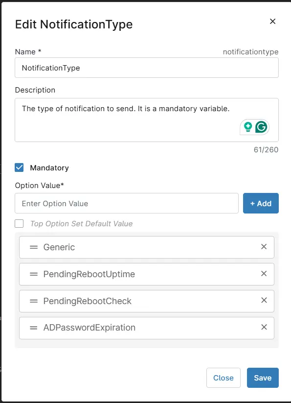

### RebootButton

- Click the Add button next to Script Variables.
- Select the `Checkbox` option.
- The `Add Checkbox Variable` window will open.
- In the box, fill in the following details and select Add to create the script variable.

    **Name**: `RebootButton`  
    **Description**: `Select RebootButton to enable the Reboot button in the notification. Unselecting the variable will disable it. RebootButton is available for Generic, PendingRebootUptime, and PendingRebootCheck notification types.`  
    **Set Defaut Value**: `<Leave it Unchecked>`

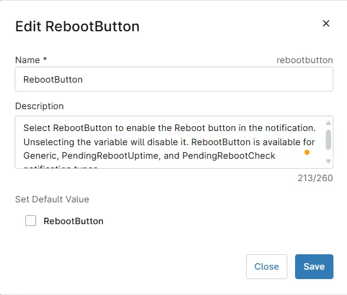

### LearnMoreButton

- Click the Add button next to Script Variables.
- Select the `Checkbox` option.
- The `Add Checkbox Variable` window will open.
- In the box, fill in the following details and select Add to create the script variable.

    **Name**: `LearnMoreButton`  
    **Description**: `Select it to enable the Learn More button in the notification. Unselecting the variable will disable it.`  
    **Set Defaut Value**: `<Leave it Unchecked>`

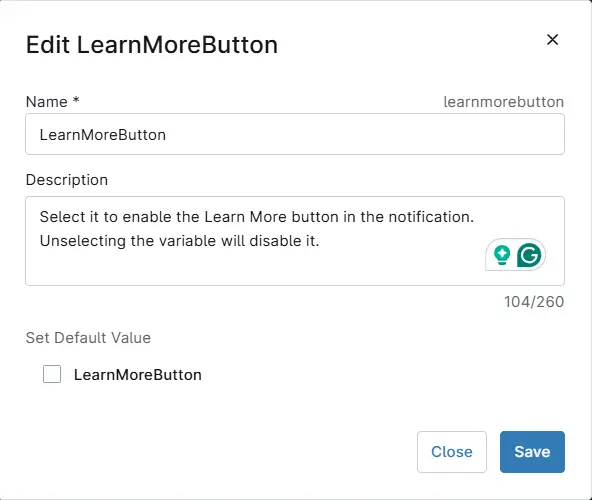

### LearnMoreUrl

- Click the Add button next to Script Variables.
- Select the `String/Text` option.
- The `Add String/Text Variable` window will open.
- In the box, fill in the following details and select Add to create the script variable.

    **Name**: `LearnMoreUrl`  
    **Description**: `Set the URL to navigate by clicking the Learn More button in the notification. LearnMoreButton should be enabled to allow the LearnMoreUrl variable.` 
    **Mandatory**: `<Leave it Unchecked>`  
    **Set Defaut Value**: `<Leave it blank`

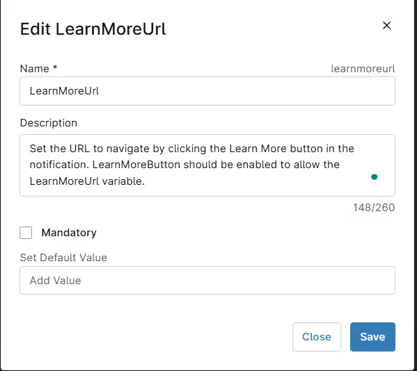

### SnoozeButton

- Click the Add button next to Script Variables.
- Select the `Checkbox` option.
- The `Add Checkbox Variable` window will open.
- In the box, fill in the following details and select Add to create the script variable.

    **Name**: `SnoozeButton`  
    **Description**: `Select it to enable the Snooze button in the notification. Unselecting variable will disable it. The LearnMoreButton and the SnoozeButton cannot be enabled simultaneously.`  
    **Set Defaut Value**: `<Leave it Unchecked>`

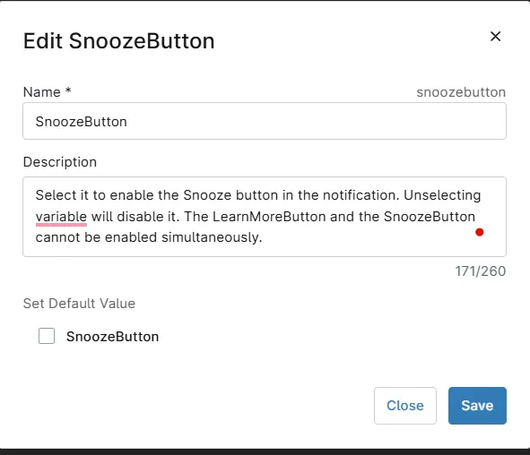

### DismissButtonText

- Click the Add button next to Script Variables.
- Select the `String/Text` option.
- The `Add String/Text Variable` window will open.
- In the box, fill in the following details and select Add to create the script variable.

    **Name**: `DismissButtonText`  
    **Description**: `Set the string in the DismissButtonText variable to customize the dismiss button's text. Leave it blank to return to the default value, Dismiss.` 
    **Mandatory**: `<Leave it Unchecked>`  
    **Set Defaut Value**: `<Leave it blank`

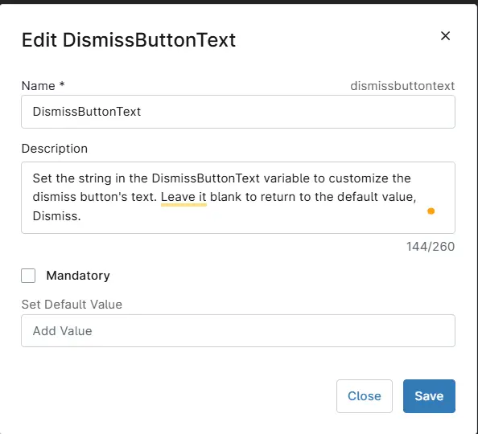

### TitleText

- Click the Add button next to Script Variables.
- Select the `String/Text` option.
- The `Add String/Text Variable` window will open.
- In the box, fill in the following details and select Add to create the script variable.

    **Name**: `TitleText`  
    **Description**: `Sets the title of the notification in the TitleText variable. It is mandatory to set this variable.` 
    **Mandatory**: `Check it`  
    **Set Defaut Value**: `<Leave it blank`

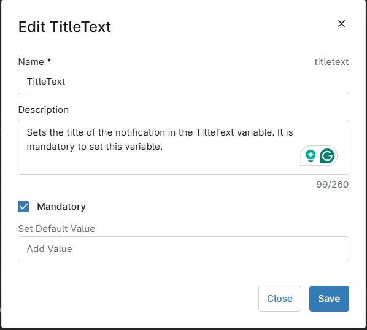

### AttributionText

- Click the Add button next to Script Variables.
- Select the `String/Text` option.
- The `Add String/Text Variable` window will open.
- In the box, fill in the following details and select Add to create the script variable.

    **Name**: `AttributionText`  
    **Description**: `Sets the attribution text in the AttributionText variable. It can be a company name or website, for authenticity.` 
    **Mandatory**: `<Leave it Unchecked>`  
    **Set Defaut Value**: `<Leave it blank`

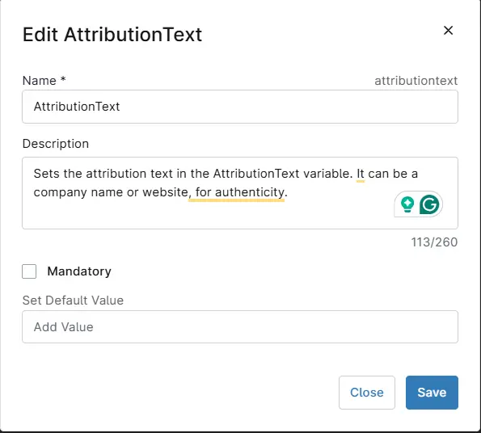

### BodyText1

- Click the Add button next to Script Variables.
- Select the `String/Text` option.
- The `Add String/Text Variable` window will open.
- In the box, fill in the following details and select Add to create the script variable.

    **Name**: `BodyText1`  
    **Description**: `BodyText1 stores the main text content of the notification body. It is a mandatory variable.` 
    **Mandatory**: `Check it`  
    **Set Defaut Value**: `<Leave it blank`

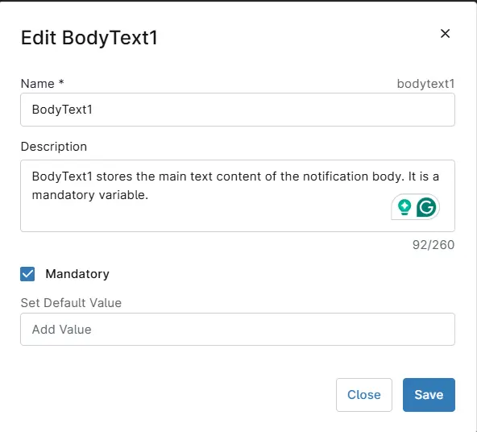

### BodyText2

- Click the Add button next to Script Variables.
- Select the `String/Text` option.
- The `Add String/Text Variable` window will open.
- In the box, fill in the following details and select Add to create the script variable.

    **Name**: `BodyText2`  
    **Description**: `BodyText2 stores the secondary text content of the notification body.` 
    **Mandatory**: `<Leave it Unchecked>`  
    **Set Defaut Value**: `<Leave it blank`

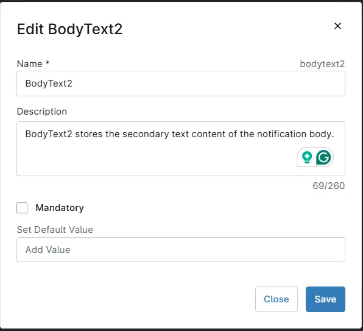

### LogoImage

- Click the Add button next to Script Variables.
- Select the `String/Text` option.
- The `Add String/Text Variable` window will open.
- In the box, fill in the following details and select Add to create the script variable.

    **Name**: `LogoImage`  
    **Description**: `LogoImage stores the URL or local path for the logo image in the notification. Leave it blank to generate the notification with the default logo.` 
    **Mandatory**: `<Leave it Unchecked>`  
    **Set Defaut Value**: `<Leave it blank`

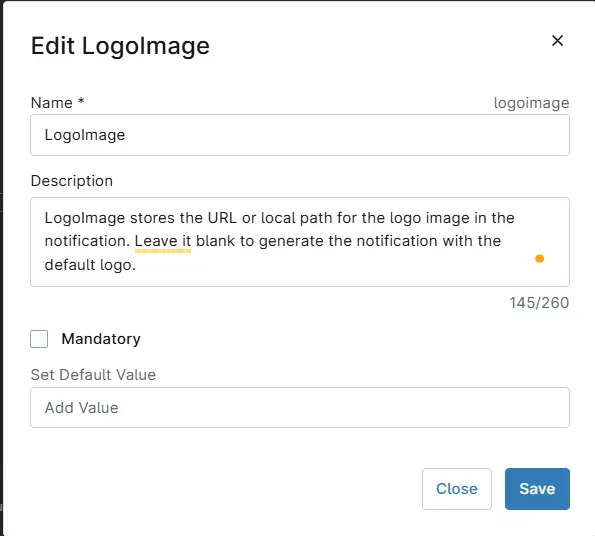

### HeroImage

- Click the Add button next to Script Variables.
- Select the `String/Text` option.
- The `Add String/Text Variable` window will open.
- In the box, fill in the following details and select Add to create the script variable.

    **Name**: `HeroImage`  
    **Description**: `HeroImage stores the URL or local path for the primary image in the notification. Leave it blank to generate the notification with the default image.` 
    **Mandatory**: `<Leave it Unchecked>`  
    **Set Defaut Value**: `<Leave it blank`

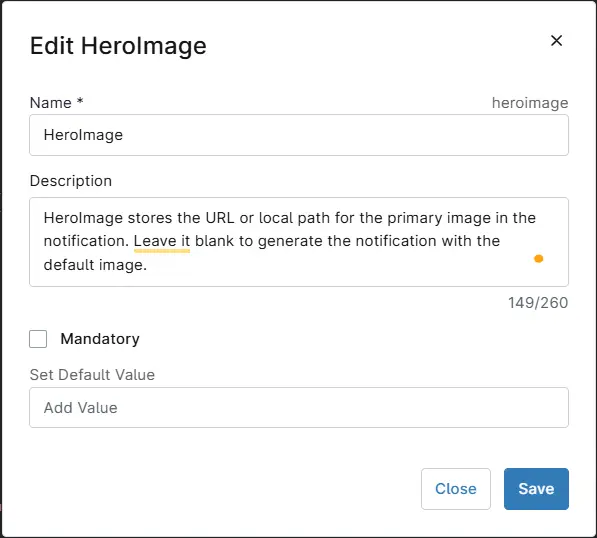

### Deadline

- Click the Add button next to Script Variables.
- Select the `Date and Time` option.
- The `Add Date and Time Variable` window will open.
- In the box, fill in the following details and select Add to create the script variable.

    **Name**: `Deadline`  
    **Description**: `Sets the deadline for the notification.` 
    **Mandatory**: `<Leave it Unchecked>`  
    **Set Defaut Value**: `<Leave it blank`

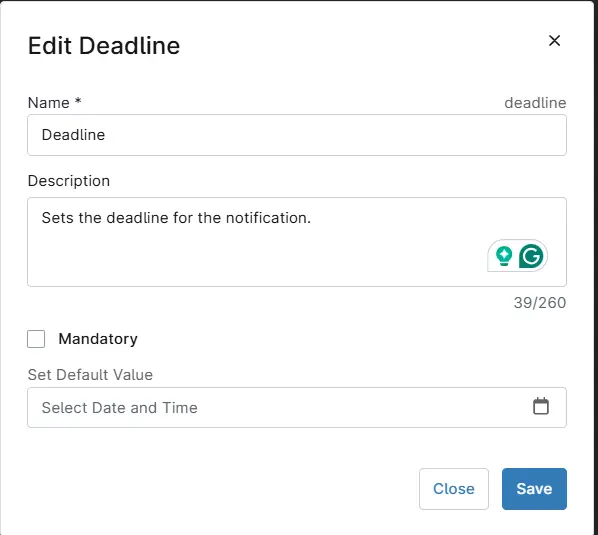

### MaxUptimeDays

- Click the Add button next to Script Variables.
- Select the `Integer` option.
- The `Add Integer Variable` window will open.
- In the box, fill in the following details and select Add to create the script variable.

    **Name**: `MaxUptimeDays`  
    **Description**: `Defines the maximum uptime (in days) for the PendingRebootUptime NotificationType parameter. Default is 30 days.` 
    **Mandatory**: `<Leave it Unchecked>`  
    **Set Defaut Value**: `<Leave it blank`

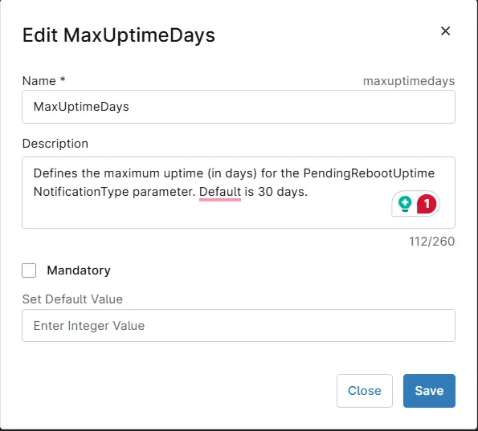

### ADPasswordExpirationDays

- Click the Add button next to Script Variables.
- Select the `Integer` option.
- The `Add Integer Variable` window will open.
- In the box, fill in the following details and select Add to create the script variable.

    **Name**: `ADPasswordExpirationDays`  
    **Description**: `Number of days before password expiration when reminders should start. It is available for the ADPasswordExpiration NotificationType parameter. Default is 7 days.` 
    **Mandatory**: `<Leave it Unchecked>`  
    **Set Defaut Value**: `<Leave it blank`

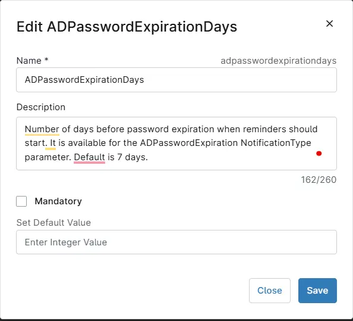

### Repeat

- Click the Add button next to Script Variables.
- Select the `String/Text` option.
- The `Add String/Text Variable` window will open.
- In the box, fill in the following details and select Add to create the script variable.

    **Name**: `Repeat`  
    **Description**: `Specifies how frequently the notification should repeat. Options: Once, Hourly, XXMinutes, XXHours, Daily, XXDays.` 
    **Mandatory**: `<Leave it Unchecked>`  
    **Set Defaut Value**: `<Leave it blank`

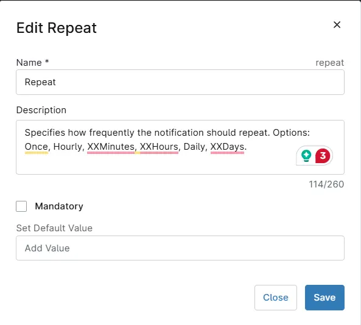

### NotificationAppName

- Click the Add button next to Script Variables.
- Select the `String/Text` option.
- The `Add String/Text Variable` window will open.
- In the box, fill in the following details and select Add to create the script variable.

    **Name**: `NotificationAppName`  
    **Description**: `Specifies the name of the application that will display the notification.` 
    **Mandatory**: `<Leave it Unchecked>`  
    **Set Defaut Value**: `Windows Powershell`

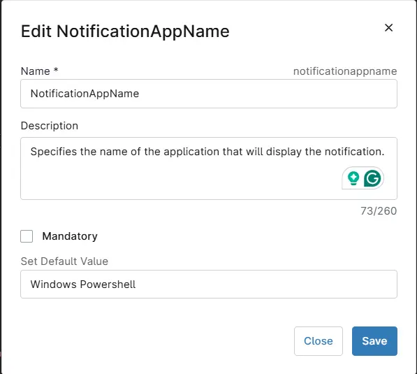

### MaxOccurrences

- Click the Add button next to Script Variables.
- Select the `Integer` option.
- The `Add Integer Variable` window will open.
- In the box, fill in the following details and select Add to create the script variable.

    **Name**: `MaxOccurrences`  
    **Description**: `Specifies the maximum number of notifications to send before the scheduled task is automatically removed. This works in conjunction with the Repeat parameter, except when Repeat is set to Once.` 
    **Mandatory**: `<Leave it Unchecked>`  
    **Set Defaut Value**: `<Leave it blank`


## Saving the Automation

Click the Save button in the top-right corner of the screen to save your automation.  


You will be prompted to enter your MFA code. Provide the code and press the Continue button to finalize the process.  


## Completed Automation

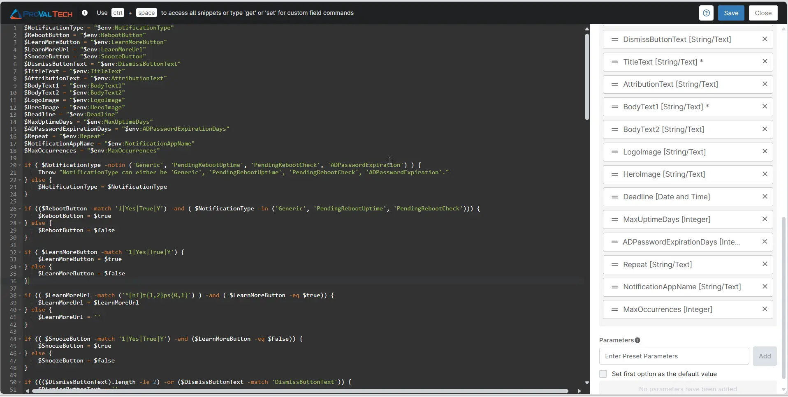

## Output

- Activity Details  
