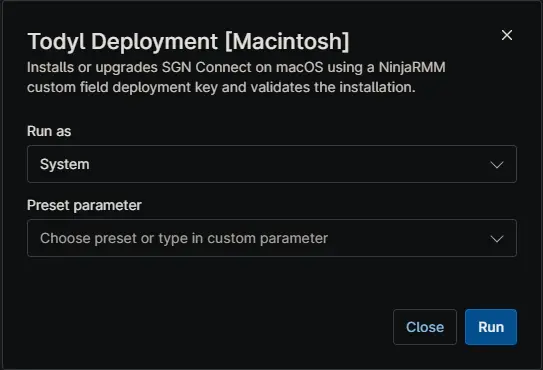

## Overview

Installs or upgrades SGN Connect on macOS using a NinjaRMM custom field deployment key and validates the installation.

## Sample Run

## Dependencies

- [Custom Field: cPVAL Todyl Mac Policy Key](/docs/44b1e55c-ff5e-42d4-b232-a52a9b5c4ae5)
- [Solution: Todyl Agent Manager](/docs/01e0e3c8-adc5-4035-84d5-9266e5af0760)

## Automation Setup/Import

[Automation Configuration](https://github.com/ProVal-Tech/ninjarmm/blob/main/scripts/todyl-deployment-macintosh.sh)

## Output

- Activity Details

## Changelog

### 2026-06-22

- Initial version of the document

