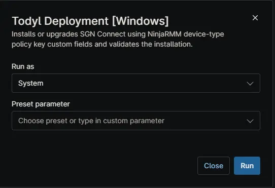

## Overview

This script automates the deployment and update of the Todyl Agent (SGN Connect) on Windows machines by downloading the latest installer, running the installation silently, and validating that the agent has been successfully installed.

## Sample Run

## Dependencies

- [Custom Field: cPVAL Todyl Desktop Policy Key](/docs/19338eed-96f4-4788-9618-76bf85f8c369)
- [Custom Field: cPVAL Todyl Laptop Policy Key](/docs/360cd317-be72-47d7-adae-3ed1c00d88b0)
- [Custom Field: cPVAL Todyl Server Policy Key](/docs/1a1c87f0-71c8-42c3-8d57-756a4d455b6c)
- [Solution: Todyl Agent Manager](/docs/01e0e3c8-adc5-4035-84d5-9266e5af0760)

## Automation Setup/Import

[Automation Configuration](https://github.com/ProVal-Tech/ninjarmm/blob/main/scripts/todyl-deployment-windows.ps1)

## Output

- Activity Details

## Changelog

### 2026-06-22

- Bug fixes and Formatting

### 2025-08-18

- Initial version of the document

