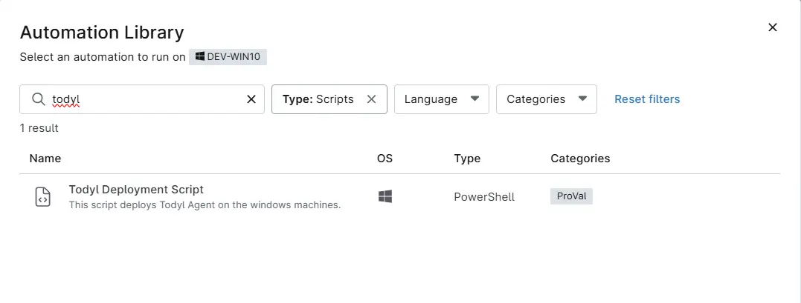

## Overview
This script automates the deployment and update of the Todyl Agent (SGN Connect) on Windows machines by downloading the latest installer, running the installation silently, and validating that the agent has been successfully installed.

## Sample Run

`Play Button` > `Run Automation` > `Script`  

Search and select `Todyl Deployment`

## Dependencies
- [cPVAL Todyl Desktop Policy Key](/docs/19338eed-96f4-4788-9618-76bf85f8c369)
- [cPVAL Todyl Laptop Policy Key](/docs/360cd317-be72-47d7-adae-3ed1c00d88b0)
- [cPVAL Todyl Server Policy Key](/docs/1a1c87f0-71c8-42c3-8d57-756a4d455b6c)

## Automation Setup/Import

[Automation Configuration]((https://github.com/ProVal-Tech/ninjarmm/blob/main/scripts/todyl-deployment.ps1))

## Output

- Activity Details
