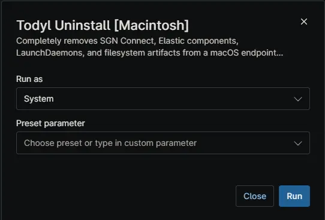

## Overview

Completely removes SGN Connect, Elastic components, LaunchDaemons, and filesystem artifacts from a macOS endpoint using NinjaRMM custom fields for tamper protection handling.

## Sample Run

## Dependencies

- [Custom Field: cPVAL Todyl Tamper Protection](/docs/f37b4a17-ada4-4455-8723-ef994cb6a803)
- [Custom Field: cPVAL Todyl Maintenance Key](/docs/7dadd797-66b4-4f2e-b21a-6445b2841c1d)
- [Solution: Todyl Agent Manager](/docs/01e0e3c8-adc5-4035-84d5-9266e5af0760)

## Automation Setup/Import

[Automation Configuration](https://github.com/ProVal-Tech/ninjarmm/blob/main/scripts/todyl-uninstall-macintosh.sh)

## Output

- Activity Details

## Changelog

### 2026-06-22

- Initial version of the document

