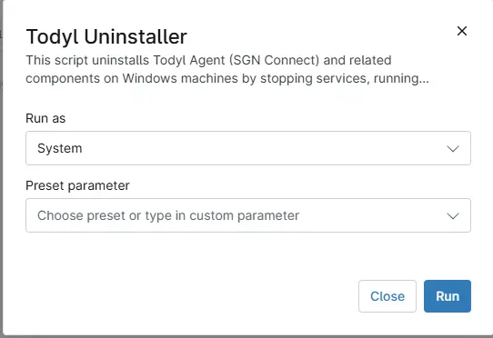

## Overview
This script uninstalls Todyl Agent (SGN Connect) and related components on Windows machines by stopping services, running the uninstaller, and cleaning up leftover files and registry entries.

## Sample Run

`Play Button` > `Run Automation` > `Script`  

## Dependencies

## Automation Setup/Import

[Automation Configuration](https://github.com/ProVal-Tech/ninjarmm/blob/main/scripts/todyl-uninstaller.ps1)

## Output

- Activity Details

## Changelog

### 2026-05-20

- Initial version of the document
