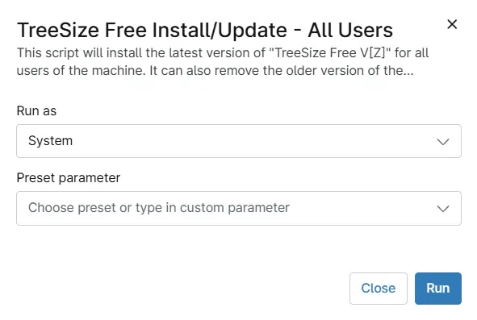

## Overview

This script will install the latest version of "TreeSize Free V[Z]" for all users of the machine.
It can also remove the older version of the "TreeSize Free" detected and reinstall the latest version.

## Sample Run

`Play Button` > `Run Automation` > `Script` 

## Automation Setup/Import

[Automation Configuration](https://github.com/ProVal-Tech/ninjarmm/blob/main/scripts/treesize-free-install-update-all-users.ps1)

## Output

- Activity Details  

## Changelog

### 2026-07-13

- Initial version of the document