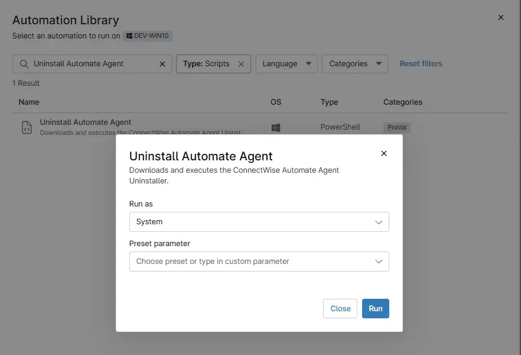

## Overview

This script automates the removal of the ConnectWise Automate agent from a Windows machine.
It performs the following steps:

  1. Creates the required working directory if it does not already exist.
  2. Downloads the Agent_Uninstaller.zip from the ConnectWise asset server.
  3. Extracts the contents of the zip archive to the working directory.
  4. Locates the uninstaller executable (setup.exe by default, or the first .exe found).
  5. Runs the uninstaller silently and validates the exit code.
  
## Sample Run

`Play Button` > `Run Automation` > `Script`  

## Automation Setup/Import

[Automation Configuration](https://github.com/ProVal-Tech/ninjarmm/blob/main/scripts/uninstall-automate-agent.ps1)

## Output

- Activity Details  

## Changelog

### 2026-04-01

This is the initial version of the document.
