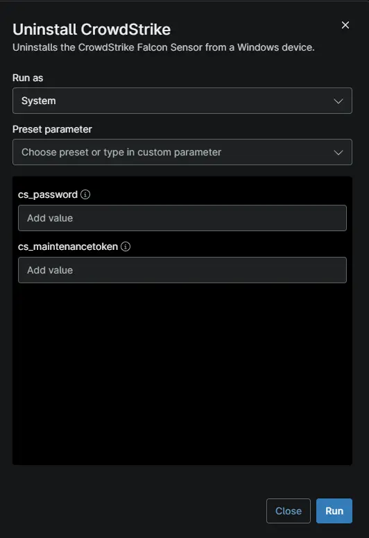

## Overview

This script uses the CrowdStrike uninstall tool to remove the Falcon Sensor from the Windows device.

## Sample Run

## Dependencies

- [File Transfer - Crowdstrike](/docs/7041c5e0-2aea-4dd7-a657-b8a5ae4caeff)
- [Solution - Uninstall-Crowdstrike-Ninjaone](/docs/96ec2315-d8e2-4793-8db9-8d3f73803945)

## Parameters

| Name | Example | Accepted Values | Required | Default | Type | Description |
| ---- | ------- | --------------- | -------- | ------- | ---- | ----------- |
| `cs_password` | -- | -- | False | -- | `string/text` | CrowdStrike Falcon Sensor uninstall password used as a fallback when the Maintenance Token is not available. |
| `cs_maintenancetoken` | -- | -- | False | -- | `string/text` | CrowdStrike Falcon Sensor Maintenance Token used to uninstall the sensor when the initial uninstallation attempt requires authentication. |

## Custom Fields

| Field Name | Type | Mandatory | Scope | Description |
| ---------- | ---- | --------- | ----- | ----------- |
| `cPVAL CS Maintenance token` | Text | `False` | `Device`, `Location`, `Organization`| Stores the CrowdStrike Falcon Sensor Maintenance Token used for authenticated sensor uninstallation. |
| `cPVAL CS Password` | Text | `false` | `Device`, `Location`, `Organization`| Stores the CrowdStrike Falcon Sensor uninstall password used for authenticated sensor removal. |

## Automation Setup/Import

[Automation Configuration](https://github.com/ProVal-Tech/ninjarmm/blob/main/scripts/uninstall-crowdstrike.ps1 )

## Output

- Activity Details  

## Changelog

### 2026-10-09

Initial version of the script.