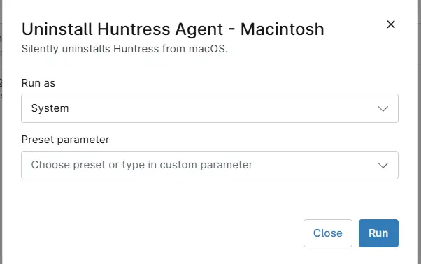

## Overview
Silently uninstalls Huntress from macOS.

## Sample Run

`Play Button` > `Run Automation` > `Script`  

Search and select `Uninstall Huntress Agent - Macintosh` and Click the `Run` button to run the script.  

## Dependencies

- [Solution : Huntress Agent Deployment](/docs/e0ad73d2-fcab-43f0-9866-72a48623ef48)

## Automation Setup/Import

[Automation Configuration](https://github.com/ProVal-Tech/ninjarmm/blob/main/scripts/install-huntress-agent-macintosh.ps1)

## Output

- Activity Details  

## Changelog

## 2026-05-27

- Initial version of the document
