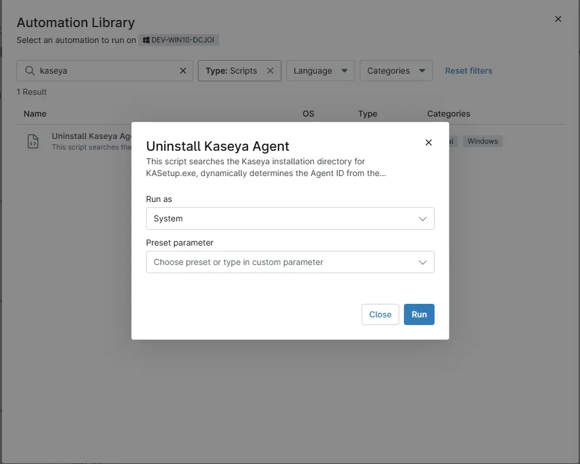

## Overview

This script searches the Kaseya installation directory for KASetup.exe, dynamically determines the Agent ID from the installation folder, checks for the associated agent service, and performs a silent uninstall.

## Sample Run

`Play Button` > `Run Automation` > `Script`  

## Automation Setup/Import

[Automation Configuration](https://github.com/ProVal-Tech/ninjarmm/blob/main/scripts/uninstall-kaseya-agent.ps1)

## Output

- Activity Details
