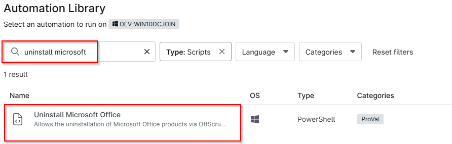
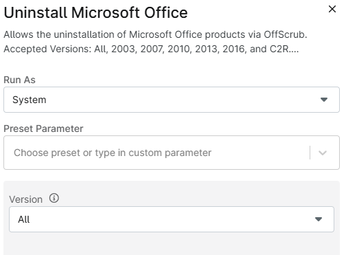
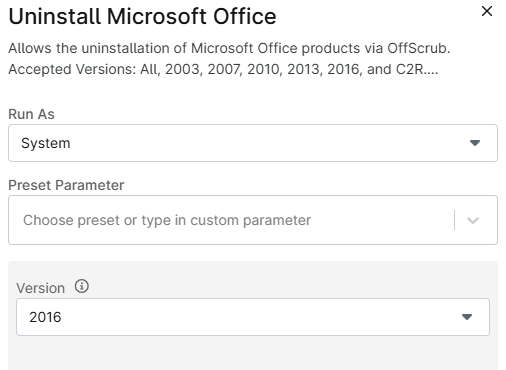
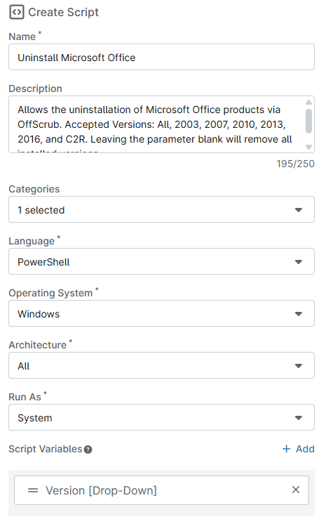
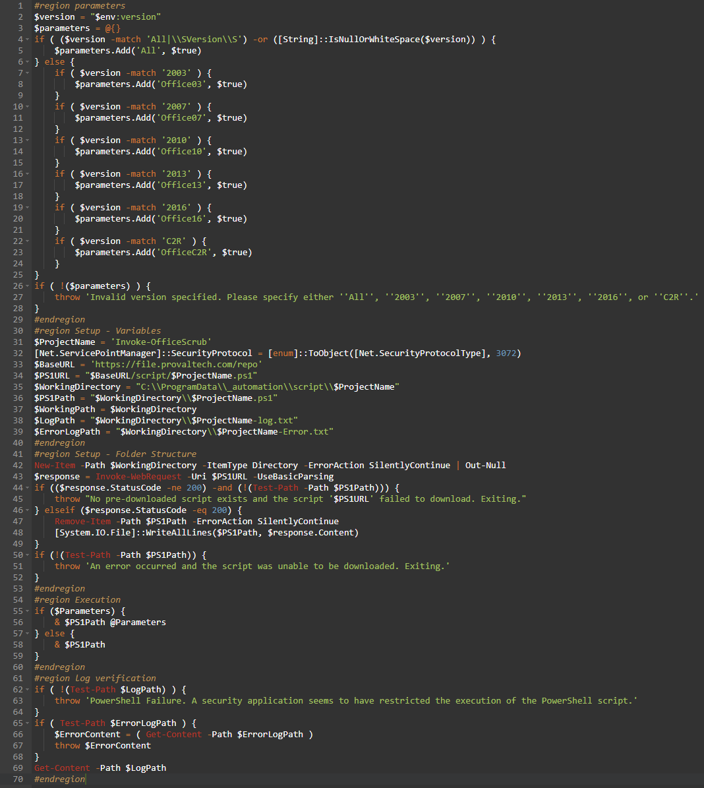
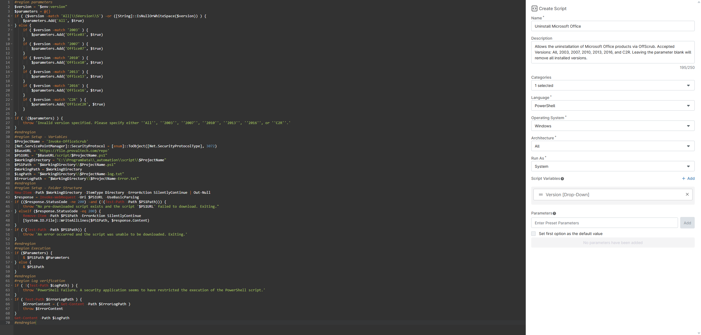

## Overview

This is a Ninja RMM implementation of the agnostic script [Invoke-OfficeScrub](/docs/e9253255-9a1f-4392-8ec6-9f7fb6e401ed/). It allows the uninstallation of Microsoft Office products via OffScrub. Accepted Versions: All, 2003, 2007, 2010, 2013, 2016, and C2R. Leaving the parameter blank will remove all installed versions.

## Sample Run

`Play Button` > `Run Automation` > `Script`  
   


Sample run to uninstall all versions of Microsoft Office:  


Sample run to uninstall Office 2016:   


## Dependencies

[Invoke-OfficeScrub](/docs/e9253255-9a1f-4392-8ec6-9f7fb6e401ed/)

## Parameters

| Name    | Example | Accepted Values                        | Required | Default | Type      | Description |
| ------- | ------- | -------------------------------------- | -------- | ------- | --------- | ----------- |
| Version | All     | All, 2003, 2007, 2010, 2013, 2016, C2R | False    | All     | Drop-Down | Specifies Office Version that needs to be Uninstalled. Leaving the parameter blank will remove all installed versions. |

## Automation Setup/Import

### Step 1

Navigate to `Administration` > `Library` > `Automation`  


### Step 2

Locate the `Add` button on the right-hand side of the screen, click on it and click the `New Script` button.  


The scripting window will open.  


**Name:** `Uninstall Microsoft Office`  
**Description:** `Allows the uninstallation of Microsoft Office products via OffScrub. Accepted Versions: All, 2003, 2007, 2010, 2013, 2016, and C2R. Leaving the parameter blank will remove all installed versions.`  
**Categories:** `<Leave it blank>`  
**Language:** `PowerShell`  
**Operating System:** `Windows`  
**Architecture:** `All`  
**Run As:** `System`  



Paste in the following PowerShell script into the Ninja One editor
```powershell
#region parameters
$version = "$env:version"
$parameters = @{}
if ( ($version -match 'All|\\SVersion\\S') -or ([String]::IsNullOrWhiteSpace($version)) ) {
    $parameters.Add('All', $true)
} else {
    if ( $version -match '2003' ) {
        $parameters.Add('Office03', $true)
    }
    if ( $version -match '2007' ) {
        $parameters.Add('Office07', $true)
    }
    if ( $version -match '2010' ) {
        $parameters.Add('Office10', $true)
    }
    if ( $version -match '2013' ) {
        $parameters.Add('Office13', $true)
    }
    if ( $version -match '2016' ) {
        $parameters.Add('Office16', $true)
    }
    if ( $version -match 'C2R' ) {
        $parameters.Add('OfficeC2R', $true)
    }
}
if ( !($parameters) ) {
    throw 'Invalid version specified. Please specify either ''All'', ''2003'', ''2007'', ''2010'', ''2013'', ''2016'', or ''C2R''.'
}
#endregion
#region Setup - Variables
$ProjectName = 'Invoke-OfficeScrub'
[Net.ServicePointManager]::SecurityProtocol = [enum]::ToObject([Net.SecurityProtocolType], 3072)
$BaseURL = 'https://file.provaltech.com/repo'
$PS1URL = "$BaseURL/script/$ProjectName.ps1"
$WorkingDirectory = "C:\\ProgramData\\_automation\\script\\$ProjectName"
$PS1Path = "$WorkingDirectory\\$ProjectName.ps1"
$WorkingPath = $WorkingDirectory
$LogPath = "$WorkingDirectory\\$ProjectName-log.txt"
$ErrorLogPath = "$WorkingDirectory\\$ProjectName-Error.txt"
#endregion
#region Setup - Folder Structure
New-Item -Path $WorkingDirectory -ItemType Directory -ErrorAction SilentlyContinue | Out-Null
$response = Invoke-WebRequest -Uri $PS1URL -UseBasicParsing
if (($response.StatusCode -ne 200) -and (!(Test-Path -Path $PS1Path))) {
    throw "No pre-downloaded script exists and the script '$PS1URL' failed to download. Exiting."
} elseif ($response.StatusCode -eq 200) {
    Remove-Item -Path $PS1Path -ErrorAction SilentlyContinue
    [System.IO.File]::WriteAllLines($PS1Path, $response.Content)
}
if (!(Test-Path -Path $PS1Path)) {
    throw 'An error occurred and the script was unable to be downloaded. Exiting.'
}
#endregion
#region Execution
if ($Parameters) {
    & $PS1Path @Parameters
} else {
    & $PS1Path
}
#endregion
#region log verification
if ( !(Test-Path $LogPath) ) {
    throw 'PowerShell Failure. A security application seems to have restricted the execution of the PowerShell script.'
}
if ( Test-Path $ErrorLogPath ) {
    $ErrorContent = ( Get-Content -Path $ErrorLogPath )
    throw $ErrorContent
}
Get-Content -Path $LogPath
#endregion
```



## Script Variables

Click the `Add` button next to `Script Variables`.  


Fill in the values as required (referenced below)

In the box, fill in the following details and select `Add` to create the script variable.

**Variable Type:** `Drop-Down`  
**Variable Name:** `Version`  
**Description:** `Specifies Office Version that needs to be Uninstalled. Leaving the parameter blank will remove all installed versions.`  
**Set Default Value:** `<Leave it unchecked.>`  
Click on `ADD`  

## Saving the Automation

Click the Save button in the top-right corner of the screen to save your automation.  


You will be prompted to enter your MFA code. Provide the code and press the Continue button to finalize the process.  


## Completed Automation



## Output

- Activity Details