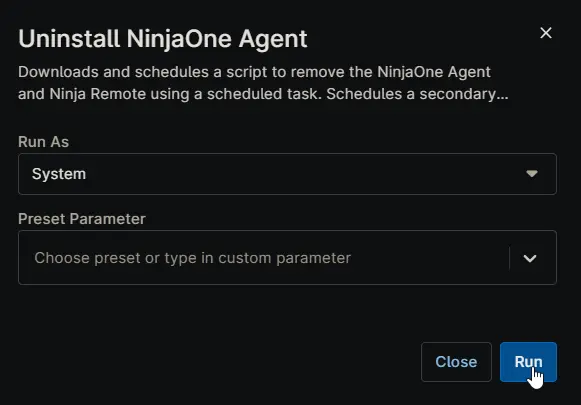

## Overview

Downloads and schedules a script to remove the NinjaOne Agent and Ninja Remote using a scheduled task.
Schedules a secondary task to clean up the scheduled task after an hour.

## Dependencies
 - [Custom Field : cPVAL Uninstall Ninja Agent ](/docs/fa1632f1-0fd8-4cc7-88da-7b2e20e122c0)  
 - [Solution : Uninstall Ninja RMM Agent ](/docs/28bf69eb-dfb9-42c7-9ea8-7f906551da9c)  

## Sample Run

**Run As:** `System`  
**Preset Parameter:** ``  

## Automation Setup/Import

[Automation Configuration](https://github.com/ProVal-Tech/ninjarmm/blob/main/scripts/uninstall-ninjaone-agent.ps1)

## Output

- Activity Details  
- Custom Field
